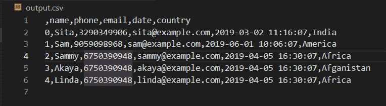

# 在 Python 中将 XML 转换为 CSV

> 原文:[https://www.geeksforgeeks.org/convert-xml-to-csv-in-python/](https://www.geeksforgeeks.org/convert-xml-to-csv-in-python/)

**先决条件:**T2】熊猫

XML 代表可扩展标记语言。这种格式对于跟踪小到中等数量的数据非常有用。由于 XML 格式的数据一般用户不可读，我们需要将其转换为一些用户友好的格式，如 CSV。CSV 易于阅读，可以使用任何编辑器打开。

现在，让我们举一个使用 python 将 XML 数据转换为 CSV 数据的例子。我们将导入元素树，用于将 XML 格式的数据解析为 CSV 格式。xml.etree.ElementTree 模块实现了一个简单高效的 API，用于解析和创建 xml 数据。

### 方法

*   导入模块
*   声明要在 csv 文件中排列的数据的行和列
*   加载 xml 文件
*   [解析 xml 文件](https://www.geeksforgeeks.org/xml-parsing-python/)
*   将每行逐一写入 csv 文件
*   保存 csv 文件

**使用的 XML 数据:**

**链接:**T2**T4**

**程序:**

## 蟒蛇 3

```
# Importing the required libraries
import xml.etree.ElementTree as Xet
import pandas as pd

cols = ["name", "phone", "email", "date", "country"]
rows = []

# Parsing the XML file
xmlparse = Xet.parse('sample.xml')
root = xmlparse.getroot()
for i in root:
    name = i.find("name").text
    phone = i.find("phone").text
    email = i.find("email").text
    date = i.find("date").text
    country = i.find("country").text

    rows.append({"name": name,
                 "phone": phone,
                 "email": email,
                 "date": date,
                 "country": country})

df = pd.DataFrame(rows, columns=cols)

# Writing dataframe to csv
df.to_csv('output.csv')
```

**输出:**

