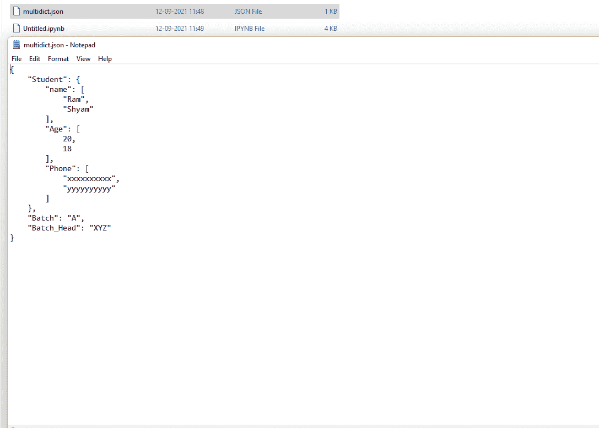

# 将多通道转换为合适的 JSON

> 原文:[https://www . geesforgeks . org/converting-multi ICT-to-proper-JSON/](https://www.geeksforgeeks.org/converting-multidict-to-proper-json/)

在本文中，我们将了解什么是多信息技术，以及如何在 Python 中将多信息技术转换成 JSON 文件。

首先，我们将多数据转换为字典数据类型，最后，我们将该字典转储到一个 JSON 文件中。

## 使用的功能:

*   **json . dump():**Python 模块中的 JSON 模块提供了一个名为 dump()的方法，将 Python 对象转换成合适的 JSON 对象。这是 dumps()方法的一个小变体。

> **语法:** json.dump(d，skipkeys=False，确保 _ascii=True，check_circular=True，allow_nan=True，cls =无，缩进=无，分隔符=无)
> 
> **参数:**
> 
> **缩进:**提高了 JSON 文件的可读性。可以传递给该参数的可能值是简单的两倍
> 
> 引号("")，任何整数值。简单的双引号使每个键值对出现在新的一行中。
> 
> **示例:**
> 
> json.dump(dic，file_name，indent=4)

*   将多信道转换为合适的**jsonmulticit**:这是一个存在于多信道 python 模块中的类

> **语法:**
> 
> *   多重引线。多重播送(**kwargs)
> *   多信道。多信道(映射，**kwargs)
> *   多重引线。multidict(可重复，**kwargs)
> 
> **返回:**
> 
> *   它将创建一个可变的多维实例。
> *   它具有字典中可用的所有相同功能。
> 
> **示例:**
> 
> 从多信道导入多信道
> 
> dic = [(极客，1)，(' for '，2)，('书呆子，3)]
> 
> 多字典

**代码:**

## 蟒蛇 3

```
# import multidict module
from multidict import MultiDict
# import json module
import json

# create multi dict
dic = [('Student.name', 'Ram'), ('Student.Age', 20),
       ('Student.Phone', 'xxxxxxxxxx'),
       ('Student.name', 'Shyam'), ('Student.Age',18),
       ('Student.Phone', 'yyyyyyyyyy'),
       ('Batch', 'A'), ('Batch_Head', 'XYZ')]

multi_dict = MultiDict(dic)
print(type(multi_dict))
print(multi_dict)

# get the required dictionary
req_dic = {}
for key, value in multi_dict.items():

      # checking for any nested dictionary
    l = key.split(".")

    # if nested dictionary is present
    if len(l) > 1: 
        i = l[0]
        j = l[1]
        if req_dic.get(i) is None:
            req_dic[i] = {}
            req_dic[i][j] = []
            req_dic[i][j].append(value)
        else:
            if req_dic[i].get(j) is None:
                req_dic[i][j] = []
                req_dic[i][j].append(value)
            else:
                req_dic[i][j].append(value)

    else:  # if single dictionary is there
        if req_dic.get(l[0]) is None:
            req_dic[l[0]] = value
        else:
            req_dic[l[0]] = value
# save the dict in json format
with open('multidict.json', 'w') as file:
    json.dump(req_dic, file, indent=4)
```

**输出:**

> <class></class>

**JSON 文件输出:**

