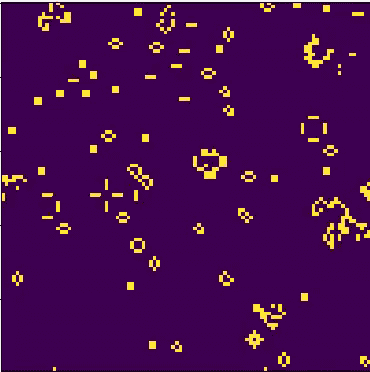
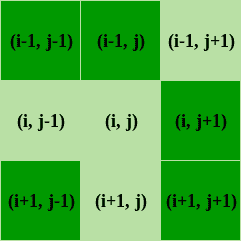

# 康威的生命游戏(Python 实现)

> 原文:[https://www . geesforgeks . org/con way-game-life-python-implementation/](https://www.geeksforgeeks.org/conways-game-life-python-implementation/)

康威的生命游戏是由约翰·康威创造的一种细胞自动化方法。这款游戏是在考虑到生物学的情况下创建的，但是已经被应用于各种领域，例如图形、地形生成等..



“游戏”是一个零玩家游戏，这意味着它的进化是由它的初始状态决定的，不需要进一步的输入。一个人通过创建一个初始配置并观察它如何进化来与生命游戏互动，或者，对于高级“玩家”，通过创建具有特定属性的模式来互动。
**游戏工作原理**
因为《生命游戏》是建立在 9 个方格的格子上，每个格子都有 8 个相邻的格子，如图所示。在网格[i][j]上访问模拟中的给定单元(I，j)，其中 I 和 j 分别是行和列索引。给定单元在给定时刻的值取决于其邻居在前一时间步的状态。康威的人生游戏有四条规则。

1.  如果一个单元是打开的，并且有少于两个邻居是打开的，它将关闭
2.  如果一个单元是开的，并且有两个或三个邻居是开的，则它保持开。
3.  如果一个单元是打开的，并且有三个以上的邻居是打开的，它将关闭。
4.  如果一个单元是关闭的，并且正好有三个邻居是打开的，那么它就会打开。



既然我们知道它是如何工作的，接下来我们就需要弄清楚如何让它工作。
**接近**

```
1\. Initialize the cells in the grid.
2\. At each time step in the simulation, for each 
   cell (i, j) in the grid, do the following:
   a. Update the value of cell (i, j) based on 
      its neighbors, taking into account the 
      boundary conditions.
   b. Update the display of grid values.
```

做完这些后，让我们开始编写代码。
**要求**

1.  num py
2.  **matplotlib**
3.  争辩
4.  **游戏**

现在让我们开始吧
**代码**

## 蟒蛇 3

```
# Python code to implement Conway's Game Of Life
import argparse
import numpy as np
import matplotlib.pyplot as plt
import matplotlib.animation as animation

# setting up the values for the grid
ON = 255
OFF = 0
vals = [ON, OFF]

def randomGrid(N):

    """returns a grid of NxN random values"""
    return np.random.choice(vals, N*N, p=[0.2, 0.8]).reshape(N, N)

def addGlider(i, j, grid):

    """adds a glider with top left cell at (i, j)"""
    glider = np.array([[0,    0, 255],
                       [255,  0, 255],
                       [0,  255, 255]])
    grid[i:i+3, j:j+3] = glider

def addGosperGliderGun(i, j, grid):

    """adds a Gosper Glider Gun with top left
       cell at (i, j)"""
    gun = np.zeros(11*38).reshape(11, 38)

    gun[5][1] = gun[5][2] = 255
    gun[6][1] = gun[6][2] = 255

    gun[3][13] = gun[3][14] = 255
    gun[4][12] = gun[4][16] = 255
    gun[5][11] = gun[5][17] = 255
    gun[6][11] = gun[6][15] = gun[6][17] = gun[6][18] = 255
    gun[7][11] = gun[7][17] = 255
    gun[8][12] = gun[8][16] = 255
    gun[9][13] = gun[9][14] = 255

    gun[1][25] = 255
    gun[2][23] = gun[2][25] = 255
    gun[3][21] = gun[3][22] = 255
    gun[4][21] = gun[4][22] = 255
    gun[5][21] = gun[5][22] = 255
    gun[6][23] = gun[6][25] = 255
    gun[7][25] = 255

    gun[3][35] = gun[3][36] = 255
    gun[4][35] = gun[4][36] = 255

    grid[i:i+11, j:j+38] = gun

def update(frameNum, img, grid, N):

    # copy grid since we require 8 neighbors
    # for calculation and we go line by line
    newGrid = grid.copy()
    for i in range(N):
        for j in range(N):

            # compute 8-neighbor sum
            # using toroidal boundary conditions - x and y wrap around
            # so that the simulaton takes place on a toroidal surface.
            total = int((grid[i, (j-1)%N] + grid[i, (j+1)%N] +
                         grid[(i-1)%N, j] + grid[(i+1)%N, j] +
                         grid[(i-1)%N, (j-1)%N] + grid[(i-1)%N, (j+1)%N] +
                         grid[(i+1)%N, (j-1)%N] + grid[(i+1)%N, (j+1)%N])/255)

            # apply Conway's rules
            if grid[i, j]  == ON:
                if (total < 2) or (total > 3):
                    newGrid[i, j] = OFF
            else:
                if total == 3:
                    newGrid[i, j] = ON

    # update data
    img.set_data(newGrid)
    grid[:] = newGrid[:]
    return img,

# main() function
def main():

    # Command line args are in sys.argv[1], sys.argv[2] ..
    # sys.argv[0] is the script name itself and can be ignored
    # parse arguments
    parser = argparse.ArgumentParser(description="Runs Conway's Game of Life simulation.")

    # add arguments
    parser.add_argument('--grid-size', dest='N', required=False)
    parser.add_argument('--mov-file', dest='movfile', required=False)
    parser.add_argument('--interval', dest='interval', required=False)
    parser.add_argument('--glider', action='store_true', required=False)
    parser.add_argument('--gosper', action='store_true', required=False)
    args = parser.parse_args()

    # set grid size
    N = 100
    if args.N and int(args.N) > 8:
        N = int(args.N)

    # set animation update interval
    updateInterval = 50
    if args.interval:
        updateInterval = int(args.interval)

    # declare grid
    grid = np.array([])

    # check if "glider" demo flag is specified
    if args.glider:
        grid = np.zeros(N*N).reshape(N, N)
        addGlider(1, 1, grid)
    elif args.gosper:
        grid = np.zeros(N*N).reshape(N, N)
        addGosperGliderGun(10, 10, grid)

    else:   # populate grid with random on/off -
            # more off than on
        grid = randomGrid(N)

    # set up animation
    fig, ax = plt.subplots()
    img = ax.imshow(grid, interpolation='nearest')
    ani = animation.FuncAnimation(fig, update, fargs=(img, grid, N, ),
                                  frames = 10,
                                  interval=updateInterval,
                                  save_count=50)

    # # of frames?
    # set output file
    if args.movfile:
        ani.save(args.movfile, fps=30, extra_args=['-vcodec', 'libx264'])

    plt.show()

# call main
if __name__ == '__main__':
    main()
```

不传递任何命令行参数。

<video class="wp-video-shortcode" id="video-162466-1" width="640" height="360" preload="metadata" controls=""><source type="video/mp4" src="https://media.geeksforgeeks.org/wp-content/uploads/1.mp4?_=1">[https://media.geeksforgeeks.org/wp-content/uploads/1.mp4](https://media.geeksforgeeks.org/wp-content/uploads/1.mp4)</video>

现在让我们打开一些东西，让我们看看如果 add 每 500 毫秒更新一次动画，设置尺寸为 32X32，并使用初始滑翔机模式会发生什么。

```
python 'filename.py' --grid-size 32 --interval 500 --glider
```

<video class="wp-video-shortcode" id="video-162466-2" width="640" height="360" preload="metadata" controls=""><source type="video/mp4" src="https://media.geeksforgeeks.org/wp-content/uploads/2017-10-27-at-02-28-55.mp4?_=2">[https://media.geeksforgeeks.org/wp-content/uploads/2017-10-27-at-02-28-55.mp4](https://media.geeksforgeeks.org/wp-content/uploads/2017-10-27-at-02-28-55.mp4)</video>

您可以尝试操作这段代码来使用它创建不同的模拟。
**参考链接:**

1.  [本文 Github 代码](https://github.com/electronut/pp/tree/master/conway)
2.  书:Python 游乐场:好奇程序员的极客项目
3.  docs-num py
4.  [docs matplotlib](https://matplotlib.org/users/pyplot_tutorial.html)

本文由 [**Subhajit Saha**](https://www.linkedin.com/in/subhajit-saha-06aa29131/) 供稿。如果你喜欢极客博客并想投稿，你也可以把你的文章邮寄到 review-team@geeksforgeeks.org。看到你的文章出现在极客博客主页上，帮助其他极客。
如果你发现任何不正确的地方，或者你想分享更多关于上面讨论的话题的信息，请写评论。