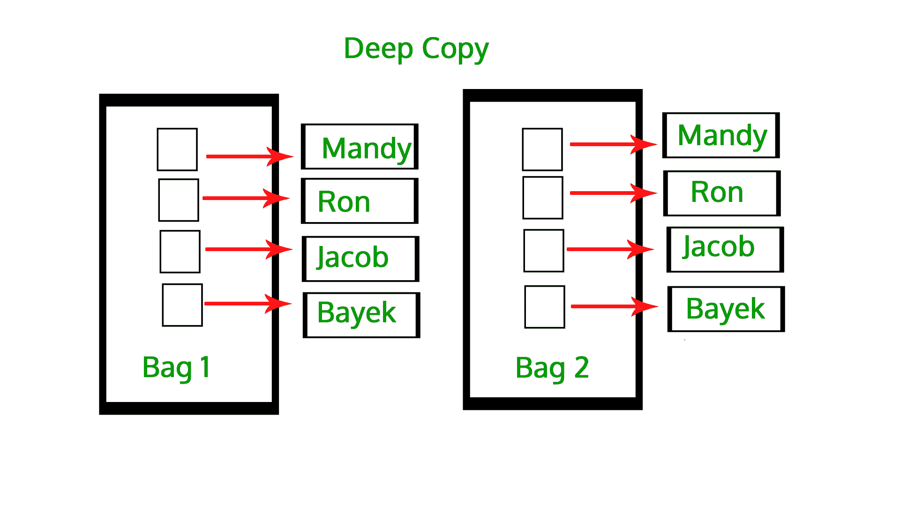
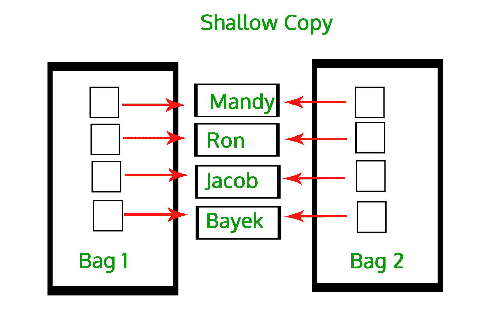

# Python 中的副本(深副本和浅副本)

> 原文:[https://www . geesforgeks . org/copy-python-deep-copy-浅层-copy/](https://www.geeksforgeeks.org/copy-python-deep-copy-shallow-copy/)

在 Python 中，赋值语句不复制对象，而是在目标和对象之间创建绑定。当我们使用`=`运算符时，用户认为这创建了一个新的对象；嗯，没有。它只创建一个共享原始对象引用的新变量。有时，用户想要处理可变对象，为了做到这一点，用户寻找一种方法来创建这些对象的“真实副本”或“克隆”。或者，有时用户想要用户可以修改的副本，而不需要同时自动修改原件，为了做到这一点，我们创建了对象的副本。

有时需要一份拷贝，这样就可以在不改变另一份拷贝的情况下改变一份拷贝。在 Python 中，有两种方法可以创建副本:

*   深度复制
*   浅拷贝

为了制作这些副本，我们使用`copy`模块。我们使用`copy`模块进行浅拷贝和深拷贝操作。例如

```py
# importing copy module
import copy

# initializing list 1 
li1 = [1, 2, [3,5], 4]

# using copy for shallow copy  
li2 = copy.copy(li1) 

# using deepcopy for deepcopy  
li3 = copy.deepcopy(li1) 
```

在上面的代码中，`copy()`返回列表的浅拷贝，`deepcopy()`返回列表的深拷贝。

#### **深度复制**

[](https://media.geeksforgeeks.org/wp-content/uploads/deep-copy.jpg)

深度复制是复制过程递归发生的过程。这意味着首先构造一个新的集合对象，然后递归地用在原始集合中找到的子对象的副本填充它。在深度复制的情况下，对象的副本被复制到其他对象中。这意味着**对对象**的副本所做的任何更改**都不会在原始对象中反映**。在 python 中，这是使用“ **deepcopy()** ”函数实现的。

```py
# Python code to demonstrate copy operations

# importing "copy" for copy operations
import copy

# initializing list 1
li1 = [1, 2, [3,5], 4]

# using deepcopy to deep copy 
li2 = copy.deepcopy(li1)

# original elements of list
print ("The original elements before deep copying")
for i in range(0,len(li1)):
    print (li1[i],end=" ")

print("\r")

# adding and element to new list
li2[2][0] = 7

# Change is reflected in l2 
print ("The new list of elements after deep copying ")
for i in range(0,len( li1)):
    print (li2[i],end=" ")

print("\r")

# Change is NOT reflected in original list
# as it is a deep copy
print ("The original elements after deep copying")
for i in range(0,len( li1)):
    print (li1[i],end=" ")
```

**输出:**

```py
The original elements before deep copying
1 2 [3, 5] 4 
The new list of elements after deep copying 
1 2 [7, 5] 4 
The original elements after deep copying
1 2 [3, 5] 4 

```

在上面的例子中，列表**中所做的更改在其他列表中没有**效果，说明列表是深度复制的。

#### **浅抄**

[](https://media.geeksforgeeks.org/wp-content/uploads/shallow-copy.jpg)

浅拷贝意味着构建一个新的集合对象，然后用对在原始集合中找到的子对象的引用填充它。复制过程不会重复，因此不会创建子对象本身的副本。在浅层复制的情况下，对象的引用被复制到其他对象中。这意味着**对对象**的副本所做的任何更改**确实反映了原始对象中的**。在 python 中，这是使用“ **copy()** ”函数实现的。

```py
# Python code to demonstrate copy operations

# importing "copy" for copy operations
import copy

# initializing list 1
li1 = [1, 2, [3,5], 4]

# using copy to shallow copy 
li2 = copy.copy(li1)

# original elements of list
print ("The original elements before shallow copying")
for i in range(0,len(li1)):
    print (li1[i],end=" ")

print("\r")

# adding and element to new list
li2[2][0] = 7

# checking if change is reflected
print ("The original elements after shallow copying")
for i in range(0,len( li1)):
    print (li1[i],end=" ")
```

**输出:**

```py
The original elements before shallow copying
1 2 [3, 5] 4 
The original elements after shallow copying
1 2 [7, 5] 4 

```

在上面的例子中，列表**所做的更改在其他列表中起到了**的效果，说明列表是浅拷贝的。

**要点:**
浅复制和深复制的区别仅与复合对象(包含其他对象的对象，如列表或类实例)相关:

*   浅拷贝构建一个新的复合对象，然后(尽可能地)在其中插入对原始对象的引用。
*   深度复制构建一个新的复合对象，然后递归地将原始对象的副本插入其中。