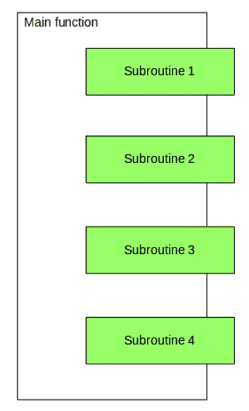
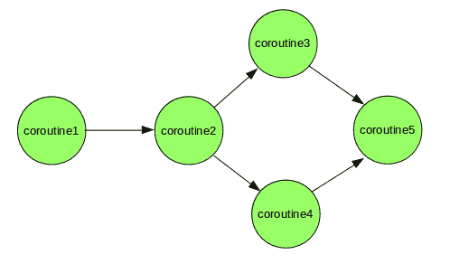
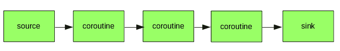
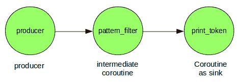

# Python 中的 Coroutine

> 原文:[https://www.geeksforgeeks.org/coroutine-in-python/](https://www.geeksforgeeks.org/coroutine-in-python/)

先决条件:[发电机](https://www.geeksforgeeks.org/generators-in-python/)
我们都熟悉**功能**又称为**子程序**、**程序**、**子过程**等。一个函数是一个指令序列，打包成一个单元来执行某项任务。当一个复杂函数的逻辑被分成几个独立的步骤，这些步骤本身就是函数，那么这些函数被称为辅助函数或**子程序**。

Python 中的子程序由**主函数**调用，主函数负责协调这些子程序的使用。子程序只有一个入口点。



协同程序是子程序的推广。它们用于协同的多任务处理，其中一个进程周期性地或在空闲时自动产生(放弃)控制，以便能够同时运行多个应用程序。协同程序和子程序的区别是:

*   与子程序不同，协同程序有许多暂停和恢复执行的入口点。Coroutine 可以暂停其执行，并将控制权转移给其他 coroutine，并可以从它停止的点再次恢复执行。
*   与子程序不同，没有主函数以特定的顺序调用协同程序并协调结果。协同是合作的，这意味着它们连接在一起形成一个管道。一个协同程序可以使用输入数据并将其发送给处理它的另一个协同程序。最后，可能会有一个协同程序来显示结果。



**Coroutine Vs Thread**

现在你可能会想协同工作和线程有什么不同，两者似乎做着相同的工作。
在线程的情况下，是操作系统(或运行时环境)根据调度器在线程之间切换。而在协同程序的情况下，决定何时切换协同程序的是程序员和编程语言。通过程序员在设定点暂停和恢复，协同程序协同工作多任务。

**蟒蛇花冠**

在 Python 中，协同程序类似于生成器，但是几乎没有额外的方法，并且我们使用[产生](https://www.geeksforgeeks.org/use-yield-keyword-instead-return-keyword-python/)语句的方式略有变化。生成器为迭代生成数据，而**协同程序也可以使用数据。**
在 Python 2.5 中，引入了对 yield 语句的轻微修改，现在 yield 也可以作为*表达式*。例如，在作业的右侧–

```py
line = (yield)
```

我们发送给 coroutine 的任何值都会被 **(yield)** 表达式捕获并返回。

一个值可以通过 **send()** 方法发送到 coroutine。例如，考虑这个打印出前缀为“亲爱的”的名字的程序。我们将使用 send()方法向 coroutine 发送名称。

## 计算机编程语言

```py
# Python3 program for demonstrating
# coroutine execution

def print_name(prefix):
    print("Searching prefix:{}".format(prefix))
    while True:
        name = (yield)
        if prefix in name:
            print(name)

# calling coroutine, nothing will happen
corou = print_name("Dear")

# This will start execution of coroutine and
# Prints first line "Searching prefix..."
# and advance execution to the first yield expression
corou.__next__()

# sending inputs
corou.send("Atul")
corou.send("Dear Atul")
```

**输出:**

```py
Searching prefix:Dear
Dear Atul
```

**执行验尸官**

协同程序的执行类似于生成器。当我们调用 coroutine 时，什么都不会发生，它只是响应 **next()** 和**发送** **()** 方法而运行。这在上面的例子中可以清楚地看到，因为只有在调用 **__next__()** 方法之后，我们的协同程序才开始执行。在这个调用之后，执行前进到第一个 yield 表达式，现在执行暂停并等待值被发送到 *corou* 对象。当第一个值发送给它时，它检查前缀，如果有前缀，则打印名称。打印名称后，它会遍历循环，直到再次遇到*名称= (yield)* 表达式。

**关闭验尸官**

科罗廷可能无限期运行，要关闭科罗廷**就要使用 close()** 方法。当一个协同程序关闭时，它会产生**生成退出**异常，该异常可以用通常的方式捕获。关闭协同程序后，如果我们尝试发送值，它将引发**停止迭代**异常。下面是一个简单的例子:

## 计算机编程语言

```py
# Python3 program for demonstrating
# closing a coroutine

def print_name(prefix):
    print("Searching prefix:{}".format(prefix))
    try :
        while True:
                name = (yield)
                if prefix in name:
                    print(name)
    except GeneratorExit:
            print("Closing coroutine!!")

corou = print_name("Dear")
corou.__next__()
corou.send("Atul")
corou.send("Dear Atul")
corou.close()
```

输出:

```py
Searching prefix:Dear
Dear Atul
Closing coroutine!!
```

**链接创建管道的协同程序**

Coroutines 可以用来设置管道。我们可以将协同程序链接在一起，并使用 send()方法通过管道推送数据。一根管子需要:

*   一个**初始源**(生产者)派生出整个管道。生产者通常不是一个验尸官，它只是一个简单的方法。
*   一个**水槽**，是管道的终点。接收器可能会收集所有数据并显示出来。



以下是链接的一个简单示例–



## 计算机编程语言

```py
# Python3 program for demonstrating
# coroutine chaining

def producer(sentence, next_coroutine):
    '''
    Producer which just split strings and
    feed it to pattern_filter coroutine
    '''
    tokens = sentence.split(" ")
    for token in tokens:
        next_coroutine.send(token)
    next_coroutine.close()

def pattern_filter(pattern="ing", next_coroutine=None):
    '''
    Search for pattern in received token
    and if pattern got matched, send it to
    print_token() coroutine for printing
    '''
    print("Searching for {}".format(pattern))
    try:
        while True:
            token = (yield)
            if pattern in token:
                next_coroutine.send(token)
    except GeneratorExit:
        print("Done with filtering!!")

def print_token():
    '''
    Act as a sink, simply print the
    received tokens
    '''
    print("I'm sink, i'll print tokens")
    try:
        while True:
            token = (yield)
            print(token)
    except GeneratorExit:
        print("Done with printing!")

pt = print_token()
pt.__next__()
pf = pattern_filter(next_coroutine = pt)
pf.__next__()

sentence = "Bob is running behind a fast moving car"
producer(sentence, pf)
```

输出:

```py
I'm sink, i'll print tokens
Searching for ing
running
moving
Done with filtering!!
Done with printing!
```

**参考文献**

*   [http://www.dabeaz.com/coroutines/Coroutines.pdf](http://www.dabeaz.com/coroutines/Coroutines.pdf)
*   [https://en . Wikipedia . org/wiki/corroutine](https://en.wikipedia.org/wiki/Coroutine)

本文由阿图尔 [**库马尔**](https://www.facebook.com/atul.kr.007) 供稿。如果你喜欢 GeeksforGeeks 并想投稿，你也可以使用[write.geeksforgeeks.org](https://write.geeksforgeeks.org)写一篇文章或者把你的文章邮寄到 review-team@geeksforgeeks.org。看到你的文章出现在极客博客主页上，帮助其他极客。
如果发现有不正确的地方，或者想分享更多关于上述话题的信息，请写评论。