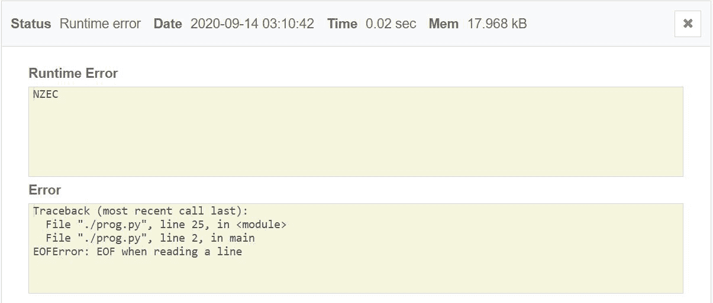

# 在 Codechef

中纠正 python 中的 EOF 错误

> 原文:[https://www . geeksforgeeks . org/correcting-eof-in-python-in-code chef/](https://www.geeksforgeeks.org/correcting-eof-error-in-python-in-codechef/)

**EOF** 代表**文件结束**T4。嗯，从技术上讲这不是错误，而是例外。当内置函数之一(最常见的是[**)input()**](https://www.geeksforgeeks.org/difference-between-input-and-raw_input-functions-in-python/)返回文件结束(e of)而不读取任何数据时，会引发此异常。

在某些特定场景下，Python 中会出现 EOF 错误:

*   有时所有程序试图做的就是获取一些东西并修改它。但是当它无法获取时，它将引发此异常。
*   当 [Python 2.7 和 Python 3.6+](https://www.geeksforgeeks.org/important-differences-between-python-2-x-and-python-3-x-with-examples/) 中的**输入()**功能中断时，或者当 Python 2.7 中的**输入()**意外到达文件末尾时。

Python 中的所有[内置异常](https://www.geeksforgeeks.org/built-exceptions-python/)都继承自 [**基本异常**](https://www.geeksforgeeks.org/built-exceptions-python/) 类或从其中的继承类扩展而来。此错误的完整异常层次结构是:

> **基础异常- >异常->eoferrer**

在任何平台上编码时避免 python 中 **EOF** 的最佳做法是**捕捉异常，**并且我们不需要执行任何操作，所以我们只需使用“**除外”块中的关键字**【通过】**来通过异常。**

**考虑 CodeChef[K-可折叠字符串(KFOLD)](https://www.codechef.com/problems/KFOLD) 中问题的以下代码:**

## **C++**

```
#Python program for the above question

#Function to reorder the characters
#of the string
def main():
    t = int(input())
    while t:

        # Input variables 
        n, k = map(int, input().split())
        s = input()
        ans = ""

        # Initialize dictionary
        s_dict = dict()
        for ch in s:
            s_dict[ch] = s_dict.get(ch, 0) + 1
        q = n// k
        a1 = s_dict['1']// q
        a0 = s_dict['0']// q

        # Check for valid conditions
        if(s_dict['1']%2!=0 or s_dict['0']%2!=0 \\
        or s_dict['1']%q!=0 or s_dict['0']%q!=0):
            ans = "Impossible"

        # Otherwise update the result
        else:
            st = ('0'*a0) + ('1'*a1)
            st = ('1'*a1) + ('0'*a0)
            part1 = st + st_rev
            ans = part1*(q// 2)

        # Print the result for the
        # current test case
        print(ans)

        t -= 1
    return

# Driver Code
if __name__=="__main__":
    main()
```

****输出:****

**给出如下所示的**电渗流误差**:**

**[](https://media.geeksforgeeks.org/wp-content/uploads/20200914085509/EOFerror.JPG)**

**上述 **EOF 错误**的解决方法是将代码括在 [**中，尝试除块**](https://www.geeksforgeeks.org/python-try-except/) 并相应处理异常，处理该异常的方法如下:**

## **C++**

```
# Python program for the above question

# Function to reorder the characters
#of the string
try : t = int(input())

    # Input test cases
    while t:

        # Input Variables
        n, k = map(int, input().split())
        s = input()
        ans = ""

        # Initialize dictionary
        s_dict = dict()
        for ch in s:
            s_dict[ch] = s_dict.get(ch, 0) + 1
        q = n// k
        a1 = s_dict['1']// q
        a0 = s_dict['0']// q

        # Check for valid conditions
        if(s_dict['1']%2!=0 or s_dict['0']%2!=0 \\ 
        or s_dict['1']%q!=0 or s_dict['0']%q!=0):
            ans = "Impossible"

        # Otherwise update the result
        else:
            st = ('0'*a0) + ('1'*a1)
            st = ('1'*a1) + ('0'*a0)
            part1 = st + st_rev
            ans = part1*(q// 2)

        # Print the result for the
        # current test case
        print(ans)

        t -= 1

except:
    pass
```

****输出:****

**[](https://media.geeksforgeeks.org/wp-content/uploads/20200914090122/correctrun.JPG)**