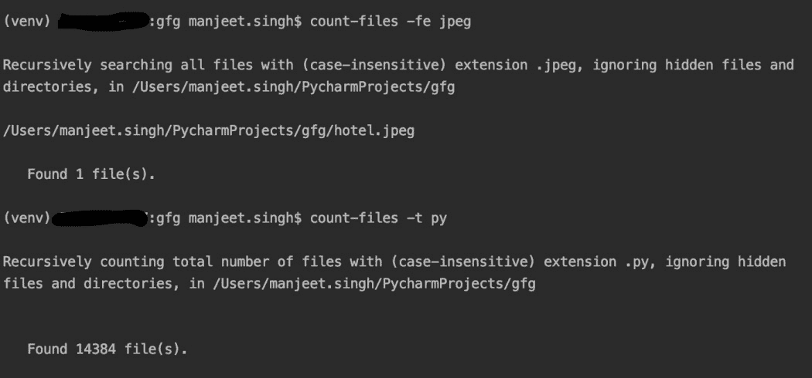
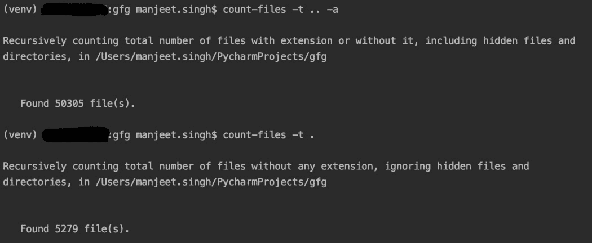

# Python 中的计数文件模块

> 原文:[https://www.geeksforgeeks.org/count-files-module-in-python/](https://www.geeksforgeeks.org/count-files-module-in-python/)

**计数文件**模块是一个用 Python 编写的命令行实用程序，用于获取带有扩展名的文件的计数和信息。它在任何路由中检查文件和扩展名的功能也可以用于检查没有扩展名或不考虑扩展名的文件。

### **安装**

这个模块没有内置 Python。要安装此软件，请在终端中键入以下命令。

```py
pip install count-files
```

**参数描述**

> count-FIles[-h][-v][-ST][-a][-NR][-c][-nf][-HC][-t EXTENSION][-alpha][-Fe FILE _ EXTENSION][-p][-PS PREWER _ SIZE][-fs][path]

<figure class="table">

| 银 | 描述 |
| --- | --- |
| -h | 打印所有帮助并退出。 |
| -v | 显示版本号并退出。 |
| 圣 | 预览支持的文件类型列表。 |
| ［构成动植物的古名或拉丁化的现代名］ | 此外，显示隐藏文件。 |
| -nr | 不要递归子目录。 |
| -c | 区分大小写处理所有文件。 |
| -nf | 关闭程序的操作指示器 |
| -hc | 开始主题的交互式帮助。 |
| -t EXTENSION | 获取目录中文件的总数。 |
| 阿尔法 | 按字母顺序对结果表进行排序。 |
| -fe FILE_EXTENSION | 搜索特定扩展名的文件。 |
| -p | 此外，显示文本预览。仅适用于短信。 |
| -fs | 显示找到的每个文件的大小 |
| -PS PREWER _ SIZE | 输入所需的预览大小。 |
| 小路 | 输入检入文件的路径。 |

</figure>

**示例 1:** 当前目录的打印数量和文件



**示例 2:** 获取所有文件的计数，不考虑扩展名，包括隐藏文件(使用..)，获取非指定扩展的总数(使用。)

