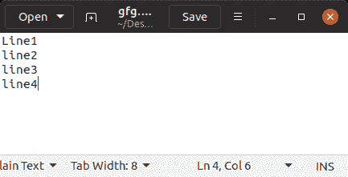

# 在 Python 中统计一个文本文件的行数

> 原文:[https://www . geesforgeks . org/count-python 文本文件行数/](https://www.geeksforgeeks.org/count-number-of-lines-in-a-text-file-in-python/)

**先决条件:**[Python 中的文件处理](https://www.geeksforgeeks.org/file-handling-python/)

计算字符数很重要，因为几乎所有依赖于用户输入的文本框都对可以插入的字符数有一定的限制。例如，脸书帖子的字符限制为 63，206 个字符。然而，对于推特上的一条推文，字符限制是 140 个字符，对于 Snapchat，每个帖子的字符限制是 80 个。

这个程序在数据[文件处理中用 Python](https://www.geeksforgeeks.org/file-handling-python/) 强调的是在 Python 中计算一个文本文件的行数。

**进场:**

*   以读取模式打开文件，并分配一个名为“file”的文件对象。
*   将 0 赋给计数器变量。
*   使用 **read** 函数读取文件内容，并将其分配给一个名为“content”的变量。
*   创建一个内容列表，其中元素在遇到“\n”时被拆分。
*   使用 for 循环遍历列表，并分别迭代计数器变量。
*   此外，还会显示变量 Counter 中的当前值，这是该程序中所需的操作。

**下面是实现。**

让我们假设文本文件如下所示–



```
# Python program to count the 
# number of lines in a text file

# Opening a file
file = open("gfg.txt","r")
Counter = 0

# Reading from file
Content = file.read()
CoList = Content.split("\n")

for i in CoList:
    if i:
        Counter += 1

print("This is the number of lines in the file")
print(Counter)
```

**输出:**

```
This is the number of lines in the file
4

```