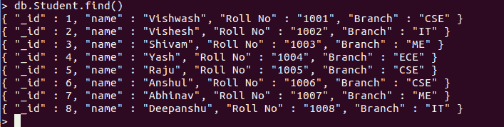

# 使用 Python 统计 MongoDB 中的文档数量

> 原文:[https://www . geeksforgeeks . org/count-in-MongoDB-using-python/](https://www.geeksforgeeks.org/count-the-number-of-documents-in-mongodb-using-python/)

是一个面向文档的 NoSQL 数据库，是非关系数据库。Mongodb 是一个基于*二进制 JSON* 格式的无模式数据库。它由一组称为集合(RDBMS 中的表)的文档(RDBMS 中的行)组成。mongodb 中的集合是无模式的。

**PyMongo** 是 MongoDB 驱动程序或客户端库之一。使用 PyMongo 模块，我们可以发送请求和接收响应

## 使用 Python 统计文档的数量

**方法 1:使用 count()**

可以使用`**count()**`方法检索集合中存在的文档总数。

**语法:**

```
db.collection.count()
```

**示例:**使用`count()`统计集合中的文档数(my_data)。

**样本数据库:**



```
from pymongo import MongoClient

Client = MongoClient()
myclient = MongoClient('localhost', 27017)

my_database = myclient["GFG"]  
my_collection = my_database["Student"] 

# number of documents in the collection
mydoc = my_collection.find().count()
print("The number of documents in collection : ", mydoc) 
```

**输出:**

```
The number of documents in collection :  8
```

**方法二:count_documents()**

或者，您也可以使用 pymongo 中的 count_documents()函数来计算集合中存在的文档数。

**语法:**

```
db.collection.count_documents({query, option})
```

**示例:**使用`count_documents()`检索集合中存在的文档和文档计数。

```
from pymongo import MongoClient

Client = MongoClient()
myclient = MongoClient('localhost', 27017)

my_database = myclient["GFG"]  
my_collection = my_database["Student"] 

# number of documents in the collection
total_count = my_collection.count_documents({})
print("Total number of documents : ", total_count)
```

**输出:**

```
Total number of documents :  8
```