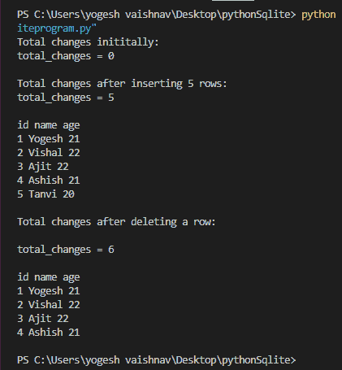

# 统计将 SQLite 连接到 Python 后所做更改的总数

> 原文:[https://www . geeksforgeeks . org/count-连接后进行的更改总数-sqlite-to-python/](https://www.geeksforgeeks.org/count-total-number-of-changes-made-after-connecting-sqlite-to-python/)

在本文中，我们将看到如何计算总的变化，因为使用 Python 打开了 SQLite 数据库连接。要获取更改的总数，我们使用连接对象的 *total_changes* 属性。

> **类实例:** sqlite3。关系
> 
> **语法:** < connection_object >。更改总数
> 
> **返回值:**自数据库连接打开以来插入、删除、更新的总行数。

出于演示目的，我们将使用存储在*极客数据库*中的*人*表。

**表定义:**

```
CREATE TABLE person(
id INTEGER PRIMARY KEY AUTOINCREMENT,
name TEXT NOT NULL,
age INTEGER NOT NULL);
```


**示例:**

## 蟒蛇 3

```
# Complete python program to get 
# the total no. of change since the
# beginning of the database connection.

# Import sqlite3 module to work with
# SQLite using python.
import sqlite3

# Create connection object by connecting
# to the required database (here geeks.db)
con = sqlite3.connect('c:/sqlite/db/geeks.db')

# SQL string to Create a database table
# named person.
create_table = '''CREATE TABLE person(
                  id INTEGER PRIMARY KEY AUTOINCREMENT,
                  name TEXT NOT NULL,
                  age INTEGER NOT NULL
                  );'''

# Execute the above SQL query.
con.execute(create_table)

# Print the current total no. of changes.
print("Total changes inititally:")
print(f'total_changes = {con.total_changes}\n')

# SQL string to insert records into 
# the table named person.
insert_data = '''INSERT INTO person(name, age)
                  VALUES ("Yogesh",21),
                  ("Vishal", 22),
                  ("Ajit",22),
                  ("Ashish",21),
                  ("Tanvi", 20);'''

# Execute the above SQL query.
con.execute(insert_data)

# Print the current total no. of changes.
print("Total changes after inserting 5 rows:")
print(f'total_changes = {con.total_changes}\n')

# SQL string to Select (retrieve) records
# from a database table named person.
select_data = 'SELECT * FROM  person;'

# Execute the above SQL query.
cursor = con.execute(select_data)

# Create a list of column names of the
# database table named person.
header = [d[0] for d in cursor.description]

# Print the column names separated 
# by a single space.
print(*header)

# Print the retrieved data.
for row in cursor:
  print(*row)
print()

# SQL string to delete a record from a
# database table named person.
delete_data = 'DELETE FROM person WHERE name="Tanvi";'

# Execute the above SQL query.
con.execute(delete_data)

# Print the current total no. of changes.
print("Total changes after deleting a row:")
print(f'\ntotal_changes = {con.total_changes}\n')

# Retrieve the modified (here deleted
# one record/row) data from a database
# table named person.
cursor = con.execute('SELECT * FROM person;')

# Print the retrieved data.
print(*header)
for row in cursor:
  print(*row)
print()

# Commit the changes to persist the
# changes.
con.commit()

# Close the database connection.
con.close()
```

**输出:**

