# 使用 Plotly Express 的新冠肺炎分析和可视化

> 原文:[https://www . geeksforgeeks . org/新冠肺炎-分析和可视化-使用-plotly-express/](https://www.geeksforgeeks.org/covid-19-analysis-and-visualization-using-plotly-express/)

在本文中，我们将讨论分析新冠肺炎数据，并使用 Python 中的 Plotly Express 可视化它。本文涉及创建数十个条形图、折线图、气泡图和散点图。将在这个项目中制作的图表质量将非常好。设想新冠肺炎将主要使用 Plotly Express 这个项目。分析和可视化使人们能够理解复杂的场景，并根据当前的情况对未来做出预测。

该分析从数据科学和可视化分析的角度总结了全球围绕新冠肺炎疫情的建模、模拟和分析工作。它审查了最佳做法和预防措施在各个部门的影响，并使疫情能够利用现有的卫生资源进行管理。

**项目中使用的工具和技术:** Google Colab(运行时类型–GPU)。

**项目建设要求:**

*   [Python 基础知识](https://www.geeksforgeeks.org/python-programming-language/)
*   [对图表的基本理解](https://www.geeksforgeeks.org/data-visualization-different-charts-python/)
*   [数据可视化](https://www.geeksforgeeks.org/data-analysis-visualization-python/)
*   [熊猫](https://www.geeksforgeeks.org/introduction-to-pandas-in-python/)
*   num py
*   [Matplotlib](https://www.geeksforgeeks.org/data-visualization-using-matplotlib/)
*   [剧情表达](https://www.geeksforgeeks.org/animated-data-visualization-using-plotly-express/)
*   [合唱团](https://www.geeksforgeeks.org/choropleth-maps-using-plotly-in-python/)
*   [Wordcloud](https://www.geeksforgeeks.org/generating-word-cloud-python/)

## 逐步实施

### 步骤 1:导入必要的库

任务很简单，一旦成功安装了所有必需的库，就需要将它们导入到工作空间中，因为它们将为分析和可视化提供额外的支持。

**示例:**导入库

## 蟒蛇 3

```py
# Data analysis and Manipulation
import plotly.graph_objs as go
import plotly.io as pio
import plotly.express as px
import pandas as pd

# Data Visualization
import matplotlib.pyplot as plt

# Importing Plotly
import plotly.offline as py
py.init_notebook_mode(connected=True)

# Initializing Plotly
pio.renderers.default = 'colab'
```

### 步骤 2:导入数据集

将三个数据集导入此项目

*   [co vid](https://media.geeksforgeeks.org/wp-content/cdn-uploads/20210903231151/covid.csv)–该数据集包含国家/地区、洲、人口、总病例数、新病例数、总死亡数、新死亡数、总恢复数、新恢复数、活动病例数、严重、严重、总病例数/百万流行数、死亡数/百万流行数、总检测数、检测数/百万流行数、世卫组织地区、iso_alpha。
*   [co vid _ group](https://media.geeksforgeeks.org/wp-content/cdn-uploads/20210903231231/covid_grouped.csv)–该数据集包含日期(从 2001 年 1 月 22 日至 2007 年 7 月 27 日)、国家/地区、确诊、死亡、已恢复、活动、新病例、新死亡、新恢复、世卫组织地区、iso_alpha。
*   [co vid death](https://media.geeksforgeeks.org/wp-content/cdn-uploads/20210903231305/coviddeath.csv)–这个数据集包含了许多新冠肺炎死亡的真实例子以及死亡背后的原因。

要将数据集导入工作空间，可以使用 pandas read_csv()方法。

**语法:**

> read_csv(路径)

### **示例:**导入数据集

## 蟒蛇 3

```py
# Importing Dataset1
dataset1 = pd.read_csv("covid.csv")
dataset1.head()  # returns first 5 rows
```

**输出:**

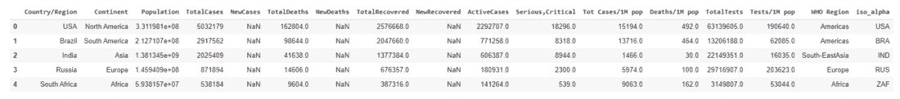

此外，关于我们正在使用的数据集的信息将有助于我们对其进行更好的采样以进行分析。

### **示例:**获取数据集信息

## 蟒蛇 3

```py
# Returns tuple of shape (Rows, columns)
print(dataset1.shape)

# Returns size of dataframe
print(dataset1.size)
```

**输出:**

```py
(209, 17)
3553
```

### **示例:**数据集信息

## 蟒蛇 3

```py
# Information about Dataset1
# return concise summary of dataframe
dataset1.info()  
```

**输出:**

```py
<class 'pandas.core.frame.DataFrame'>
RangeIndex: 209 entries, 0 to 208
Data columns (total 17 columns):
 #   Column            Non-Null Count  Dtype  
---  ------            --------------  -----  
 0   Country/Region    209 non-null    object 
 1   Continent         208 non-null    object 
 2   Population        208 non-null    float64
 3   TotalCases        209 non-null    int64  
 4   NewCases          4 non-null      float64
 5   TotalDeaths       188 non-null    float64
 6   NewDeaths         3 non-null      float64
 7   TotalRecovered    205 non-null    float64
 8   NewRecovered      3 non-null      float64
 9   ActiveCases       205 non-null    float64
 10  Serious,Critical  122 non-null    float64
 11  Tot Cases/1M pop  208 non-null    float64
 12  Deaths/1M pop     187 non-null    float64
 13  TotalTests        191 non-null    float64
 14  Tests/1M pop      191 non-null    float64
 15  WHO Region        184 non-null    object 
 16  iso_alpha         209 non-null    object 
dtypes: float64(12), int64(1), object(4)
memory usage: 27.9+ KB
```

类似地，可以导入和探索其他数据集。

### **示例:我**导入数据集

## 蟒蛇 3

```py
# Importing Dataset2
dataset2 = pd.read_csv("covid_grouped.csv")
dataset2.head()  # return first 5 rows of dataset2
```

**输出:**

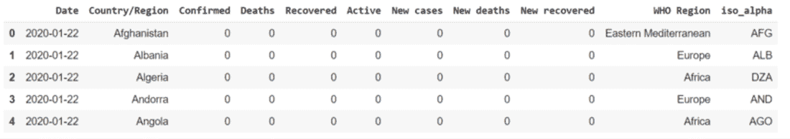

### **示例:**获取数据集信息

## 蟒蛇 3

```py
# Returns tuple of shape (Rows, columns)
print(dataset2.shape)

# Returns size of dataframe
print(dataset2.size)
```

**输出:**

```py
(35156, 11)
386716
```

### **示例:**数据集信息

## 蟒蛇 3

```py
# Information about Dataset2
dataset2.info()  # return concise summary of dataframe
```

**输出:**

```py
<class 'pandas.core.frame.DataFrame'>
RangeIndex: 35156 entries, 0 to 35155
Data columns (total 11 columns):
 #   Column          Non-Null Count  Dtype 
---  ------          --------------  ----- 
 0   Date            35156 non-null  object
 1   Country/Region  35156 non-null  object
 2   Confirmed       35156 non-null  int64 
 3   Deaths          35156 non-null  int64 
 4   Recovered       35156 non-null  int64 
 5   Active          35156 non-null  int64 
 6   New cases       35156 non-null  int64 
 7   New deaths      35156 non-null  int64 
 8   New recovered   35156 non-null  int64 
 9   WHO Region      35156 non-null  object
 10  iso_alpha       35156 non-null  object
dtypes: int64(7), object(4)
memory usage: 3.0+ MB
```

### 步骤 3:数据集清理

数据清理是更改、修改记录集、纠正数据库中的错误记录并识别数据的不完整、不正确或不相关部分，然后删除脏数据的过程。

### **示例:**获取数据集列

## 蟒蛇 3

```py
# Columns labels of a Dataset1
dataset1.columns
```

**输出:**

> 索引(['国家/地区'，'大陆'，'人口'，'总病例数'，'新增病例数'，'总死亡数'，'新增死亡数'，'总恢复数'，'新增恢复数'，'活动病例'，'严重，严重'，'总病例数/百万例'，'死亡数/百万例'，'总检测数'，'检测数/百万例'，'世卫组织地区'，' iso_alpha']，dtype= '对象')

我们不需要“新病例”、“新死亡”、“新恢复”列，因为它们包含 NaN 值。所以把熊猫的 drop()函数的这些列去掉。

**语法:**

> 拖放(列名)

### **示例:**清理数据框

## 蟒蛇 3

```py
# Drop NewCases, NewDeaths, NewRecovered rows from dataset1

dataset1.drop(['NewCases', 'NewDeaths', 'NewRecovered'], 
              axis=1, inplace=True)

# Select random set of values from dataset1
dataset1.sample(5)
```

**输出:**

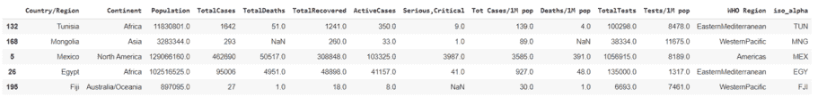

让我们通过 plotly express 中已有的 table 函数创建一个表。

### **示例:**使用 plotly express 创建表格

## 蟒蛇 3

```py
# Import create_table Figure Factory

from plotly.figure_factory import create_table

colorscale = [[0, '#4d004c'], [.5, '#f2e5ff'], [1, '#ffffff']]
table = create_table(dataset1.head(15), colorscale=colorscale)
py.iplot(table)
```

**输出:**

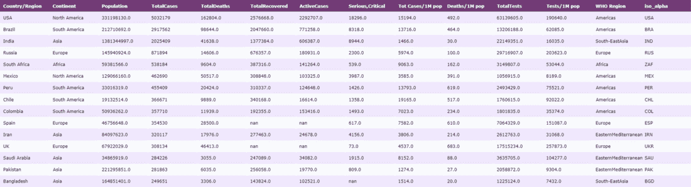

### 第 4 步:条形图-根据总病例数、总死亡数、总恢复数和总检测数对 COVID 感染国家进行比较

使用一行代码，我们将使用 Plotly Express 创建惊人的图形。可视化可以通过在任何图中移动光标来轻松完成，我们可以通过使用光标直接获得标签存在点。我们可以使用列之间的关系来可视化和分析每个方面的数据集。

主要根据前 15 个国家/地区的病例总数来查看国家/地区，并将病例总数和悬停数据着色为“国家/地区”、“大陆”。

### **示例:**条形图

## 蟒蛇 3

```py
px.bar(dataset1.head(15), x = 'Country/Region', 
       y = 'TotalCases',color = 'TotalCases', 
       height = 500,hover_data = ['Country/Region', 'Continent'])
```

**输出:**

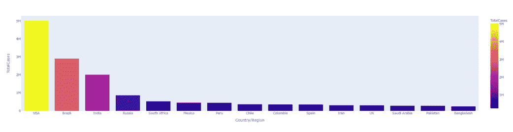

由于该图清楚地显示了前 15 个国家的数据，现在再次以该国前 15 个国家的病例总数为例，将死亡总数悬停数据着色为“国家/地区”、“大陆”，并分析可视化。

### **示例:**条形图

## 蟒蛇 3

```py
px.bar(dataset1.head(15), x = 'Country/Region', y = 'TotalCases',
       color = 'TotalDeaths', height = 500,
       hover_data = ['Country/Region', 'Continent'])
```

**输出:**

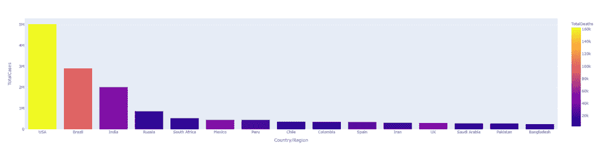

让我们通过给已恢复病例的总数着色来进行分析

### **示例:**条形图

## 蟒蛇 3

```py
px.bar(dataset1.head(15), x = 'Country/Region', y = 'TotalCases',
       color = 'TotalDeaths', height = 500,
       hover_data = ['Country/Region', 'Continent'])
```

**输出:**

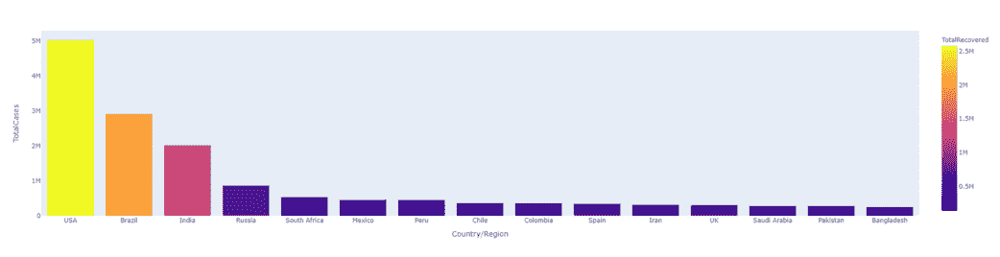

通过对测试总数进行着色，再次可视化相同的内容。

### **示例:**条形图

## 蟒蛇 3

```py
px.bar(dataset1.head(15), x = 'Country/Region', y = 'TotalCases',
       color = 'TotalTests', height = 500, hover_data = ['Country/Region', 'Continent'])
```

**输出:**

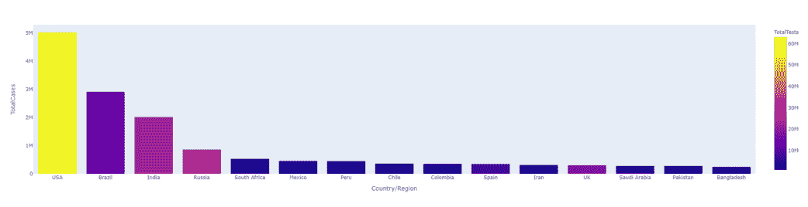

可视化可以像我们对总病例数、死亡数、恢复数和检测数排名前 15 的国家所做的那样。我们可以通过看它们来分析情节。

让我们创建一个水平方向图，X 轴为“总测试”，Y 轴为“国家/地区”，并传递参数方向=“h”，然后用“总测试”给图着色。

### **例:B** ar 图

## 蟒蛇 3

```py
px.bar(dataset1.head(15), x = 'TotalTests', y = 'Country/Region',
       color = 'TotalTests',orientation ='h',  height = 500,
       hover_data = ['Country/Region', 'Continent'])
```

**输出:**

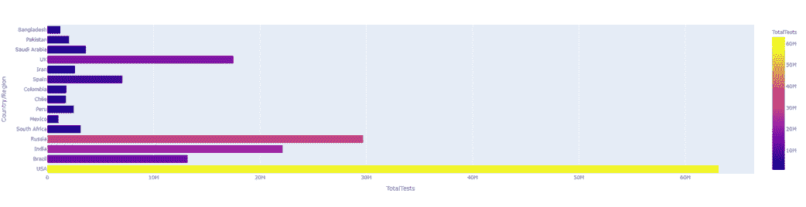

让我们看看“TotalTests”后面跟着“大陆”，并用“大陆”给情节涂上颜色。

### **示例:**条形图

## 蟒蛇 3

```py
px.bar(dataset1.head(15), x = 'TotalTests', y = 'Continent',
       color = 'TotalTests',orientation ='h',  height = 500,
       hover_data = ['Country/Region', 'Continent'])
```

**输出:**

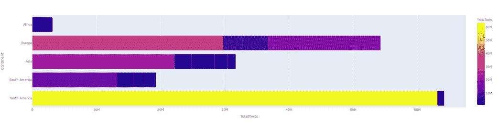

总测试和大陆(水平方向)

### 第五步:通过气泡图进行数据可视化-大陆方向

让我们创建一个散点图，看看大陆的统计数据，首先按大陆查看病例总数，并将悬停数据作为“国家/地区”、“大陆”。

### **示例:**散点图

## 蟒蛇 3

```py
px.scatter(dataset1, x='Continent',y='TotalCases', 
           hover_data=['Country/Region', 'Continent'], 
           color='TotalCases', size='TotalCases', size_max=80)
```

**输出:**

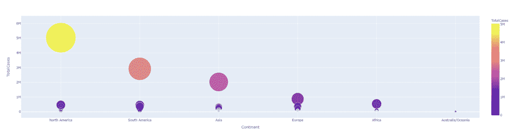

log_y= True，直方图轴(不是返回的参数)以对数刻度表示。返回参数(n，面元)，即面元和面元的值对于对数=真和对数=假是相同的。这意味着 n==n2 和 bins = = bins2 都为真

### **示例:**散点图

## 蟒蛇 3

```py
px.scatter(dataset1.head(57), x='Continent',y='TotalCases', 
           hover_data=['Country/Region', 'Continent'], 
           color='TotalCases', size='TotalCases', size_max=80, log_y=True)
```

**输出:**

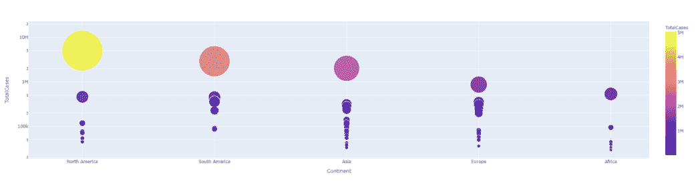

### **示例:**散点图

## 蟒蛇 3

```py
px.scatter(dataset1.head(54), x='Continent',y='TotalTests', 
           hover_data=['Country/Region', 'Continent'], 
           color='TotalTests', size='TotalTests', size_max=80)
```

**输出:**

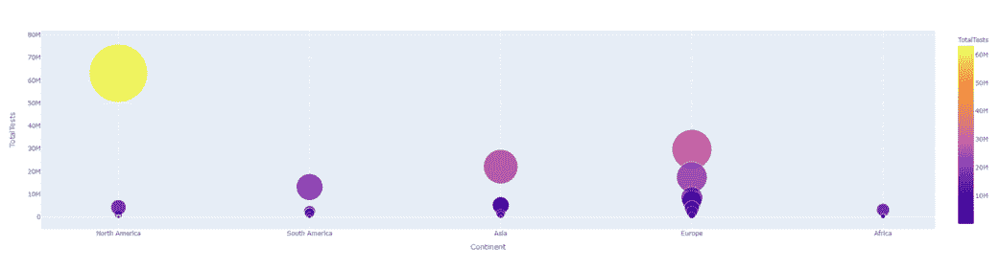

### **示例:**散点图

## 蟒蛇 3

```py
px.scatter(dataset1.head(50), x='Continent',y='TotalTests', 
           hover_data=['Country/Region', 'Continent'], 
           color='TotalTests', size='TotalTests', size_max=80, log_y=True)
```

**输出:**

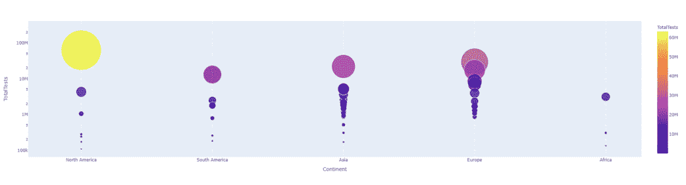

### 第 6 步:通过气泡图实现数据可视化-国家/地区

让我们看一下国家数据可视化，首先只查看前 50 个国家的死亡总人数，并将死亡总人数涂上颜色，并将悬停数据作为“国家/地区”、“大陆”。

### **示例:**气泡图

## 蟒蛇 3

```py
px.scatter(dataset1.head(100), x='Country/Region', y='TotalCases', 
           hover_data=['Country/Region', 'Continent'],
           color='TotalCases', size='TotalCases', size_max=80)
```

**输出:**

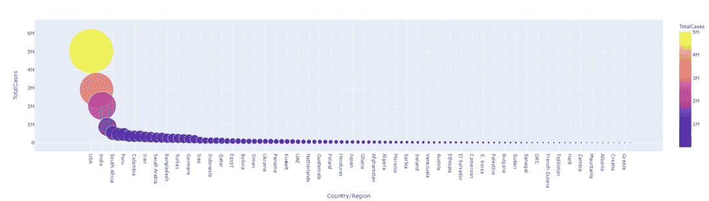

现在，关于病例总数的国家/地区仅用于排名前 30 的国家和地区，对病例总数进行着色，并将悬停数据作为“国家/地区”、“大陆”。

### **示例**:气泡图

## 蟒蛇 3

```py
px.scatter(dataset1.head(30), x='Country/Region', y='TotalCases', 
           hover_data=['Country/Region', 'Continent'],
           color='Country/Region', size='TotalCases', size_max=80, log_y=True)
```

**输出:**

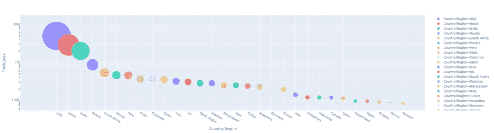

现在根据死亡总数格式化国家/地区的图像。对数据集 1 中新冠肺炎的其他方面也是如此。

### **示例:**气泡图

## 蟒蛇 3

```py
px.scatter(dataset1.head(10), x='Country/Region', y= 'TotalDeaths', 
           hover_data=['Country/Region', 'Continent'],
           color='Country/Region', size= 'TotalDeaths', size_max=80)
```

**输出:**

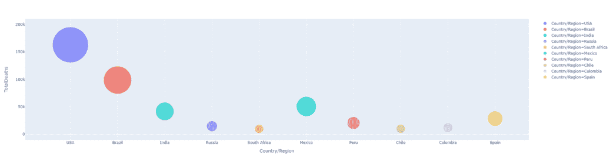

### **示例:**气泡图

## 蟒蛇 3

```py
px.scatter(dataset1.head(30), x='Country/Region', y= 'Tests/1M pop', 
           hover_data=['Country/Region', 'Continent'],
           color='Country/Region', size= 'Tests/1M pop', size_max=80)
```

**输出:**

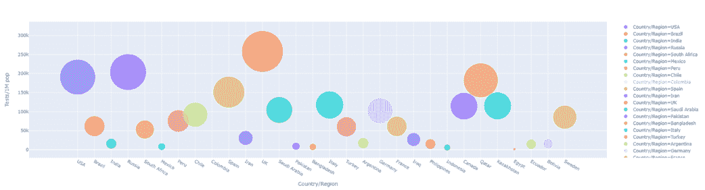

### **示例:**国家/地区 VS 测试/1M 持久性有机污染物(测试色标/1M 持久性有机污染物)

## 蟒蛇 3

```py
px.scatter(dataset1.head(30), x='Country/Region', y= 'Tests/1M pop', 
           hover_data=['Country/Region', 'Continent'],
           color='Tests/1M pop', size= 'Tests/1M pop', size_max=80)
```

**输出:**

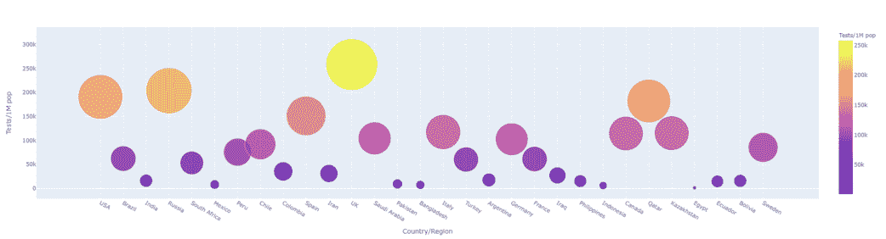

### **示例:**气泡图

## 蟒蛇 3

```py
px.scatter(dataset1.head(30), x='TotalCases', y= 'TotalDeaths', 
           hover_data=['Country/Region', 'Continent'],
           color='TotalDeaths', size= 'TotalDeaths', size_max=80)
```

**输出:**

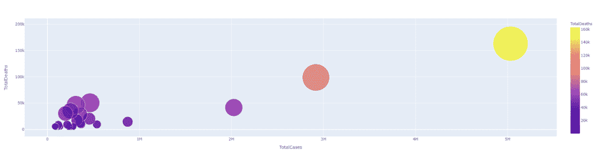

从结果中可以清楚地看出，它们在病例总数和死亡总数之间具有线性关系。这意味着更多的病例，更多的死亡。

### **示例:**气泡图

## 蟒蛇 3

```py
px.scatter(dataset1.head(30), x='TotalCases', y= 'TotalDeaths', 
           hover_data=['Country/Region', 'Continent'],
           color='TotalDeaths', size= 'TotalDeaths', size_max=80, 
           log_x=True, log_y=True)
```

**输出:**

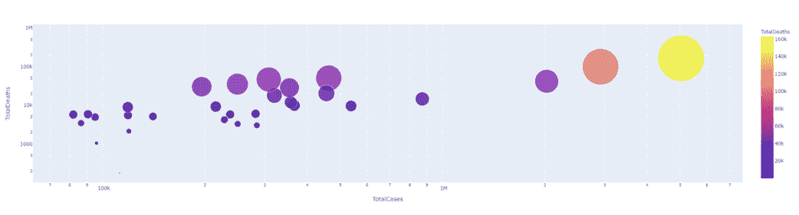

总病例数与总死亡数(log _ y =真)

### **示例:B** 子图表

## 蟒蛇 3

```py
px.scatter(dataset1.head(30), x='TotalTests', y= 'TotalCases', 
           hover_data=['Country/Region', 'Continent'],
           color='TotalTests', size= 'TotalTests', size_max=80, 
           log_x=True, log_y=True)
```

**输出:**

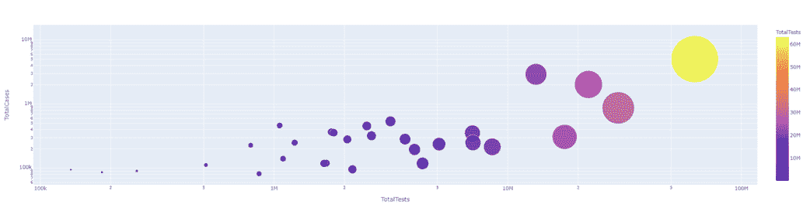

totaltestes vs totalcases 测试总数 VS TotalCases

### 第 7 步:高级数据可视化-所有顶级感染国家的条形图

在本任务中，我们将使用条形图和图表探索新冠肺炎数据，并使用数据集 2，因为它有日期列。

### **示例:**条形图

## 蟒蛇 3

```py
px.bar(dataset2, x="Date", y="Confirmed", color="Confirmed", 
       hover_data=["Confirmed", "Date", "Country/Region"], height=400)
```

**输出:**

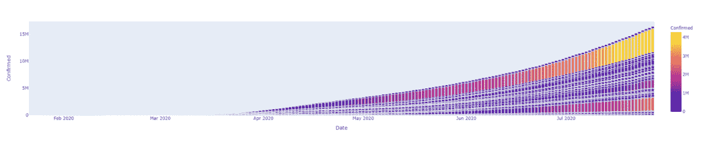

上图是我们得到的输出，其中包括了所有国家的恢复病例。我们可以想象日冕案例按日期的指数增长。我们可以使用 log 函数来更清楚地说明这一点。

### **例:B** ar 图

## 蟒蛇 3

```py
px.bar(dataset2, x="Date", y="Confirmed", color="Confirmed", 
       hover_data=["Confirmed", "Date", "Country/Region"],log_y=True, height=400)
```

**输出:**

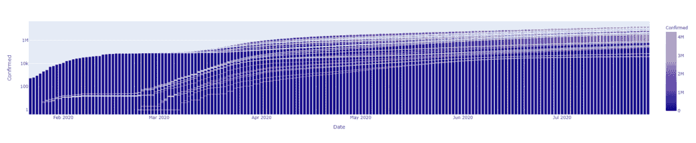

让我们想象死亡，而不是用同样的确认，并按日期给它涂上颜色。

### **示例:**条形图

## 蟒蛇 3

```py
px.bar(dataset2, x="Date", y="Deaths", color="Deaths", 
       hover_data=["Confirmed", "Date", "Country/Region"],
       log_y=False, height=400)
```

**输出:**

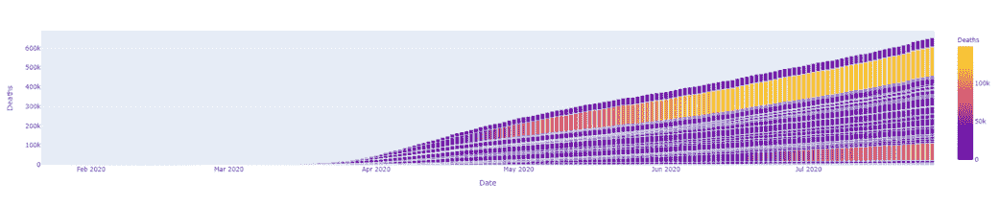

### 步骤 8:特定国家的 COVID 数据可视化:(美国)

在这个具体的任务中，我们将分析美国国家的数据。

### **示例:**细化数据集以仅获取美国数据

## 蟒蛇 3

```py
df_US= dataset2.loc[dataset2["Country/Region"]=="US"]
```

现在让我们绘制并研究美国的 covid 情况。

### **例:B** ar 图

## 蟒蛇 3

```py
px.bar(df_US, x="Date", y="Confirmed", color="Confirmed", height=400)
```

**输出:**

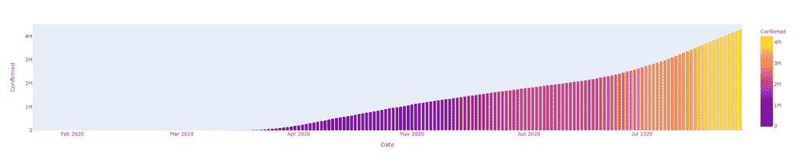

在这里，我们可以清楚地看到美国确诊病例相对于时间(2020 年 1 月至 2020 年 7 月)是如何增加的。同样，我们可以对恢复的病例、测试和死亡进行同样的检查。

### **例:B** ar 图

## 蟒蛇 3

```py
px.bar(df_US,x="Date", y="Recovered", color="Recovered", height=400)
```

**输出:**

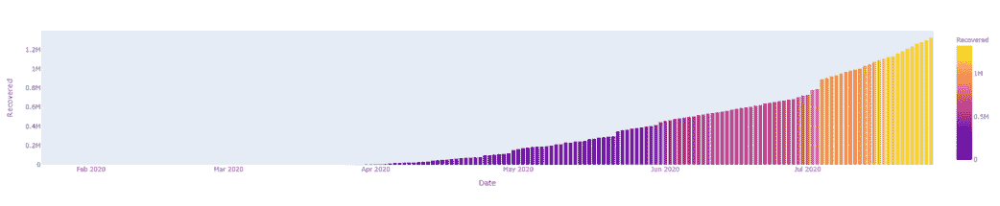

同样，我们可以用各种方法分析数据，以生成相同的折线图。

### **示例**:线图

## 蟒蛇 3

```py
px.line(df_US,x="Date", y="Recovered", height=400)
```

**输出:**

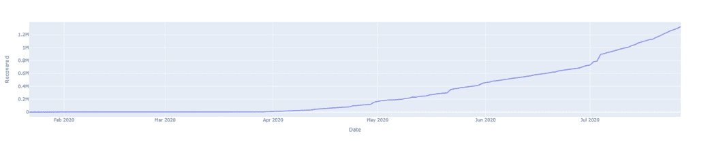

### **示例**:线图

## 蟒蛇 3

```py
px.line(df_US,x="Date", y="Deaths", height=400)
```

**输出:**

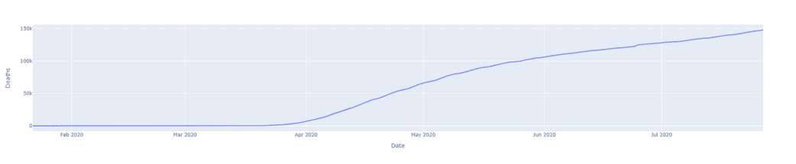

### **示例**:线图

## 蟒蛇 3

```py
px.line(df_US,x="Date", y="Confirmed", height=400)
```

**输出:**

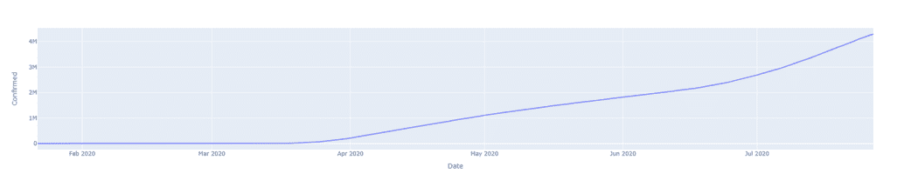

### **示例**:线图

## 蟒蛇 3

```py
px.line(df_US,x="Date", y="New cases", height=400)
```

**输出:**

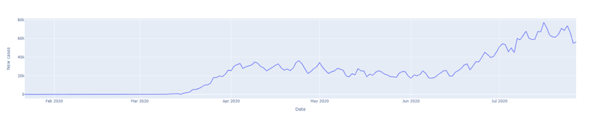

现在让我们创建条形图，并用它来研究美国的情况。

### **示例:**条形图

## 蟒蛇 3

```py
px.bar(df_US,x="Date", y="New cases", height=400)
```

**输出:**

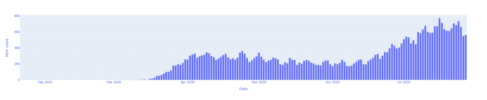

同样，让我们也绘制一个线条图。

### **示例:**散点图

## 蟒蛇 3

```py
px.scatter(df_US, x="Confirmed", y="Deaths", height=400)
```

**输出:**

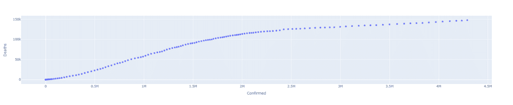

### 步骤 9:以地图的形式可视化数据

我们可以使用 choropleth 以地图的形式可视化数据，地图通常是可视化数据的主要方式。因为新冠肺炎是一个全球性的现象，所以我们通过墙壁地图来审视和修正它们。正交图形、矩形和自然地球投影，以**数据集 2** 可视化数据，因为它有日期列。它将把新冠肺炎的发展(从 2020 年 1 月到 7 月)看作是病毒如何传播到世界各地。

Choropleth 是地图上数据的惊人表示。地理地图提供了一种简单的方法来可视化一个测量值在地理区域的变化-生活

真实地形图中的项目应用显示与数据变量相关的彩色、阴影或图案化的分割地理区域。

**等矩形投影:**

> **语法:**氯过多()
> 
> **参数:**
> 
> *   资料组
> *   位置= ISOALPHA
> *   颜色
> *   悬停名称
> *   color_continuous_scale= [RdYlGn，Blues，Viridis…]
> *   动画 _ 帧=日期

### **示例:**创建地图

## 蟒蛇 3

```py
px.choropleth(dataset2,
              locations="iso_alpha",
              color="Confirmed",
              hover_name="Country/Region", 
              color_continuous_scale="Blues",
              animation_frame="Date")
```

**输出:**

<video class="wp-video-shortcode" id="video-673283-1" width="640" height="360" preload="metadata" controls=""><source type="video/mp4" src="https://media.geeksforgeeks.org/wp-content/uploads/20210730174816/ta1.mp4?_=1">[https://media.geeksforgeeks.org/wp-content/uploads/20210730174816/ta1.mp4](https://media.geeksforgeeks.org/wp-content/uploads/20210730174816/ta1.mp4)</video>

这将创建一个包含 2020 年 1 月至 7 月可视化效果的动画。播放这部动画会让大家更清楚病毒是如何在全球传播的。颜色越深，确诊病例越高。

### **示例:**创建地图

## 蟒蛇 3

```py
px.choropleth(dataset2,
              locations='iso_alpha',
              color="Deaths",
              hover_name="Country/Region",
              color_continuous_scale="Viridis",
              animation_frame="Date" )
```

**输出:**

<video class="wp-video-shortcode" id="video-673283-2" width="640" height="360" preload="metadata" controls=""><source type="video/mp4" src="https://media.geeksforgeeks.org/wp-content/uploads/20210807010137/1.mp4?_=2">[https://media.geeksforgeeks.org/wp-content/uploads/20210807010137/1.mp4](https://media.geeksforgeeks.org/wp-content/uploads/20210807010137/1.mp4)</video>

这段代码创建了一个按日期排列的死亡案例动画。通过播放这部动画，将展示世界各地的死亡人数是如何增加的。

自然地球投影是世界地图的折衷伪圆柱地图投影。

### **例:**自然地球投影

## 蟒蛇 3

```py
px.choropleth(dataset2,
              locations='iso_alpha',
              color="Recovered",
              hover_name="Country/Region",
              color_continuous_scale="RdYlGn",
              projection="natural earth",
              animation_frame="Date" )
```

**输出:**

<video class="wp-video-shortcode" id="video-673283-3" width="640" height="360" preload="metadata" controls=""><source type="video/mp4" src="https://media.geeksforgeeks.org/wp-content/uploads/20210807010643/2.mp4?_=3">[https://media.geeksforgeeks.org/wp-content/uploads/20210807010643/2.mp4](https://media.geeksforgeeks.org/wp-content/uploads/20210807010643/2.mp4)</video>

通过运行输出，事情开始变得更加清楚恢复率如何随着日期而变化。让我们也看看如何将动画添加到条形图中。我们可以使用数据集 2 中的**日期**列将条形图转换为动画。

### **示例:**条形图动画

## 蟒蛇 3

```py
px.bar(dataset2, x="WHO Region", y="Confirmed", color="WHO Region", 
       animation_frame="Date", hover_name="Country/Region")
```

**输出:**

<video class="wp-video-shortcode" id="video-673283-4" width="640" height="360" preload="metadata" controls=""><source type="video/mp4" src="https://media.geeksforgeeks.org/wp-content/uploads/20210730192005/t3.mp4?_=4">[https://media.geeksforgeeks.org/wp-content/uploads/20210730192005/t3.mp4](https://media.geeksforgeeks.org/wp-content/uploads/20210730192005/t3.mp4)</video>

运行输出时，动画将从 2020 年 1 月运行到 7 月。它将显示 6 个不同的条形图，每个洲都有自己的颜色代表确诊病例。

### 步骤 10:使用单词云可视化文本

想象由于新冠肺炎造成的死亡原因，因为新冠肺炎以不同的方式影响人们，因此创建了一个词云来想象新冠肺炎死亡的主要原因。要可视化文本，需要遵循的步骤是-

*   用于将数组的数据元素转换为列表。
*   将字符串转换为一个字符串。
*   将字符串转换为单词云

**数据集 3:** 该数据集包含新冠肺炎死亡人数和死亡原因的真实世界示例。

### **示例:**导入数据集

## 蟒蛇 3

```py
dataset3= pd.read_csv("covid+death.csv")
dataset3.head()
```

**输出:**

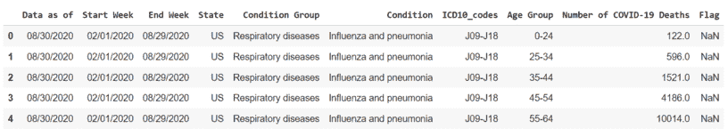

### **示例:**数据集信息

## 蟒蛇 3

```py
dataset3.tail()
```

**输出:**

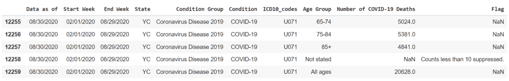

### **示例:G** 设置数据集信息

## 蟒蛇 3

```py
dataset3.groupby(["Condition"]).count()
```

**输出:**

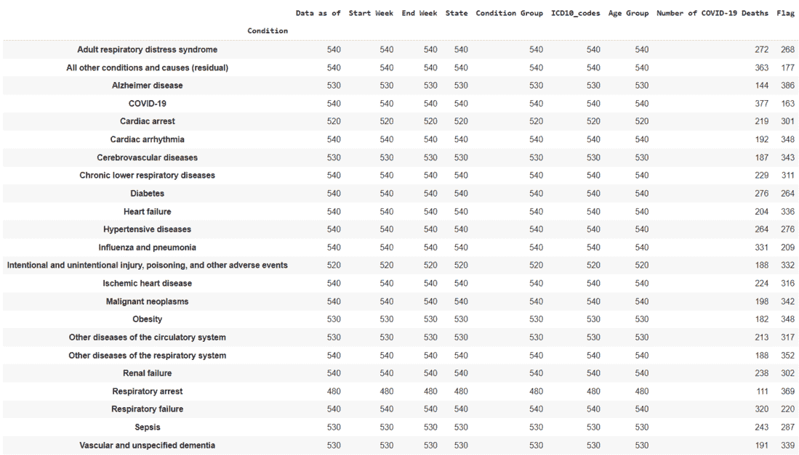

情况

### **示例:C** 创建单词云

## 蟒蛇 3

```py
# import word cloud
from wordcloud import WordCloud

sentences = dataset3["Condition"].tolist()
sentences_as_a_string = ' '.join(sentences)

# Convert the string into WordCloud
plt.figure(figsize=(20, 20))
plt.imshow(WordCloud().generate(sentences_as_a_string))
```

**输出:**

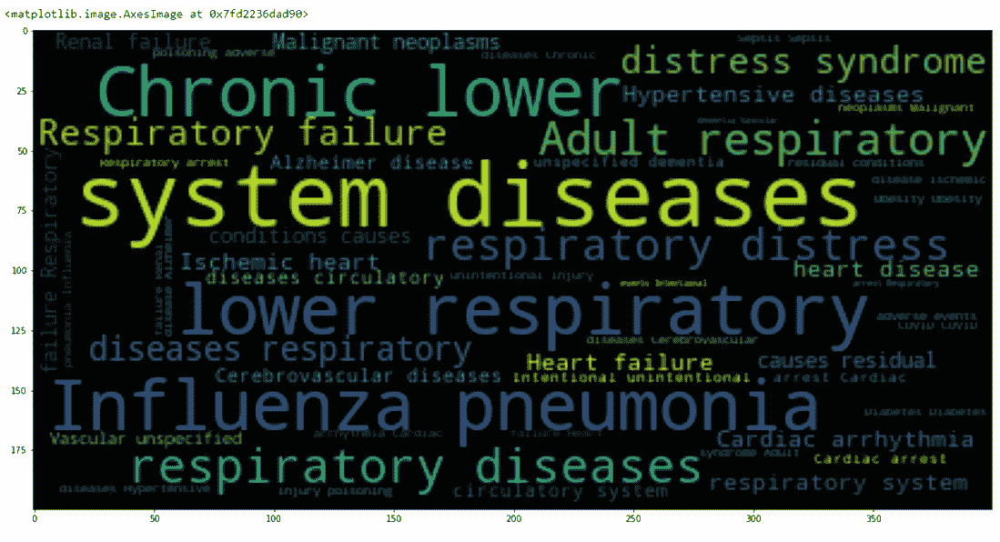

从输出中可以清楚地看到，导致死亡的首要原因是流感肺炎。我们已经将**条件组**转换为列表，并将该列表存储在变量“column_to_list”中。在这里，我们使用**将列表转换为单个字符串，并存储在名为“column2_to_string”的变量中。join()。**

### **示例:C** 创建单词云

## 蟒蛇 3

```py
column2_tolist= dataset3["Condition Group"].tolist()

# Convert the list to one single string
column_to_string= " ".join(column2_tolist)

# Convert the string into WordCloud
plt.figure(figsize=(20,20))
plt.imshow(WordCloud().generate(column_to_string))
```

**输出:**

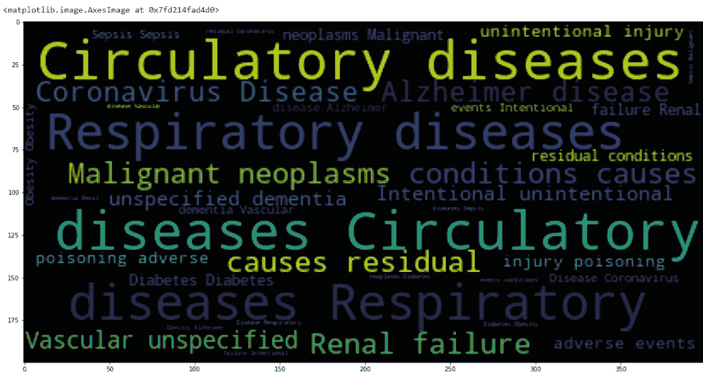

在这里，呼吸系统疾病是死亡的主要原因，其次是循环系统疾病，即心血管疾病。