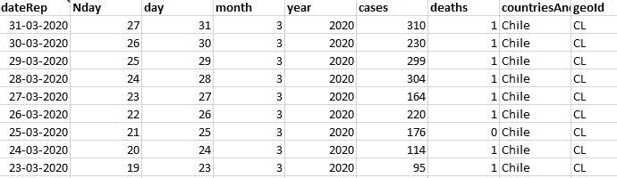
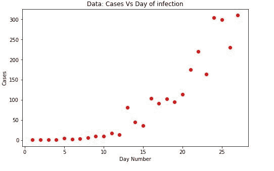
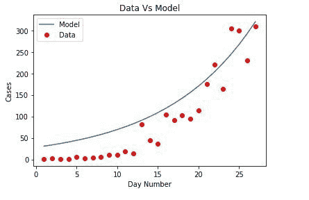
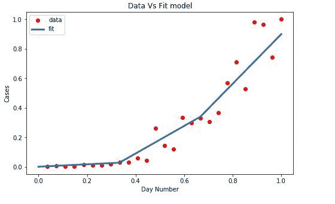

# 使用逻辑函数的新冠肺炎峰值预测

> 原文:[https://www . geeksforgeeks . org/新冠肺炎-峰值-预测-使用-逻辑-函数/](https://www.geeksforgeeks.org/covid-19-peak-prediction-using-logistic-function/)

如今，做出快速、准确的决策至关重要，尤其是现在，当世界面临新冠肺炎这样的现象时，因此，依靠当前和预测的信息对这一过程至关重要。
在这件事上，我们应用了一个模型，在这个模型中，我们可以使用当前的统计信息来观察特定国家案例中的峰值，希望它可以作为在这种情况下采取行动的基础支持。为了实现这一目标，非线性回归已经应用于模型，使用逻辑函数。该过程包括:

*   数据清理
*   选择最适合数据的方程，在本例中为逻辑函数(Sigmoid)
*   数据库规范化
*   使用“曲线拟合”过程将模型拟合到我们的数据集，获得新的参考 beta。
*   模型评估

数据集是公开的，可通过以下链接在 Data.europa.eu 上获得: [DATASET](https://data.europa.eu/euodp/es/data/dataset/covid-19-coronavirus-data)
**数据清理:**可获得的数据最初已被标记。我们能够识别出两个没有提到地理位置的国家，这些信息是添加的，但是对模型的贡献不大。一个名为“n-day”的新列被添加到数据集中，以显示连续天数。

**代码:导入库**

## 蟒蛇 3

```
# import libraries
import pandas as pd
import numpy as np
import matplotlib.pyplot as plt % matplotlib inline

# sklearn specific function to obtain R2 calculations
from sklearn.metrics import r2_score
```

**代码:使用数据**

## 蟒蛇 3

```
# Data Reading
df = pd.read_excel("C:/BaseDato / COVID-19-310302020chi.xlsx")
df.head()
```

**输出:**



**代码:**

## 蟒蛇 3

```
# Initial Data Graphics
plt.figure(figsize =(8, 5))

x_data, y_data = (df["Nday"].values, df["cases"].values)

plt.plot(x_data, y_data, 'ro')
plt.title('Data: Cases Vs Day of infection')
plt.ylabel('Cases')
plt.xlabel('Day Number')
```

**输出:**



**代码:选择模型**
我们应用 logistic 函数，sigmoid 函数的一个具体例子，考虑到原始曲线从缓慢增长开始，在增长之前保持几乎平坦的一段时间，最终它可以以指数曲线的方式下降或保持增长。

逻辑函数的公式为:

```
Y = 1/(1+e^B1(X-B2))
```

**代码:模型的构造**

## 蟒蛇 3

```
# Definition of the logistic function
def sigmoid(x, Beta_1, Beta_2):
     y = 1 / (1 + np.exp(-Beta_1*(x-Beta_2)))
     return y

# Choosing initial arbitrary beta parameters
beta_1 = 0.09
beta_2 = 305

# application of the logistic function using beta
Y_pred = sigmoid(x_data, beta_1, beta_2)

# point prediction
plt.plot(x_data, Y_pred * 15000000000000., label = "Model")
plt.plot(x_data, y_data, 'ro', label = "Data")
plt.title('Data Vs Model')
plt.legend(loc ='best')
plt.ylabel('Cases')
plt.xlabel('Day Number')
```

**输出:**



**数据归一化:**这里，变量 x 和 y 被归一化，给它们分配 0 到 1 的范围(取决于每种情况)。所以两者可以同等关联地解读。
参考–[信息](https://empresas.blogthinkbig.com/precauciones-la-hora-de-normalizar/)

**代码:**

## 蟒蛇 3

```
xdata = x_data / max(x_data)
ydata = y_data / max(y_data)
```

**模型拟合:**
目标是获得新的 B 最优参数，以调整模型到我们的数据。我们使用“曲线拟合”，它使用非线性最小二乘法来拟合 sigmoid 函数。成为我们优化的参数。

**代码:输入**

## 蟒蛇 3

```
from scipy.optimize import curve_fit
popt, pcov = curve_fit(sigmoid, xdata, data)

# imprimir los parámetros finales
print(" beta_1 = % f, beta_2 = % f" % (popt[0], popt[1]))
```

**输出:**

```
beta_1 = 9.833364, beta_2 = 0.777140
```

**代码:新的 Beta 值应用于模型**

## 蟒蛇 3

```
x = np.linspace(0, 40, 4)
x = x / max(x)

plt.figure(figsize = (8, 5))

y = sigmoid(x, *popt)

plt.plot(xdata, ydata, 'ro', label ='data')
plt.plot(x, y, linewidth = 3.0, label ='fit')
plt.title("Data Vs Fit model")
plt.legend(loc ='best')
plt.ylabel('Cases')
plt.xlabel('Day Number')
plt.show()
```



**模型评估:**模型已准备好接受评估。数据在 80:20 分开，分别用于训练和测试。将数据应用于模型，获得相应的统计手段，以评估所得数据与回归线的距离。

**代码:输入**

## 蟒蛇 3

```
# Model accuracy calculation
# Splitting training and testing data

L = np.random.rand(len(df)) < 0.8 # 80 % training data
train_x = xdata[L]
test_x = xdata[~L]
train_y = ydata[L]
test_y = ydata[~L]

# Construction of the model
popt, pcov = curve_fit(sigmoid, train_x, train_y)

# Predicting using testing model
y_predic = sigmoid(test_x, *popt)

# Evaluation
print("Mean Absolute Error: %.2f" % np.mean(np.absolute(y_predic - test_y)))
print("Mean Square Error (MSE): %.2f" % np.mean(( test_y - y_predic)**2))
print("R2-score: %.2f" % r2_score(y_predic, test_y))
```

**输出:**

```
Mean Absolute Error: 0.06
Mean Square Error (MSE): 0.01
R2-score: 0.93
```