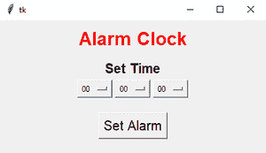

# 使用 Tkinter

创建闹钟

> 原文:[https://www . geesforgeks . org/creat-a-闹钟-使用-tkinter/](https://www.geeksforgeeks.org/creat-an-alarm-clock-using-tkinter/)

**先决条件:**[Python GUI–tkinter](https://www.geeksforgeeks.org/python-gui-tkinter/)、 [winsound、](https://www.geeksforgeeks.org/python-winsound-module/) [time](https://www.geeksforgeeks.org/python-time-time-method/) 、 [datetime](https://www.geeksforgeeks.org/python-datetime-module-with-examples/) 。

众所周知，如今按时醒来是一项非常困难的任务。解决办法是闹钟。在本文中，我们将学习如何使用 Python 中的 Tkinter 创建闹钟。没有警报，几个人会睡过头，工作到很晚。闹钟也可能有助于保持睡眠规律。

*   **Tkinter:** Python 为开发 GUI(图形用户界面)提供了多种选择。在所有的图形用户界面策略中，tkinter 是最常用的技术。这是 Python 附带的 Tk 图形用户界面工具包的习惯 Python 接口。
*   **Winsound:**Winsound 模块提供了对 Windows 平台提供的基本声音播放机制的访问。它包括函数和许多其他常数。按下电脑的扬声器。
*   **时间:**Python 中的时间模块提供了各种与时间相关的功能。该模块附带 Python 的普通模块。
*   **datetime:**datetime 的主要重点是使访问与日期、时间和时区相关联的事物的属性变得更加简单。

**下图是 GUI 的样子:-**



**我们来了解一下分步实施:**

**步骤 1:** 导入所需库

## 蟒蛇 3

```py
# Import Required Library
from tkinter import *
import datetime
import time
import winsound
```

**步骤 2:** 添加按钮、标签、框架和选项菜单

**语法:**

> #按钮
> 
> 按钮(对象名称，文本=“输入文本”，* *属性)
> 
> #标签
> 
> 标签(对象名称，文本=“输入文本”，命令=“输入命令”，* *属性)
> 
> #框架
> 
> 框架(对象名称，* *属性)
> 
> #选项菜单
> 
> 选项菜单(“对象名”、“数据类型”、“元组形式的值列表”、“属性”)

我们将创建一个三选项菜单:-

*   小时(00–24)
*   分钟(00–60)
*   秒(00–60)

时间是 24 小时制。

**第三步:**制作一个名为**闹钟()**的功能，执行闹钟工作。

## 蟒蛇 3

```py
def alarm():
    # Infinite Loop
    while True:
        # Set Alarm
        set_alarm = f"{hour.get()}:{minute.get()}:{second.get()}"

        # Wait for one seconds
        time.sleep(1)

        # Get current time
        current_time = datetime.datetime.now().strftime("%H:%M:%S")

        # Check whether set alarm is equal to current time or not
        if current_time == set_alarm:
            print("Time to Wake up")
            # Playing sound
            winsound.PlaySound("sound.wav",winsound.SND_ASYNC)
```

**以下是完整实现:**

*   制作无限循环
*   从用户处获取小时、分钟、秒的值
*   使用**时间**模块等待一秒钟
*   使用**日期时间**模块获取当前时间
*   检查当前时间是否等于设定时间；使用 **winsound** 模块播放声音

## 蟒蛇 3

```py
# Import Required Library
from tkinter import *
import datetime
import time
import winsound
from threading import *

# Create Object
root = Tk()

# Set geometry
root.geometry("400x200")

# Use Threading
def Threading():
    t1=Thread(target=alarm)
    t1.start()

def alarm():
    # Infinite Loop
    while True:
        # Set Alarm
        set_alarm_time = f"{hour.get()}:{minute.get()}:{second.get()}"

        # Wait for one seconds
        time.sleep(1)

        # Get current time
        current_time = datetime.datetime.now().strftime("%H:%M:%S")
        print(current_time,set_alarm_time)

        # Check whether set alarm is equal to current time or not
        if current_time == set_alarm_time:
            print("Time to Wake up")
            # Playing sound
            winsound.PlaySound("sound.wav",winsound.SND_ASYNC)

# Add Labels, Frame, Button, Optionmenus
Label(root,text="Alarm Clock",font=("Helvetica 20 bold"),fg="red").pack(pady=10)
Label(root,text="Set Time",font=("Helvetica 15 bold")).pack()

frame = Frame(root)
frame.pack()

hour = StringVar(root)
hours = ('00', '01', '02', '03', '04', '05', '06', '07',
         '08', '09', '10', '11', '12', '13', '14', '15',
         '16', '17', '18', '19', '20', '21', '22', '23', '24'
        )
hour.set(hours[0])

hrs = OptionMenu(frame, hour, *hours)
hrs.pack(side=LEFT)

minute = StringVar(root)
minutes = ('00', '01', '02', '03', '04', '05', '06', '07',
           '08', '09', '10', '11', '12', '13', '14', '15',
           '16', '17', '18', '19', '20', '21', '22', '23',
           '24', '25', '26', '27', '28', '29', '30', '31',
           '32', '33', '34', '35', '36', '37', '38', '39',
           '40', '41', '42', '43', '44', '45', '46', '47',
           '48', '49', '50', '51', '52', '53', '54', '55',
           '56', '57', '58', '59', '60')
minute.set(minutes[0])

mins = OptionMenu(frame, minute, *minutes)
mins.pack(side=LEFT)

second = StringVar(root)
seconds = ('00', '01', '02', '03', '04', '05', '06', '07',
           '08', '09', '10', '11', '12', '13', '14', '15',
           '16', '17', '18', '19', '20', '21', '22', '23',
           '24', '25', '26', '27', '28', '29', '30', '31',
           '32', '33', '34', '35', '36', '37', '38', '39',
           '40', '41', '42', '43', '44', '45', '46', '47',
           '48', '49', '50', '51', '52', '53', '54', '55',
           '56', '57', '58', '59', '60')
second.set(seconds[0])

secs = OptionMenu(frame, second, *seconds)
secs.pack(side=LEFT)

Button(root,text="Set Alarm",font=("Helvetica 15"),command=Threading).pack(pady=20)

# Execute Tkinter
root.mainloop()
```

**输出:**

<video class="wp-video-shortcode" id="video-540736-1" width="640" height="360" preload="metadata" controls=""><source type="video/mp4" src="https://media.geeksforgeeks.org/wp-content/uploads/20210113111523/FreeOnlineScreenRecorderProject3.mp4?_=1">[https://media.geeksforgeeks.org/wp-content/uploads/20210113111523/FreeOnlineScreenRecorderProject3.mp4](https://media.geeksforgeeks.org/wp-content/uploads/20210113111523/FreeOnlineScreenRecorderProject3.mp4)</video>