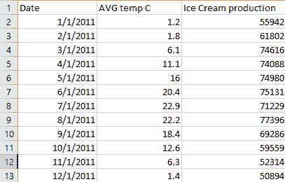

# 使用 Python 创建关联矩阵

> 原文:[https://www . geeksforgeeks . org/create-a-correlation-matrix-using-python/](https://www.geeksforgeeks.org/create-a-correlation-matrix-using-python/)

相关矩阵是包含变量之间相关系数的表格。表格中的每个单元格代表两个变量之间的相关性。该值介于-1 和 1 之间。相关矩阵用于总结数据，作为高级分析的诊断和更高级分析的输入。相关性的两个关键组成部分是:

*   **震级:**震级越大，相关性越强。
*   **符号:**如果为正，则有规律的相关性。如果为负，则存在反向相关性。

使用以下两个库创建了相关矩阵:

1.  数字图书馆
2.  熊猫图书馆

**方法 1:使用 Numpy 库创建相关矩阵**

Numpy 库利用 corrcoef()函数返回一个 2×2 的矩阵。该矩阵由 x 与 x (0，0)、x 与 y (0，1)、y 与 x (1，0)和 y 与 y (1，1)的相关性组成。我们只关心 x 与 y 的相关性，即像元(0，1)或(1，0)。下面是一个例子。

**示例 1:** 假设一家冰淇淋店记录了当天冰淇淋的总销量与温度的关系。

## 蟒蛇 3

```py
import numpy as np

# x represents the total sale in
# dollers
x = [215, 325, 185, 332, 406, 522, 412,
     614, 544, 421, 445, 408],

# y represents the temperature on
# each day of sale
y = [14.2, 16.4, 11.9, 15.2, 18.5, 22.1,
     19.4, 25.1, 23.4, 18.1, 22.6, 17.2]

# create correlation matrix
matrix = np.corrcoef(x, y)

# print matrix
print(matrix)
```

**输出**

```py
[[1\.         0.95750662]
 [0.95750662 1\.        ]]
```

从上面的矩阵中，如果我们看到单元格(0，1)和(1，0)都具有等于 0.95750662 的相同值，这使我们得出结论，无论何时温度高，我们都有更多的销售额。

**例 2:** 假设给定男孩的葡萄糖水平与年龄相对应。找出年龄(x)和体内葡萄糖水平(y)之间的相关性。

## 蟒蛇 3

```py
import numpy as np

# x represents the age
x = [43, 21, 25, 42, 57, 59]

# y represents the glucose level
# corresponding to that age
y = [99, 65, 79, 75, 87, 81]

# correlation matrix
matrix = np.corrcoef(x, y)
print(matrix)
```

**输出**

```py
[[1\.        0.5298089]
 [0.5298089 1\.       ]]
```

从上面的相关矩阵来看，0.5298089 或 52.98%意味着变量具有中度正相关。

**方法二:利用熊猫库**创建关联矩阵

为了给定数据集创建相关矩阵，我们对数据帧使用 [corr()](https://www.geeksforgeeks.org/python-pandas-dataframe-corr/) 方法。

**例 1:**

## 蟒蛇 3

```py
import pandas as pd

# collect data
data = {
    'x': [45, 37, 42, 35, 39],
    'y': [38, 31, 26, 28, 33],
    'z': [10, 15, 17, 21, 12]
}

# form dataframe
dataframe = pd.DataFrame(data, columns=['x', 'y', 'z'])
print("Dataframe is : ")
print(dataframe)

# form correlation matrix
matrix = dataframe.corr()
print("Correlation matrix is : ")
print(matrix)
```

**输出:**

```py
Dataframe is : 
    x   y   z
0  45  38  10
1  37  31  15
2  42  26  17
3  35  28  21
4  39  33  12
Correlation matrix is :
          x         y         z
x  1.000000  0.518457 -0.701886
y  0.518457  1.000000 -0.860941
z -0.701886 -0.860941  1.000000
```

**例 2:**

**使用的 CSV 文件:**



## 蟒蛇 3

```py
import pandas as pd

# create dataframe from file
dataframe = pd.read_csv("C:\\GFG\\sample.csv")

# show dataframe
print(dataframe)

# use corr() method on dataframe to
# make correlation matrix
matrix = dataframe.corr()

# print correlation matrix
print("Correlation Matrix is : ")
print(matrix)
```

**输出:**

```py
Correlation Matrix is : 
                     AVG temp C  Ice Cream production
AVG temp C              1.000000              0.718032
Ice Cream production    0.718032              1.000000
```