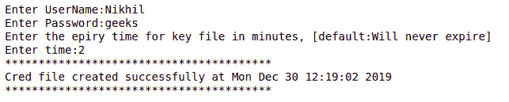

# 使用 Python 创建凭证文件

> 原文:[https://www . geesforgeks . org/create-a-credential-file-use-python/](https://www.geeksforgeeks.org/create-a-credential-file-using-python/)

凭证文件只不过是一个配置文件，带有一点点加密和后端看不见的安全结构。在使用某种云平台时，可能会遇到这种文件。你所要做的就是登录到实例，或者给脚本权限，在没有用户名和密码的情况下做一些事情，这看起来有点不可思议，但是如果你也想这么做呢？假设您创建了一个脚本，登录时只需要很少的配置或凭据。用户每次想要运行代码时都要输入凭证或配置，这非常令人恼火。那么解决办法是什么呢？有很多方法可以做到这一点，但是由于这是关于创建凭据文件，将使用相同的方法。让您的用户创建一个凭据文件或配置文件，稍后脚本可以使用这些文件来获取所需的详细信息。下面是如何做到的。

#### 向脚本添加凭据文件创建者

实际上，这就像复制下面的脚本并将其添加到您的包中一样简单，但是如果您想为您的脚本获取自定义凭据或配置文件，您需要了解一些事情。首先，下面的脚本只接受用户输入，并在一些东西上添加加密，然后将其写入文件。如果您想添加其他数据，只需添加一个新变量或将其直接写入文件。其次，这里的加密是使用加密包中的 Fernet 完成的。因此，密钥存储在一个. key 文件中，如果您确实想让某个第三方破坏加密，请将 Credentials creator 文件转换为。exe 或其他不易读取的格式。

**注意:**所用模块均内置 Python，无需外接安装。

**create red . py–**

## 蟒蛇 3

```py
#CreateCred.py
#Creates a credential file.
from cryptography.fernet import Fernet
import re
import ctypes
import time
import os
import sys

class Credentials():

    def __init__(self):
        self.__username = ""
        self.__key = ""
        self.__password = ""
        self.__key_file = 'key.key'
        self.__time_of_exp = -1

#----------------------------------------
# Getter setter for attributes
#----------------------------------------

    @property
    def username(self):
        return self.__username

    @username.setter
    def username(self,username):
        while (username == ''):
            username = input('Enter a proper User name, blank is not accepted:')
        self.__username = username

    @property
    def password(self):
        return self.__password

    @password.setter
    def password(self,password):
        self.__key = Fernet.generate_key()
        f = Fernet(self.__key)
        self.__password = f.encrypt(password.encode()).decode()
        del f

    @property
    def expiry_time(self):
        return self.__time_of_exp

    @expiry_time.setter
    def expiry_time(self,exp_time):
        if(exp_time >= 2):
            self.__time_of_exp = exp_time

    def create_cred(self):
        """
        This function is responsible for encrypting the password and create  key file for
        storing the key and create a credential file with user name and password
        """

        cred_filename = 'CredFile.ini'

        with open(cred_filename,'w') as file_in:
            file_in.write("#Credential file:\nUsername={}\nPassword={}\nExpiry={}\n"
            .format(self.__username,self.__password,self.__time_of_exp))
            file_in.write("++"*20)

        #If there exists an older key file, This will remove it.
        if(os.path.exists(self.__key_file)):
            os.remove(self.__key_file)

        #Open the Key.key file and place the key in it.
        #The key file is hidden.
        try:

            os_type = sys.platform
            if (os_type == 'linux'):
                self.__key_file = '.' + self.__key_file

            with open(self.__key_file,'w') as key_in:
                key_in.write(self.__key.decode())
                #Hidding the key file.
                #The below code snippet finds out which current os the script is running on and does the task base on it.
                if(os_type == 'win32'):
                    ctypes.windll.kernel32.SetFileAttributesW(self.__key_file, 2)
                else:
                    pass

        except PermissionError:
            os.remove(self.__key_file)
            print("A Permission error occurred.\n Please re run the script")
            sys.exit()

        self.__username = ""
        self.__password = ""
        self.__key = ""
        self.__key_file

def main():

    # Creating an object for Credentials class
    creds = Credentials()

    #Accepting credentials
    creds.username = input("Enter UserName:")
    creds.password = input("Enter Password:")
    print("Enter the epiry time for key file in minutes, [default:Will never expire]")
    creds.expiry_time = int(input("Enter time:") or '-1')

    #calling the Credit
    creds.create_cred()
    print("**"*20)
    print("Cred file created successfully at {}"
    .format(time.ctime()))

    if not(creds.expiry_time == -1):
        os.startfile('expire.py')

    print("**"*20)

if __name__ == "__main__":
    main()
```

**输出:**



#### 正在读取凭据文件

要读取凭证，就像使用 python 文件读取方法读取普通文件一样简单，但是要解密数据，您需要有用于加密的密钥。因此，凭据文件创建者创建了一个凭据文件和一个密钥文件。检索脚本使用密钥文件并解密数据。

## 蟒蛇 3

```py
#Retrieve credentials.

from cryptography.fernet import Fernet
import os

cred_filename = 'CredFile.ini'
key_file = 'key.key'

key = ''

with open('key.key','r') as key_in:
    key = key_in.read().encode()

#If you want the Cred file to be of one
# time use uncomment the below line
#os.remove(key_file)

f = Fernet(key)
with open(cred_filename,'r') as cred_in:
    lines = cred_in.readlines()
    config = {}
    for line in lines:
        tuples = line.rstrip('\n').split('=',1)
        if tuples[0] in ('Username','Password'):
            config[tuples[0]] = tuples[1]

    passwd = f.decrypt(config['Password'].encode()).decode()
    print("Password:", passwd)
```

**输出:**


现在，如果您正确阅读了脚本，您可能会看到一个文件“expire.py”。此脚本在创建凭据文件时启动一个时钟，并删除密钥文件，以便在指定时间结束后不再可能解密。
T1

## 蟒蛇 3

```py
import os
import time

key_file = 'key.key'
key_exp_start = time.time()
cred_filename = 'CredFile.ini'

with open(cred_filename, 'r') as cred_in:

    lines = cred_in.readlines()
    config = {}
    for line in lines:
        tuples = line.rstrip('\n').split('=', 1)

        if tuples[0] in ('Expiry '):
            config[tuples[0]] = tuples[1]

    if not(config['Expiry '] == -1):

        # Time below is in seconds.
        time_for_exp = int(config['Expiry ']) * 60

        while(os.path.isfile(key_file)):
            time.sleep(10)

            if (not(time.time() - key_exp_start <= time_for_exp)
                and os.path.isfile(key_file)):
                os.remove(key_file)
```