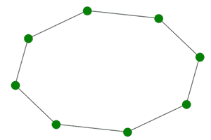

# 使用 Python 中的 Networkx 创建循环图

> 原文:[https://www . geesforgeks . org/create-a-cycle-graph-use-networkx-in-python/](https://www.geeksforgeeks.org/create-a-cycle-graph-using-networkx-in-python/)

循环图是包含单个循环的图，其中所有节点在结构上是等价的，因此不能识别开始和结束节点。

### 属性:

*   循环图中的节点数(C <sub>n</sub> )等于 n
*   循环图中的边数(C <sub>n</sub> )等于 n
*   每个节点连接到 2 条边，因此每个节点的度数为 2。
*   这是一个哈密顿图。
*   这是一个连通图。
*   即使在移除一条边后，它仍然保持连接，因为它是循环的。
*   我们可以简单地通过连接路径图的初始节点和最终节点来获得循环图。

### 使用的模块:

我们将使用网络模块来实现循环图。python 中的这个模块用于可视化和分析不同类型的图形，大多数图形的生成器都是在这个库中预定义的。

它带有一个内置函数 networkx.cycle_graph()，可以使用 networkx.draw()方法来说明。

### 使用的功能:

*   **draw()-** 此功能用于使用 networkx 模块绘制所需的图形。

> **语法:**
> 
> 绘制(G，节点大小，节点颜色)
> 
> **参数:**
> 
> *   g:指的是传递给它的 Cycle graph 对象，这样 draw 方法就能准确知道要打印哪个图形。
> *   node_size:指节点的大小。
> *   node_color:指节点的颜色。

*   **cycle_graph()-** 这个函数用来创建循环图，它给出了创建一个循环图所需的所有信息。

> **语法:**
> 
> networkx.cycle_graph(n)
> 
> **参数:**
> 
> n:此参数用于指定循环图中的节点数。
> 
> **返回:**
> 
> 此方法返回 C <sub>n</sub> (有 n 个节点的循环图)。因此，它用于初始化图形对象 g。

### **进场:**

*   导入模块
*   使用 cycle_graph()构造函数创建循环图对象
*   使用 nx.draw()函数
*   显示图

**程序:**

## 蟒蛇 3

```
# import required module
import networkx

# create object
G = networkx.cycle_graph(8)

# illustrate graph
networkx.draw(G, node_size=150, node_color='green')
```

**输出:**



输出