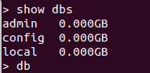
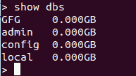

# 使用 Python 在 MongoDB 中创建数据库

> 原文:[https://www . geesforgeks . org/create-a-database-in-MongoDB-using-python/](https://www.geeksforgeeks.org/create-a-database-in-mongodb-using-python/)

[**【MongoDB】**](https://www.geeksforgeeks.org/mongodb-and-python/)是一个通用的、基于文档的、分布式的数据库，是为现代应用程序开发人员和云构建的。它是一个文档数据库，这意味着它将数据存储在类似 JSON 的文档中。这是一种考虑数据的有效方式，比传统的表模型更具表现力和功能性。

MongoDB 没有单独的命令来创建数据库。相反，它使用 use 命令来创建数据库。use 命令用于切换到特定的数据库。如果在 use 关键字后指定的数据库名称不存在，则会使用指定的名称创建一个新数据库。

## 在 MongoDB 中使用 Python 创建数据库

为了在 MongoDB 中使用 Python，我们将导入 PyMongo。由此，可以导入 MongoClient，用于创建数据库的客户端。使用客户端，可以创建新的数据库。

**示例:**

**使用 MongoDB shell 的数据库列表(之前):**



```py
# import MongoClient
from pymongo import MongoClient

# Creating a client
client = MongoClient('localhost', 27017)

# Greating a database name GFG
db = client['GFG']
print("Database is created !!")
```

**输出:**

```py
Database is created!!

```

在上面的例子中，它清楚地显示了数据库是如何创建的。创建客户端时，本地主机及其端口号(此处为 27017)被传递给 MongoClient。然后，通过使用客户端，创建一个名为“GFG”的新数据库。

我们可以使用以下代码检查数据库列表中是否存在该数据库:

```py
list_of_db = client.list_database_names()

if "mydbase" in list_of_db:
    print("Exists !!")
```

**输出:**

```py
Exists!!

```

**MongoDB 外壳中的数据库列表(后):**

