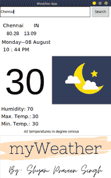

# 使用 Python 中的 openweathermap API 创建天气预报的图形用户界面

> 原文:[https://www . geeksforgeeks . org/create-a-GUI-for-weather-预报-使用-open weather map-API-in-python/](https://www.geeksforgeeks.org/create-a-gui-for-weather-forecast-using-openweathermap-api-in-python/)

**先决条件:** [使用 openweathermap API](https://www.geeksforgeeks.org/python-find-current-weather-of-any-city-using-openweathermap-api/) 查找任何城市的当前天气

本文的想法是为用户提供一个简单的图形用户界面应用程序，以获得他们希望看到的任何城市的当前温度。该系统还为简化应用程序提供了一个简单的用户界面。它还为用户提供了一个令人惊叹的 UX。这个应用程序的特点将是，这将是一个实时天气预报应用程序，返回当前温度，最高和最低温度，湿度，纬度和经度坐标的搜索城市，当前日期和时间。它也可以根据一天中的时间来改变它的主题。

### **Openweathermap API**

**openweathermap** 是一个向 web 服务和移动应用的开发者提供天气数据的服务，包括当前天气数据、预报和历史数据。

### 需要的模块

*   [**Tkinter:**](https://www.geeksforgeeks.org/python-gui-tkinter/)**It是创建 GUI 应用最快最简单的方法。这包含在 Python 标准模块中，所以不需要到外部安装。**
*   ****PIL:** PIL 是 python 图像库，为 Python 解释器提供图像编辑功能。**
*   **[**json:**](https://www.geeksforgeeks.org/working-with-json-data-in-python/) 该模块用于处理 json 文件，内置 Python。所以不需要从外部安装**
*   **[**请求:**](https://www.geeksforgeeks.org/python-requests-tutorial/) 它用于向指定的网址发出 HTTP 请求。这个模块没有内置 Python。要安装它，请在终端中键入以下命令。**

```
pip install requests
```

****以下应用中使用的图像:****

**

moon.png 档案** **

sun.png** **

logo.png** 

**下面是实现。**

## **蟒蛇 3**

```
# python3 -- Weather Application using API

# importing the libraries
from tkinter import *
import requests
import json
import datetime
from PIL import ImageTk, Image

# necessary details
root = Tk()
root.title("Weather App")
root.geometry("450x700")
root['background'] = "white"

# Image
new = ImageTk.PhotoImage(Image.open('logo.png'))
panel = Label(root, image=new)
panel.place(x=0, y=520)

# Dates
dt = datetime.datetime.now()
date = Label(root, text=dt.strftime('%A--'), bg='white', font=("bold", 15))
date.place(x=5, y=130)
month = Label(root, text=dt.strftime('%m %B'), bg='white', font=("bold", 15))
month.place(x=100, y=130)

# Time
hour = Label(root, text=dt.strftime('%I : %M %p'),
             bg='white', font=("bold", 15))
hour.place(x=10, y=160)

# Theme for the respective time the application is used
if int((dt.strftime('%I'))) >= 8 & int((dt.strftime('%I'))) <= 5:
    img = ImageTk.PhotoImage(Image.open('moon.png'))
    panel = Label(root, image=img)
    panel.place(x=210, y=200)
else:
    img = ImageTk.PhotoImage(Image.open('sun.png'))
    panel = Label(root, image=img)
    panel.place(x=210, y=200)

# City Search
city_name = StringVar()
city_entry = Entry(root, textvariable=city_name, width=45)
city_entry.grid(row=1, column=0, ipady=10, stick=W+E+N+S)

def city_name():

    # API Call
    api_request = requests.get("https://api.openweathermap.org/data/2.5/weather?q="
                               + city_entry.get() + "&units=metric&appid="+api_key)

    api = json.loads(api_request.content)

    # Temperatures
    y = api['main']
    current_temprature = y['temp']
    humidity = y['humidity']
    tempmin = y['temp_min']
    tempmax = y['temp_max']

    # Coordinates
    x = api['coord']
    longtitude = x['lon']
    latitude = x['lat']

    # Country
    z = api['sys']
    country = z['country']
    citi = api['name']

    # Adding the received info into the screen
    lable_temp.configure(text=current_temprature)
    lable_humidity.configure(text=humidity)
    max_temp.configure(text=tempmax)
    min_temp.configure(text=tempmin)
    lable_lon.configure(text=longtitude)
    lable_lat.configure(text=latitude)
    lable_country.configure(text=country)
    lable_citi.configure(text=citi)

# Search Bar and Button
city_nameButton = Button(root, text="Search", command=city_name)
city_nameButton.grid(row=1, column=1, padx=5, stick=W+E+N+S)

# Country  Names and Coordinates
lable_citi = Label(root, text="...", width=0, 
                   bg='white', font=("bold", 15))
lable_citi.place(x=10, y=63)

lable_country = Label(root, text="...", width=0, 
                      bg='white', font=("bold", 15))
lable_country.place(x=135, y=63)

lable_lon = Label(root, text="...", width=0,
                  bg='white', font=("Helvetica", 15))
lable_lon.place(x=25, y=95)
lable_lat = Label(root, text="...", width=0,
                  bg='white', font=("Helvetica", 15))
lable_lat.place(x=95, y=95)

# Current Temperature

lable_temp = Label(root, text="...", width=0, bg='white',
                   font=("Helvetica", 110), fg='black')
lable_temp.place(x=18, y=220)

# Other temperature details

humi = Label(root, text="Humidity: ", width=0, 
             bg='white', font=("bold", 15))
humi.place(x=3, y=400)

lable_humidity = Label(root, text="...", width=0,
                       bg='white', font=("bold", 15))
lable_humidity.place(x=107, y=400)

maxi = Label(root, text="Max. Temp.: ", width=0, 
             bg='white', font=("bold", 15))
maxi.place(x=3, y=430)

max_temp = Label(root, text="...", width=0, 
                 bg='white', font=("bold", 15))
max_temp.place(x=128, y=430)

mini = Label(root, text="Min. Temp.: ", width=0, 
             bg='white', font=("bold", 15))
mini.place(x=3, y=460)

min_temp = Label(root, text="...", width=0, 
                 bg='white', font=("bold", 15))
min_temp.place(x=128, y=460)

# Note
note = Label(root, text="All temperatures in degree celsius",
             bg='white', font=("italic", 10))
note.place(x=95, y=495)

root.mainloop()
```

****输出:****

****