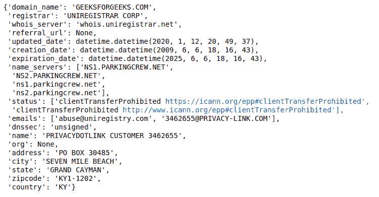

# 创建一个图形用户界面，使用 Tkinter

检查域可用性

> 原文:[https://www . geesforgeks . org/create-a-GUI-to-check-domain-availability-using-tkinter/](https://www.geeksforgeeks.org/create-a-gui-to-check-domain-availability-using-tkinter/)

可能会有这样一种情况，用户想要创建一个网站，并对网站的名称有某些想法，但对它们的可用性感到惊讶。因此，让我们开发一个检查域可用性的图形用户界面。我们将使用**Python-whois**[](https://pypi.org/project/python-whois/)**模块获取该网站的相关信息。它能够提取所有流行顶级域名的数据**

### **装置**

**在编写代码之前，我们需要安装 **python-whois** 模块。要安装此软件，请在终端中键入以下命令。**

```py
pip install python-whois
```

**安装后，让我们用例子编写代码。**

**导入 python-whois 模块并从网站中提取信息**

## **蟒蛇 3**

```py
import whois

whois.whois('geeksforgeeks.com')
```

****输出:****

****

**如果我们得到这种类型的信息，那就意味着这个域名是为 geeksforgeeks 注册的。**

****现在让我们编写检查域可用性的代码。****

## **蟒蛇 3**

```py
# importing modules
import whois
import sys

# Use exception handle program
# and get information from whois
try:
    domain = whois.whois("geeksforgeeks.com")
    if domain.domain_name == None:
        sys.exit(1)

except :
    print("This domain is available")
else:
    print("Oops! this domain already purchased")
```