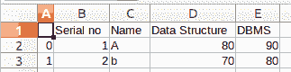

# 用 Python 创建一个 GUI，将 CSV 文件转换成 excel 文件

> 原文:[https://www . geesforgeks . org/create-a-GUI-to-convert-CSV-file-to-excel-file-use-python/](https://www.geeksforgeeks.org/create-a-gui-to-convert-csv-file-into-excel-file-using-python/)

**先决条件:**[Python GUI–tkinter](https://www.geeksforgeeks.org/python-gui-tkinter/)[使用熊猫](https://www.geeksforgeeks.org/python-read-csv-using-pandas-read_csv/)读取 csv

**[CSV 文件是逗号分隔值](https://www.geeksforgeeks.org/writing-csv-files-in-python/)** 文件，使用逗号分隔值。它基本上用于在不同的应用程序之间交换数据。在这种情况下，单独的行用换行符隔开。每行中的数据字段用逗号分隔。

### 需要的模块

*   **Pandas:** Python 是一种很好的数据分析语言，主要是因为以数据为中心的 Python 包的奇妙生态系统。要安装此模块，请在终端中键入以下命令。

    ```py
    pip install pandas
    ```

*   **pandastable:** 这个库为 Tkinter 提供了一个带有绘图和数据操作功能的表格小部件。要安装该模块，在终端中输入以下命令

    ```py
    pip install pandastable
    ```

*   **tkintertable:** 该库用于向 Tkinter 应用程序添加表。要安装此库，请在终端中键入以下命令。

    ```py
    pip install tkintertable
    ```

下面是实现。

**输入 CSV 文件:**



```py
import pandas as pd
from tkinter import *
from tkinter import filedialog
from tkinter import messagebox as msg
from pandastable import Table
from tkintertable import TableCanvas

class csv_to_excel:

    def __init__(self, root):

        self.root = root
        self.file_name = ''
        self.f = Frame(self.root,
                       height = 200,
                       width = 300)

        # Place the frame on root window
        self.f.pack()

        # Creating label widgets
        self.message_label = Label(self.f,
                                   text = 'GeeksForGeeks',
                                   font = ('Arial', 19,'underline'),
                                   fg = 'Green')
        self.message_label2 = Label(self.f,
                                    text = 'Converter of CSV to Excel file',
                                    font = ('Arial', 14,'underline'),
                                    fg = 'Red')

        # Buttons
        self.convert_button = Button(self.f,
                                     text = 'Convert',
                                     font = ('Arial', 14),
                                     bg = 'Orange',
                                     fg = 'Black',
                                     command = self.convert_csv_to_xls)
        self.display_button = Button(self.f,
                                     text = 'Display',
                                     font = ('Arial', 14), 
                                     bg = 'Green',
                                     fg = 'Black',
                                     command = self.display_xls_file)
        self.exit_button = Button(self.f,
                                  text = 'Exit',
                                  font = ('Arial', 14),
                                  bg = 'Red',
                                  fg = 'Black', 
                                  command = root.destroy)

        # Placing the widgets using grid manager
        self.message_label.grid(row = 1, column = 1)
        self.message_label2.grid(row = 2, column = 1)
        self.convert_button.grid(row = 3, column = 0,
                                 padx = 0, pady = 15)
        self.display_button.grid(row = 3, column = 1, 
                                 padx = 10, pady = 15)
        self.exit_button.grid(row = 3, column = 2,
                              padx = 10, pady = 15)

    def convert_csv_to_xls(self):
        try:
            self.file_name = filedialog.askopenfilename(initialdir = '/Desktop',
                                                        title = 'Select a CSV file',
                                                        filetypes = (('csv file','*.csv'),
                                                                     ('csv file','*.csv')))

            df = pd.read_csv(self.file_name)

            # Next - Pandas DF to Excel file on disk
            if(len(df) == 0):      
                msg.showinfo('No Rows Selected', 'CSV has no rows')
            else:

                # saves in the current directory
                with pd.ExcelWriter('GeeksForGeeks.xls') as writer:
                        df.to_excel(writer,'GFGSheet')
                        writer.save()
                        msg.showinfo('Excel file ceated', 'Excel File created')     

        except FileNotFoundError as e:
                msg.showerror('Error in opening file', e)

    def display_xls_file(self):
        try:
            self.file_name = filedialog.askopenfilename(initialdir = '/Desktop',
                                                        title = 'Select a excel file',
                                                        filetypes = (('excel file','*.xls'),
                                                                     ('excel file','*.xls')))
            df = pd.read_excel(self.file_name)

            if (len(df)== 0):
                msg.showinfo('No records', 'No records')
            else:
                pass

            # Now display the DF in 'Table' object
            # under'pandastable' module
            self.f2 = Frame(self.root, height=200, width=300) 
            self.f2.pack(fill=BOTH,expand=1)
            self.table = Table(self.f2, dataframe=df,read_only=True)
            self.table.show()

        except FileNotFoundError as e:
            print(e)
            msg.showerror('Error in opening file',e)

# Driver Code 
root = Tk()
root.title('GFG---Convert CSV to Excel File')

obj = csv_to_excel(root)
root.geometry('800x600')
root.mainloop()
```

**输出:**

<video class="wp-video-shortcode" id="video-405629-1" width="665" height="374" preload="metadata" controls=""><source type="video/webm" src="https://media.geeksforgeeks.org/wp-content/cdn-uploads/20200430180409/gui-to-convert-csv-to-excel.webm?_=1">[https://media.geeksforgeeks.org/wp-content/cdn-uploads/20200430180409/gui-to-convert-csv-to-excel.webm](https://media.geeksforgeeks.org/wp-content/cdn-uploads/20200430180409/gui-to-convert-csv-to-excel.webm)</video>