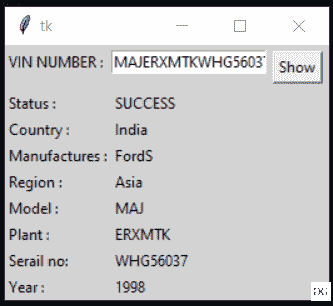

# 使用 Python 创建图形用户界面从车辆识别号中提取信息

> 原文:[https://www . geesforgeks . org/create-a-GUI-to-extract-information-from-vin-number-use-python/](https://www.geeksforgeeks.org/create-a-gui-to-extract-information-from-vin-number-using-python/)

**先决条件:** [Python 图形用户界面–tkinter](https://www.geeksforgeeks.org/python-gui-tkinter/)

在本文中，我们将研究如何使用 Python 从车辆识别号(车辆识别号)中提取车辆信息。车辆识别号由 17 个字符(数字和大写字母)组成，作为车辆的唯一标识符。这是一个唯一的代码，在制造时分配给每辆机动车。车辆识别号可用于提取车辆的信息，如制造国、制造商等。

开始之前，我们需要安装 **vininfo** 模块。将此代码运行到您的终端中进行安装:

```
pip install vininfo
```

下面是实现。

## 蟒蛇 3

```
# importing module
from vininfo import Vin

# Pass the VIN number into Vin methods
vin = Vin('MAJGERTYKGHG56037')

# prints vehicle's country
print(vin.country)

# prints vehicle's manufacturer
print(vin.manufacturer)

# prints vehicle manufacturer's region
print(vin.region)
```

**输出:**

```
India
FordS
Asia
```

用 Tkinter 从车辆识别号应用程序中提取信息的程序。该脚本实现了上述实现，但在图形用户界面中。

## 蟒蛇 3

```
# import modules
from tkinter import *
from vininfo import Vin
from tkinter import messagebox

def check_vin():
    try:
        vin = Vin(str(e.get()))
        country.set(vin.country)
        manufacturer.set(vin.manufacturer)
        region.set(vin.region)
        model.set(vin.wmi)
        Plant.set(vin.vds)
        Serial.set(vin.vis)
        year.set(vin.years)
        res.set("SUCCESS")
    except:
        messagebox.showerror("showerror", "VIN not found")

# object of tkinter
# and background set for light grey
master = Tk()
master.configure(bg='light grey')

# Variable Classes in tkinter
country = StringVar()
manufacturer = StringVar()
region = StringVar()
model = StringVar()
Plant = StringVar()
Serial = StringVar()
year = StringVar()
res = StringVar()

# Creating label for each information
# name using widget Label
Label(master, text="VIN NUMBER :", bg="light grey").grid(row=0, sticky=W)
Label(master, text="Status :", bg="light grey").grid(row=3, sticky=W)
Label(master, text="Country :", bg="light grey").grid(row=4, sticky=W)
Label(master, text="Manufactures :", bg="light grey").grid(row=5, sticky=W)
Label(master, text="Region :", bg="light grey").grid(row=6, sticky=W)
Label(master, text="Model :", bg="light grey").grid(row=7, sticky=W)
Label(master, text="Plant :", bg="light grey").grid(row=8, sticky=W)
Label(master, text="Serial no:", bg="light grey").grid(row=9, sticky=W)
Label(master, text="Year :", bg="light grey").grid(row=10, sticky=W)

# Creating label for class variable
# name using widget Entry
Label(master, text="", textvariable=res, bg="light grey").grid(
    row=3, column=1, sticky=W)
Label(master, text="", textvariable=country,
      bg="light grey").grid(row=4, column=1, sticky=W)
Label(master, text="", textvariable=manufacturer,
      bg="light grey").grid(row=5, column=1, sticky=W)
Label(master, text="", textvariable=region,
      bg="light grey").grid(row=6, column=1, sticky=W)
Label(master, text="", textvariable=model,
      bg="light grey").grid(row=7, column=1, sticky=W)
Label(master, text="", textvariable=Plant,
      bg="light grey").grid(row=8, column=1, sticky=W)
Label(master, text="", textvariable=Serial,
      bg="light grey").grid(row=9, column=1, sticky=W)
Label(master, text="", textvariable=year, bg="light grey").grid(
    row=10, column=1, sticky=W)

e = Entry(master)
e.grid(row=0, column=1)

# creating a button using the widget
# Button that will call the submit function
b = Button(master, text="Show", command=check_vin)
b.grid(row=0, column=2, columnspan=2, rowspan=2, padx=5, pady=5)

mainloop()
```

**输出:**

