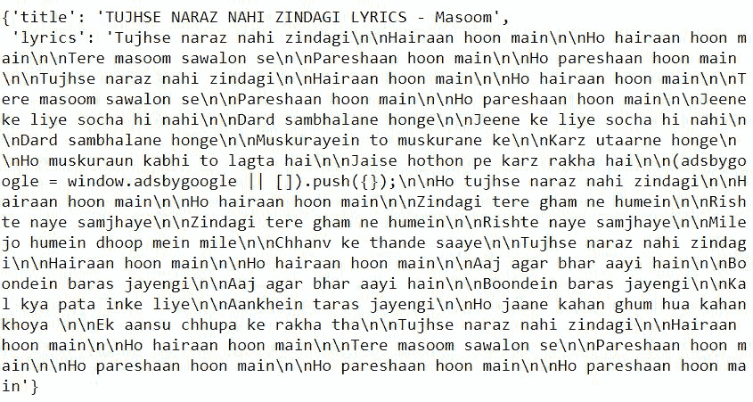

# 使用 Python 创建图形用户界面从歌曲中提取歌词

> 原文:[https://www . geesforgeks . org/create-a-GUI-to-extract-歌词-从歌曲中-使用-python/](https://www.geeksforgeeks.org/create-a-gui-to-extract-lyrics-from-song-using-python/)

在本文中，我们将编写一个 python 脚本来从歌曲中提取歌词，并与其 GUI 应用程序绑定。我们将使用**歌词提取器**来获取一首歌曲的歌词，只需传入歌曲名称，它就会从各个网站提取并返回歌曲的标题和歌词。开始前，安装**歌词提取器**模块。将此命令运行到您的终端。

```py
pip install lyrics-extractor
```

### 要求

需要谷歌自定义搜索 JSON 应用编程接口的应用编程接口密钥和引擎标识。

**发动机号**

*   创建一个自定义搜索引擎，在此获取您的引擎标识。
*   我们必须创建自己的可编程搜索引擎(谷歌自定义搜索引擎)，并添加链接来获取歌词。
*   可编程搜索引擎基于谷歌的核心搜索技术。
*   它是你的网站的搜索引擎，并有一个任务来查找用户选择的信息。

选择其中的任何一个链接来获得您的搜索引擎:

```py
https://genius.com/
http://www.lyricsted.com/
http://www.lyricsbell.com/
https://www.glamsham.com/
http://www.lyricsoff.com/
http://www.lyricsmint.com/
```

JSON API:

*   自定义搜索 JSON 应用编程接口能够从可编程搜索引擎检索和显示搜索结果。
*   要使用自定义搜索 JSON 应用编程接口，我们必须创建可编程搜索引擎。
*   访问[此处](https://developers.google.com/custom-search/v1/overview)获取您的 API 密钥。

**进场:**

*   导入模块。

```py
from lyrics_extractor import SongLyrics 
```

*   将谷歌自定义搜索 JSON API 密钥和引擎 ID 传入**songlexis()**。

```py
extract_lyrics = SongLyrics(Your_API_KEY, GCS_ENGINE_ID)
```

*   通过将歌曲名称作为参数传递给**extract _ lexis . get _ lexis()**方法来获取歌词。

```py
extract_lyrics.get_lyrics("Shape of You")
```

下面是实现。

## 蟒蛇 3

```py
# importing modules
from lyrics_extractor import SongLyrics

# pass the GCS_API_KEY, GCS_ENGINE_ID
extract_lyrics = SongLyrics("AIzaSewfsdfsdfOq0oTixw","frewrewrfsac")

extract_lyrics.get_lyrics("Tujhse Naraz Nahi Zindagi Lyrics")
```

**输出:**



注意:请输入您自己的 API 密钥和引擎 id，否则会产生错误。

**用 Tkinter 提取歌词应用:**

## 蟒蛇 3

```py
# import modules
from tkinter import *
from lyrics_extractor import SongLyrics

# user defined function
def get_lyrics():

    extract_lyrics = SongLyrics(
        "Aerwerwefwdssdj-nvN3Oq0oTixw", "werwerewcxzcsda")

    temp = extract_lyrics.get_lyrics(str(e.get()))
    res = temp['lyrics']
    result.set(res)

# object of tkinter
# and background set to light grey
master = Tk()
master.configure(bg='light grey')

# Variable Classes in tkinter
result = StringVar()

# Creating label for each information
# name using widget Label
Label(master, text="Enter Song name : ",
      bg="light grey").grid(row=0, sticky=W)

Label(master, text="Result :",
      bg="light grey").grid(row=3, sticky=W)

# Creating label for class variable
# name using widget Entry
Label(master, text="", textvariable=result,
      bg="light grey").grid(row=3, column=1, sticky=W)

e = Entry(master, width=50)
e.grid(row=0, column=1)

# creating a button using the widget
b = Button(master, text="Show",
           command=get_lyrics, bg="Blue")

b.grid(row=0, column=2, columnspan=2,
       rowspan=2, padx=5, pady=5,)

mainloop()
```

注意:请输入您自己的 API 密钥和引擎 id，否则会产生错误。

**输出:**

