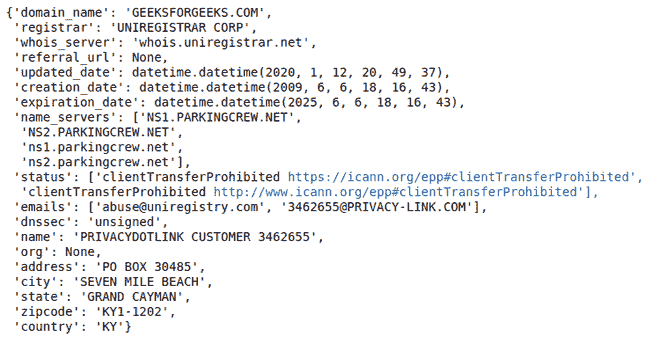
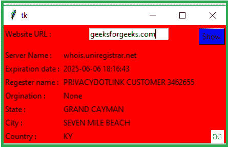

# 使用 Tkinter

创建一个获取域信息的图形用户界面

> 原文:[https://www . geesforgeks . org/create-a-GUI-to-get-domain-information-use-tkinter/](https://www.geeksforgeeks.org/create-a-gui-to-get-domain-information-using-tkinter/)

**先决条件:**[Python GUI–tkinter](https://www.geeksforgeeks.org/python-gui-tkinter/)

领域信息对每个用户都非常重要。它包含名称、组织、州、城市、Ip 地址、电子邮件、服务器名称等信息。在本文中，我们将编写获取域信息并将其与图形用户界面应用程序绑定的代码。我们将使用 **Python-whois** 模块来获取关于该网站的信息。它能够提取所有流行顶级域名的数据

### 装置

在编写代码之前，我们需要安装 [**python-whois**](https://pypi.org/project/python-whois/) 模块。要安装此软件，请在终端中键入以下命令。

```py
pip install python-whois
```

安装后，让我们用例子来理解这个模块。

**步骤 1:** 导入 python-whois 模块

## 蟒蛇 3

```py
import whois
```

**第二步:**使用 whois.whois()方法获取所有信息。

## 蟒蛇 3

```py
whois.whois('geeksforgeeks.com')
```

**输出:**



**步骤 3:** 让我们从 geeksforgeeks.com 站点提取一些导入数据。

## 蟒蛇 3

```py
domain = whois.whois('geeksforgeeks.com')
print("Expration Date :",domain.expiration_date)
print("Email :", domain.emails)
print("Server name : ",domain.name_servers)
```

**输出:**

```py
Expration Date : 2025-06-06 18:16:43
Email : abuse@uniregistry.com
Server name :  ['NS1.PARKINGCREW.NET', 'NS2.PARKINGCREW.NET']
```

让我们使用 [tkinter](https://www.geeksforgeeks.org/python-gui-tkinter/) 为上面的代码创建一个图形用户界面。

**实施:**

## 蟒蛇 3

```py
# import modules
from tkinter import *
import whois

# user define funtion
# for get domain information
def Domain_info():
    domain = whois.whois(str(e1.get()))
    server.set(domain.whois_server)
    exp_date.set(domain.expiration_date)
    reg_name.set(domain.name)
    org.set(domain.org)
    state.set(domain.state)
    city.set(domain.city)
    country.set(domain.country)

# object of tkinter
# and background set for red
master = Tk()
master.configure(bg='red')

# Variable Classes in tkinter
server = StringVar()
exp_date = StringVar()
reg_name = StringVar()
org = StringVar()
state = StringVar()
city = StringVar()
country = StringVar()

# Creating label for each information
# name using widget Label
Label(master, text="Website URL : ", bg="red").grid(row=0, sticky=W)
Label(master, text="Server Name :", bg="red").grid(row=3, sticky=W)
Label(master, text="Expiration date :", bg="red").grid(row=4, sticky=W)
Label(master, text="Register name :", bg="red").grid(row=5, sticky=W)
Label(master, text="Origination :", bg="red").grid(row=6, sticky=W)
Label(master, text="State :", bg="red").grid(row=7, sticky=W)
Label(master, text="City :", bg="red").grid(row=8, sticky=W)
Label(master, text="Country :", bg="red").grid(row=9, sticky=W)

# Creating label for class variable
# name using widget Entry
Label(master, text="", textvariable=server,
      bg="red").grid(row=3, column=1, sticky=W)
Label(master, text="", textvariable=exp_date,
      bg="red").grid(row=4, column=1, sticky=W)
Label(master, text="", textvariable=reg_name,
      bg="red").grid(row=5, column=1, sticky=W)
Label(master, text="", textvariable=org, bg="red").grid(
    row=6, column=1, sticky=W)
Label(master, text="", textvariable=state,
      bg="red").grid(row=7, column=1, sticky=W)
Label(master, text="", textvariable=city,
      bg="red").grid(row=8, column=1, sticky=W)
Label(master, text="", textvariable=country,
      bg="red").grid(row=9, column=1, sticky=W)

e1 = Entry(master)
e1.grid(row=0, column=1)

# creating a button using the widget
# Button that will call the submit function
b = Button(master, text="Show", command=Domain_info, bg="Blue")
b.grid(row=0, column=2, columnspan=2, rowspan=2, padx=5, pady=5,)

mainloop()
```

**输出:**

