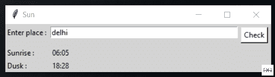

# 使用 Python 创建一个 GUI 来获取日落和日出时间。

> 原文:[https://www . geeksforgeeks . org/create-a-GUI-get-日落和日出-时间-使用 python/](https://www.geeksforgeeks.org/create-a-gui-to-get-sunset-and-sunrise-time-using-python/)

**先决条件:** [**Tkinter 模块**](https://www.geeksforgeeks.org/python-gui-tkinter/#:~:text=Python%20offers%20multiple%20options%20for,to%20create%20the%20GUI%20applications.)

在本文中，我们将编写 python 脚本来获取日落和日出时间，并将其与 GUI 应用程序绑定。在开始之前，我们需要了解**太阳时间**和**地质**模块

### 所需模块:

**suntime 模块:**该模块将返回日落日出时间计算 python 库。在您的终端中运行此命令进行安装。

```py
pip install suntime
```

**地理模块:**该模块使用第三方地理编码器和其他数据源定位全球范围内的地址、城市、国家和地标的坐标。Nominatim 是一个地理编码器，用于 OpenStreetMap 数据。在您的终端中运行此命令进行安装。

```py
pip install geopy
```

**进场:**

*   导入所有必需的模块。
*   用地理信息获取经纬度。
*   用**太阳(纬度、经度)得到日出时间。get_sunrise_time()** 方法。
*   用**太阳(纬度、经度)得到黄昏时间。get _ 日落 _ 时间()**方法。

以下是实施情况:

## 蟒蛇 3

```py
# import required modules
import datetime
from suntime import Sun
from geopy.geocoders import Nominatim

# Nominatim API to get latitude and longitude
geolocator = Nominatim(user_agent="geoapiExercises")

# input place
place = "delhi"
location = geolocator.geocode(place)

# latitude and longitude fetch
latitude = location.latitude
longitude = location.longitude
sun = Sun(latitude, longitude)

# date in your machine's local time zone
time_zone = datetime.date(2020, 9,13)
sun_rise = sun.get_local_sunrise_time(time_zone)
sun_dusk = sun.get_local_sunset_time(time_zone)

# display
print("Sun rise at : ", sun_rise.strftime('%H:%M'))
print("Dusk at : ",sun_dusk.strftime('%H:%M'))
```

**输出:**

```py
Sun rise at :  06:05
Dusk at :  18:28
```

### 与图形用户界面应用程序绑定

## 蟒蛇 3

```py
# import modules
from tkinter import *
from geopy.geocoders import Nominatim
import datetime
from suntime import Sun

# user defined function
def sun():

    try:

        geolocator = Nominatim(user_agent="geoapiExercises")

        ladd1 = str(e.get())
        location1 = geolocator.geocode(ladd1)

        latitude = location1.latitude
        longitude = location1.longitude

        sun = Sun(latitude, longitude)

        time_zone = datetime.datetime.now()

        sun_rise = sun.get_local_sunrise_time(time_zone)
        sun_dusk = sun.get_local_sunset_time(time_zone)

        res_rise = sun_rise.strftime('%H:%M')
        res_dusk = sun_dusk.strftime('%H:%M')

        result1.set(res_rise)
        result2.set(res_dusk)

    except:
        result1.set("oops! something get wrong")

# object of tkinter
# and background set to light grey
master = Tk()
master.configure(bg='light grey')
master.title("Sun")

# Variable Classes in tkinter
result1 = StringVar();
result2 = StringVar();

# Creating label for each information
# name using widget Label
Label(master, text="Enter place : " ,
      bg = "light grey").grid(row=1, sticky=W)
Label(master, text="Sunrise :",
      bg = "light grey").grid(row=3, sticky=W)
Label(master, text="Dusk :",
      bg = "light grey").grid(row=4, sticky=W)

# Creating label for class variable
# name using widget Entry
Label(master, text="", textvariable=result1,
      bg = "light grey").grid(row=3,column=1, sticky=W)
Label(master, text="", textvariable=result2,
      bg = "light grey").grid(row=4,column=1, sticky=W)

e = Entry(master,width = 50)
e.grid(row=1, column=1)

# creating a button using the widget 
b = Button(master, text="Check",
           command=sun, bg = "white")
b.grid(row=1, column=2,columnspan=2,
       rowspan=2,padx=5, pady=5,)

mainloop()
```

**输出:**

