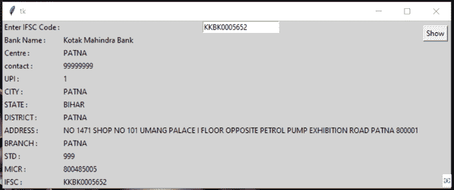

# 使用 Python 创建一个使用 IFSC 代码搜索银行信息的图形用户界面

> 原文:[https://www . geesforgeks . org/create-a-GUI-to-search-bank-information-with-ifsc-code-use-python/](https://www.geeksforgeeks.org/create-a-gui-to-search-bank-information-with-ifsc-code-using-python/)

**先决条件:**[**Python GUI–tkinter**](https://www.geeksforgeeks.org/python-gui-tkinter/)

下面的程序描述了如何使用 python 脚本编写 GUI 应用程序，以通过使用 IFSC 代码获取银行详细信息。在这里，我们使用 [**Razorpay IFSC 工具包**](https://ifsc.razorpay.com/) 来获取 IFSC 代码。Razorpay IFSC 工具包通过工具包处理 IFSC 代码，并返回数据集。

**所需模块:请求**

*请求*可以让你极其轻松的发送 HTTP/1.1 请求。这不是 Python 内置的，因此必须显式安装。

要安装此模块，只需在您的终端中键入以下命令:

```
pip install requests
```

**进场:**

*   导入模块
*   将网址和 IFSC 代码传递给 requests.get()函数
*   获取这个 JSON 响应
*   它以 Dict 数据类型返回银行详细信息

**程序:**

## 蟒蛇 3

```
import requests

IFSC_Code ='KKBK0005652'
URL = "https://ifsc.razorpay.com/"
result = requests.get(URL+IFSC_Code).json()
print(result)
```

**输出:**

> { ' ADDRESS ':' NO . 1471 SHOP NO . 101 UMANG PALACE I FLOOR 对立汽油泵展览路 PATNA 800001 '，
> 'CENTRE': 'PATNA '，
> 'MICR 代码':' 800485005 '，
> 'CITY': 'PATNA '，
> 'STD CODE': '999 '，
> 'RTGS': True，
> 'BRANCH': 'PATNA '，
> 'IMPS': True，
> ' CONTACT ':' 9999999999999900001

**程序二:(**用 IFSC 码搜索银行明细的 GUI 应用 **:** 概念与上述实现类似)

## 蟒蛇 3

```
# import modules
from tkinter import *
from tkinter import messagebox
import requests

def getifsc():
    try:
        IFSC_Code = e.get()
        URL = "https://ifsc.razorpay.com/"
        result = requests.get(URL+IFSC_Code).json()
        Centre.set(result['CENTRE'])
        contact.set(result['CONTACT'])
        UPI.set(result['UPI'])
        CITY.set(result['CITY'])
        STATE.set(result['STATE'])
        DISTRICT.set(result['DISTRICT'])
        IMPS.set(result['IMPS'])
        ADDRESS.set(result['ADDRESS'])
        BRANCH.set(result['BRANCH'])
        STD.set(result['STD CODE'])
        MICR.set(result['MICR CODE'])
        BANK.set(result['BANK'])
        BANKCODE.set(result['BANKCODE'])
        IFSC.set(result['IFSC'])
    except:
        messagebox.showerror("showerror", "Something wrong")

# object of tkinter
# and background set for light grey
master = Tk()
master.configure(bg='light grey')

# Variable Classes in tkinter
Centre = StringVar()
contact = StringVar()
UPI = StringVar()
CITY = StringVar()
STATE = StringVar()
DISTRICT = StringVar()
IMPS = StringVar()
ADDRESS = StringVar()
BRANCH = StringVar()
STD = StringVar()
MICR = StringVar()
BANK = StringVar()
BANKCODE = StringVar()
IFSC = StringVar()

# Creating label for each information
# name using widget Label
Label(master, text="Enter IFSC Code :", bg="light grey").grid(row=0, sticky=W)
Label(master, text="Bank Name :", bg="light grey").grid(row=1, sticky=W)
Label(master, text="Centre :", bg="light grey").grid(row=2, sticky=W)
Label(master, text="contact :", bg="light grey").grid(row=3, sticky=W)
Label(master, text="UPI :", bg="light grey").grid(row=4, sticky=W)
Label(master, text="CITY :", bg="light grey").grid(row=5, sticky=W)
Label(master, text="STATE :", bg="light grey").grid(row=6, sticky=W)
Label(master, text="DISTRICT :", bg="light grey").grid(row=7, sticky=W)
Label(master, text="ADDRESS :", bg="light grey").grid(row=8, sticky=W)
Label(master, text="BRANCH :", bg="light grey").grid(row=9, sticky=W)
Label(master, text="STD :", bg="light grey").grid(row=10, sticky=W)
Label(master, text="MICR :", bg="light grey").grid(row=11, sticky=W)
Label(master, text="IFSC :", bg="light grey").grid(row=12, sticky=W)

# Creating label for class variable
# name using widget Entry
Label(master, text="", textvariable=BANK,
      bg="light grey").grid(row=1, column=1, sticky=W)
Label(master, text="", textvariable=Centre,
      bg="light grey").grid(row=2, column=1, sticky=W)
Label(master, text="", textvariable=contact,
      bg="light grey").grid(row=3, column=1, sticky=W)
Label(master, text="", textvariable=UPI, bg="light grey").grid(
    row=4, column=1, sticky=W)
Label(master, text="", textvariable=CITY,
      bg="light grey").grid(row=5, column=1, sticky=W)
Label(master, text="", textvariable=STATE,
      bg="light grey").grid(row=6, column=1, sticky=W)
Label(master, text="", textvariable=DISTRICT,
      bg="light grey").grid(row=7, column=1, sticky=W)
Label(master, text="", textvariable=ADDRESS,
      bg="light grey").grid(row=8, column=1, sticky=W)
Label(master, text="", textvariable=BRANCH,
      bg="light grey").grid(row=9, column=1, sticky=W)
Label(master, text="", textvariable=STD, bg="light grey").grid(
    row=10, column=1, sticky=W)
Label(master, text="", textvariable=MICR, bg="light grey").grid(
    row=11, column=1, sticky=W)
Label(master, text="", textvariable=IFSC, bg="light grey").grid(
    row=12, column=1, sticky=W)

e = Entry(master)
e.grid(row=0, column=1)

# creating a button using the widget
# Button that will call the submit function
b = Button(master, text="Show", command=getifsc)
b.grid(row=0, column=2, columnspan=2, rowspan=2, padx=5, pady=5)

mainloop()
```

**输出:**

