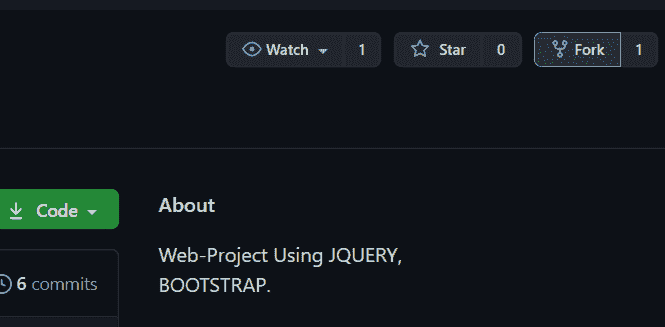
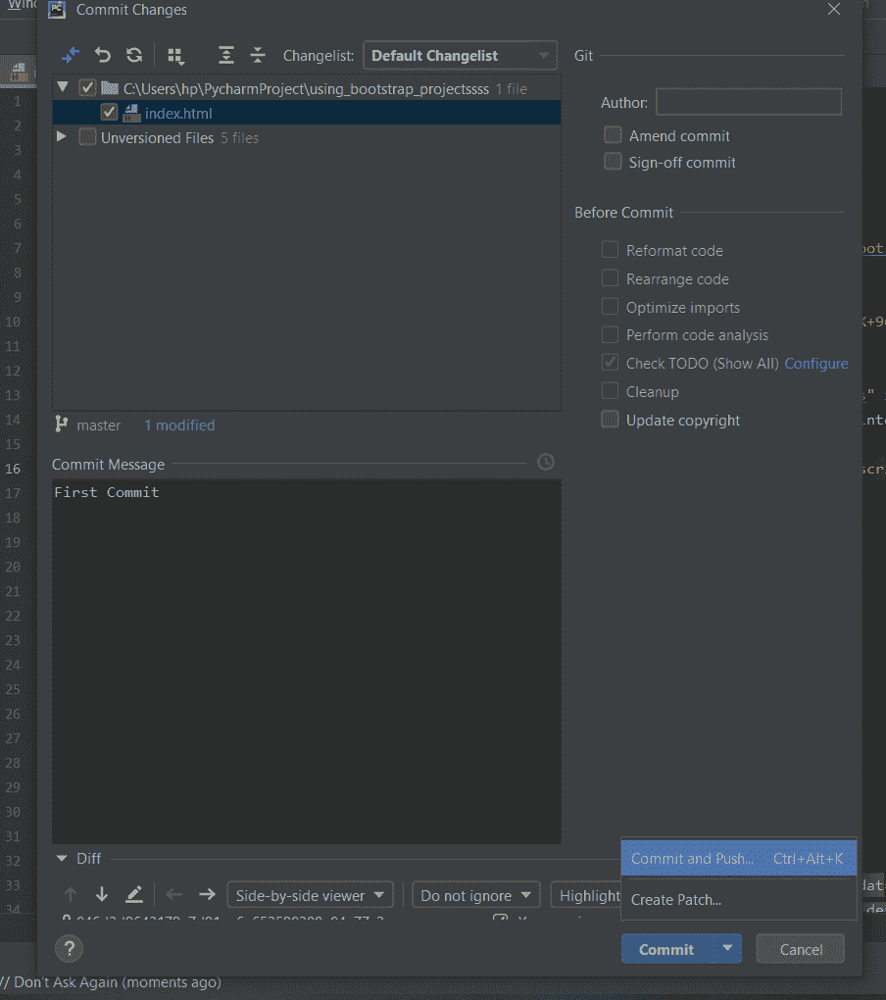
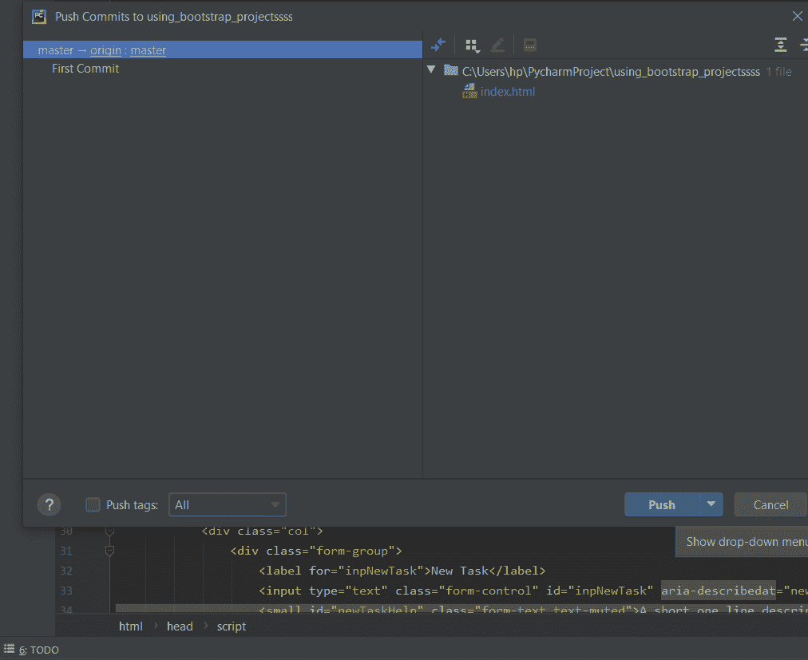
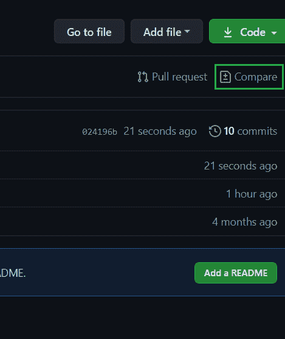
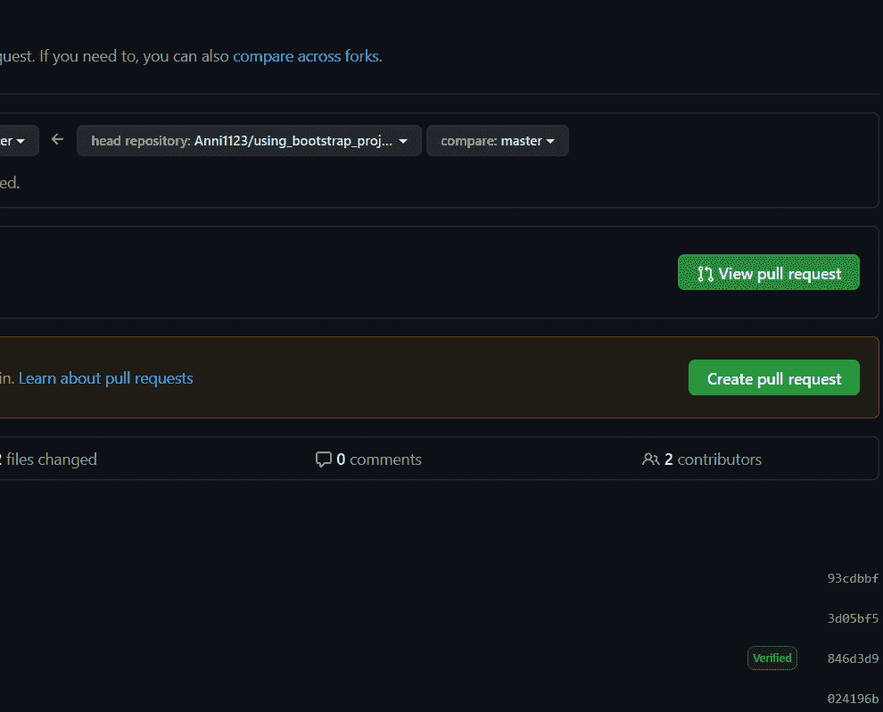
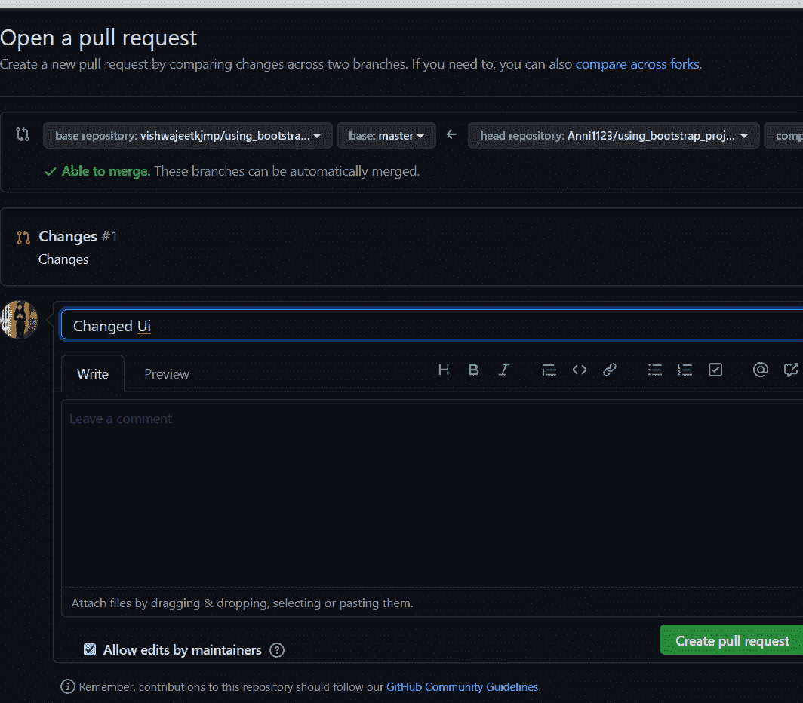
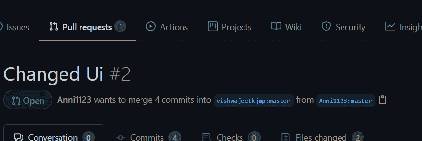

# 使用 Pycharm 在 GitHub 上创建拉取请求

> 原文:[https://www . geesforgeks . org/create-a-pull-request-on-github-using-py charm/](https://www.geeksforgeeks.org/create-a-pull-request-on-github-using-pycharm/)

**Git** 是一个开源的版本控制系统。这意味着，每当开发人员开发某个项目(如应用程序或网站)或其他东西时，他/她都会不断更新它，以满足用户、技术和其他方面的需求， [Git](https://www.geeksforgeeks.org/git-lets-get-into-it/) 是一个版本控制系统，允许您管理和跟踪源代码历史。在 Github 中根据你的需求找到合适的网络项目。

### 使用 Pycharm 创建请求的步骤

**步骤 1:创建存储库的副本**

为了从事开源项目，我们首先需要制作我们自己的存储库副本。为此，我们应该分叉存储库，然后克隆它，这样您就有了一个本地工作副本。

**第二步:分叉存储库**

我们需要分叉我们想要创建拉请求的存储库。点击分叉按钮，然后我们会在**资源库**部分找到该项目。

**第三步:**然后在你的 **Pycharm** 中打开项目。然后我们将进行所有需要的更改，然后我们将这些更改提交给 GitHub。点击**提交并推送**。

**第四步:**然后点击**推**。

**第五步:**现在打开你的 GitHub，可以看到比较按钮。点击**比较按钮。**

**步骤 5:** 在下一个窗口中，点击**创建拉取请求。**

**第六步:**写**提交消息**点击**创建拉取请求。**

现在您可以看到一个**拉动请求**被创建。

