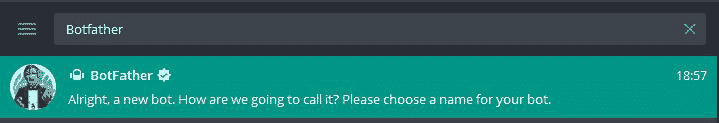
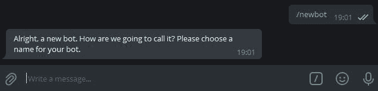
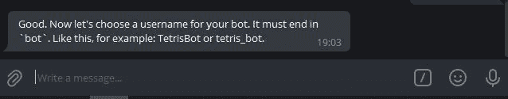
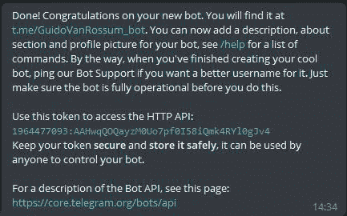

# 使用 Python 创建电报机器人

> 原文:[https://www . geesforgeks . org/create-a-telegram-bot-using-python/](https://www.geeksforgeeks.org/create-a-telegram-bot-using-python/)

在本文中，我们将看到如何使用 Python 创建一个电报机器人。

近年来，Telegram 已经成为最常用的消息和内容共享平台之一，它没有像 whatsapp 那样的文件共享限制，并且它附带了一些预装的僵尸工具，人们可以在任何渠道(在 Whatsapp 的情况下是组)使用来控制行为或过滤用户发送的垃圾消息。

## 要求

*   **A Telegram 账号:**如果你没有安装 Telegram app，只需要从游戏商店下载即可。下载后，使用您的手机号码创建一个帐户，就像 WhatsApp 一样。
*   。 **python-telegram-bot 模块:**这里我们需要一个名为 **python-telegram-bot** 的模块，这个库为 Telegram Bot API 提供了一个纯 python 接口。它与 Python 版本 3.6.8+兼容。除了纯 API 实现之外，该库还具有许多高级类，使僵尸工具的开发变得简单明了。这些类包含在“telegram.ext”子模块中。更多信息，可以查看他们的官方 GitHub 回购。

## **模块安装**

我们可以用下面的命令通过 pip 和 conda 安装这个模块。

```py
# installing via pip
pip install python-telegram-bot

# installing via conda
conda install -c conda-forge python-telegram-bot
```

## 创建第一个机器人的步骤

**第一步:**在 Telegram 上开户后，在顶部的搜索栏中搜索“botdean”



**第二步:**点击【机器人父亲】(第一个结果)，输入**/新手**



**第三步:**给你的机器人取一个唯一的名字。命名后，僵尸父亲会询问它的用户名。然后给出一个唯一的名字，但是记住你的机器人的用户名必须以**机器人、**结束，比如 **my_bot、hellobot 等等。**



**第 4 步:**在给出一个唯一的名字后，如果它被接受，你会收到一条类似如下的信息–



这里的令牌值对您来说将是不同的，我们将在 python 代码中使用这个令牌来对我们的 bot 进行更改，并使其与我们想要的一样，并在其中添加一些命令。

## 逐步实施

### **第 1 步:导入所需库**

## 蟒蛇 3

```py
from telegram.ext.updater import Updater
from telegram.update import Update
from telegram.ext.callbackcontext import CallbackContext
from telegram.ext.commandhandler import CommandHandler
from telegram.ext.messagehandler import MessageHandler
from telegram.ext.filters import Filters
```

**我们正在导入的功能的简要用法:**

*   **更新程序:**这将包含我们从 BotFard 获得的 API 密钥，以指定我们使用 python 代码在哪个机器人中添加功能。
*   **更新:**这将在机器人每次收到更新时调用，即**。**消息或命令，并将向用户发送消息。
*   **CallbackContext:** 我们不会在代码中直接使用它的功能，但是当我们添加调度程序时，它是必需的(并且它将在内部工作)
*   **CommandHandler:** 这个 Handler 类用于处理用户发送给机器人的任何命令，一个命令总是以“/”开头，即“/start”、“/help”等。
*   **MessageHandler:** 这个 Handler 类用于处理用户发送给机器人的任何正常消息，
*   **过滤器:**这将从发送的消息中过滤正常的文本、命令、图像等。

### **第二步:定义操作功能**

**开始功能:**它会显示第一个对话，你可以给它起别的名字，但是只要用户一开始按下“开始”，它里面的信息就会发送给用户。

## 蟒蛇 3

```py
updater = Updater("your_own_API_Token got from BotFather",
                  use_context=True)

def start(update: Update, context: CallbackContext):
    update.message.reply_text(
        "Enter the text you want to show to the user whenever they start the bot")
```

基本上，在开始消息中，你应该添加一些像“你好，欢迎来到机器人”等内容。

**帮助功能:**基本上在这个功能中，你应该添加用户可能需要的任何类型的帮助，即你的机器人理解的所有命令、与机器人相关的信息等)

## 蟒蛇 3

```py
def help(update: Update, context: CallbackContext):
    update.message.reply_text("Your Message")
```

**给机器人增加更多功能。**

## 蟒蛇 3

```py
def gmail_url(update: Update, context: CallbackContext):
    update.message.reply_text("gmail link here")

def youtube_url(update: Update, context: CallbackContext):
    update.message.reply_text("youtube link")

def linkedIn_url(update: Update, context: CallbackContext):
    update.message.reply_text("Your linkedin profile url")

def geeks_url(update: Update, context: CallbackContext):
    update.message.reply_text("GeeksforGeeks url here")

def unknown_text(update: Update, context: CallbackContext):
    update.message.reply_text(
        "Sorry I can't recognize you , you said '%s'" % update.message.text)

def unknown(update: Update, context: CallbackContext):
    update.message.reply_text(
        "Sorry '%s' is not a valid command" % update.message.text)
```