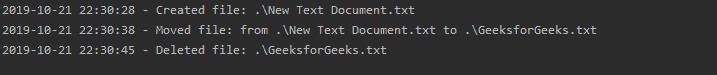
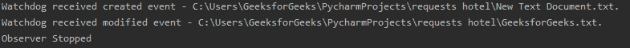
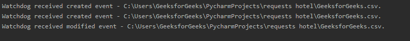

# 在 Python 中创建一个看门狗来寻找文件系统的变化

> 原文:[https://www . geesforgeks . org/create-a-watchdog-in-python-to-look-file system-changes/](https://www.geeksforgeeks.org/create-a-watchdog-in-python-to-look-for-filesystem-changes/)

很多时候，文件需要在创建或修改时进行处理。这可以通过跟踪特定目录中的更改来完成。python 中有许多方法可以跟踪目录中的更改。其中一种方法是使用 **`watchdog`** 模块。顾名思义，该模块会观察给定的目录，并在文件创建或更改时发出通知。

#### 需要的模块

*   **看门狗**
    要安装看门狗在终端运行该命令。

    ```py
    pip install watchdog

    ```

*   **登录**
    自带 python，无需外接安装。

现在，让我们深入研究记录所有注册更改的代码。此代码将记录仅在当前目录中注册的更改。

```py
# import the modules
import sys
import time
import logging
from watchdog.observers import Observer
from watchdog.events import LoggingEventHandler

if __name__ == "__main__":
    # Set the format for logging info
    logging.basicConfig(level=logging.INFO,
                        format='%(asctime)s - %(message)s',
                        datefmt='%Y-%m-%d %H:%M:%S')

    # Set format for displaying path
    path = sys.argv[1] if len(sys.argv) > 1 else '.'

    # Initialize logging event handler
    event_handler = LoggingEventHandler()

    # Initialize Observer
    observer = Observer()
    observer.schedule(event_handler, path, recursive=True)

    # Start the observer
    observer.start()
    try:
        while True:
            # Set the thread sleep time
            time.sleep(1)
    except KeyboardInterrupt:
        observer.stop()
    observer.join()
```

**输出:**


上面的代码将记录目录中注册的所有更改。如果要在创建或修改文件时进行更改，可以使用以下代码来实现。

```py
# import time module, Observer, FileSystemEventHandler
import time
from watchdog.observers import Observer
from watchdog.events import FileSystemEventHandler

class OnMyWatch:
    # Set the directory on watch
    watchDirectory = "/give / the / address / of / directory"

    def __init__(self):
        self.observer = Observer()

    def run(self):
        event_handler = Handler()
        self.observer.schedule(event_handler, self.watchDirectory, recursive = True)
        self.observer.start()
        try:
            while True:
                time.sleep(5)
        except:
            self.observer.stop()
            print("Observer Stopped")

        self.observer.join()

class Handler(FileSystemEventHandler):

    @staticmethod
    def on_any_event(event):
        if event.is_directory:
            return None

        elif event.event_type == 'created':
            # Event is created, you can process it now
            print("Watchdog received created event - % s." % event.src_path)
        elif event.event_type == 'modified':
            # Event is modified, you can process it now
            print("Watchdog received modified event - % s." % event.src_path)

if __name__ == '__main__':
    watch = OnMyWatch()
    watch.run()
```

**输出:**


## 破译密码

#### 观察者

`Observer` 是监视任何文件系统更改，然后将事件分派给事件处理程序的类。它监控文件系统并查找任何更改。

#### 事件处理程序

事件处理程序是一个对象，当文件系统出现问题时，它会得到通知。一般来说，编写脚本是为了监视任何类型的新创建或修改的文件，如 jpg、xml 等。例如，在下面的代码中，`PatternMatchingEventHandler` 继承自`FileSystemEventHandler` 类，并用于实现这一点。这个类的一些有用的方法是:

*   **on_any_event:** 将对任何事件执行。
*   **on_created:** 创建文件或目录时执行。
*   **on_modified:** 当文件被修改或目录被重命名时执行。
*   **on_deleted:** 删除文件或目录时执行。
*   **on_moved:** 文件或目录移动时执行。

这些方法中的每一个都接收事件对象作为第一个参数，并且事件对象有 3 个属性:

*   **事件类型:**修改/创建/移动/删除
*   **为 _ 目录:**真/假
*   **src _ path:**path/to/observe/file

以下脚本仅用于观察。csv 文件使用`PatternMAtchingEventHandler`。如果希望观察多种类型的文件，可以进一步扩展模式列表。

```py
import watchdog.events
import watchdog.observers
import time

class Handler(watchdog.events.PatternMatchingEventHandler):
    def __init__(self):
        # Set the patterns for PatternMatchingEventHandler
        watchdog.events.PatternMatchingEventHandler.__init__(self, patterns=['*.csv'],
                                                             ignore_directories=True, case_sensitive=False)

    def on_created(self, event):
        print("Watchdog received created event - % s." % event.src_path)
        # Event is created, you can process it now

    def on_modified(self, event):
        print("Watchdog received modified event - % s." % event.src_path)
        # Event is modified, you can process it now

if __name__ == "__main__":
    src_path = r"C:\Users\GeeksforGeeks\PycharmProjects\requests hotel"
    event_handler = Handler()
    observer = watchdog.observers.Observer()
    observer.schedule(event_handler, path=src_path, recursive=True)
    observer.start()
    try:
        while True:
            time.sleep(1)
    except KeyboardInterrupt:
        observer.stop()
    observer.join()
```

**输出:**


在`PatternMAtchingEventHandler` 的帮助下，我们可以利用。csv 扩展。通过扩展 Watchdog 提供的事件处理程序类，我们可以通过实现上述类方法来处理修改、创建、删除和移动的事件。