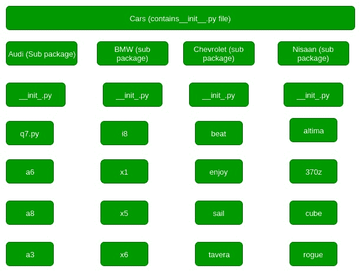

# 创建和访问 Python 包

> 原文:[https://www.geeksforgeeks.org/create-access-python-package/](https://www.geeksforgeeks.org/create-access-python-package/)

包是构造许多包和模块的一种方式，这有助于数据集的良好组织的层次结构，使得目录和模块易于访问。就像一个操作系统中有不同的驱动器和文件夹来帮助我们存储文件一样，类似的包也帮助我们存储其他子包和模块，以便用户在必要时使用。

**创建和探索包**

为了告诉 Python 一个特定的目录是一个包，我们创建了一个名为 __init__ 的文件。py，然后它被认为是一个包，我们可以在其中创建其他模块和子包。这个 __init__。py 文件可以留空，也可以用包的初始化代码进行编码。
**要用 Python 创建包，我们需要遵循这三个简单的步骤:**

1.  首先，我们创建一个目录，并给它一个包名，最好与其操作相关。
2.  然后我们把类和需要的函数放进去。
3.  最后我们创建一个 __init__。py 文件里面的目录，让 Python 知道这个目录是一个包。

**创建包的示例**

让我们看看这个例子，看看包是如何创建的。让我们创建一个名为 Cars 的包，并在其中构建三个模块，即宝马、奥迪和日产。

1.  **首先我们创建一个目录，并将其命名为 Cars。**
2.  **Then we need to create modules**. To do this we need to create a file with the name Bmw.py and create its content by putting this code into it.

    ```py
    # Python code to illustrate the Modules
    class Bmw:
        # First we create a constructor for this class
        # and add members to it, here models
        def __init__(self):
            self.models = ['i8', 'x1', 'x5', 'x6']

        # A normal print function
        def outModels(self):
            print('These are the available models for BMW')
            for model in self.models:
                print('\t%s ' % model)
    ```

    然后我们创建另一个名为 Audi.py 的文件，并用不同的成员向其中添加类似类型的代码。

    ```py
    # Python code to illustrate the Module
    class Audi:
        # First we create a constructor for this class
        # and add members to it, here models
        def __init__(self):
            self.models = ['q7', 'a6', 'a8', 'a3']

        # A normal print function
        def outModels(self):
            print('These are the available models for Audi')
            for model in self.models:
                print('\t%s ' % model)
    ```

    然后我们创建另一个名为 Nissan.py 的文件，并用不同的成员向其中添加类似类型的代码。

    ```py
    # Python code to illustrate the Module
    class Nissan:
        # First we create a constructor for this class
        # and add members to it, here models
        def __init__(self):
            self.models = ['altima', '370z', 'cube', 'rogue']

        # A normal print function
        def outModels(self):
            print('These are the available models for Nissan')
            for model in self.models:
                print('\t%s ' % model)
    ```

3.  **Finally we create the __init__.py file.** This file will be placed inside Cars directory and can be left blank or we can put this initialisation code into it.

    ```py
    from Bmw import Bmw
    from Audi import Audi
    from Nissan import Nissan
    ```

    现在，让我们使用我们创建的包。为此，在 Cars 包所在的目录中创建一个示例. py 文件，并向其中添加以下代码:

    ```py
    # Import classes from your brand new package
    from Cars import Bmw
    from Cars import Audi
    from Cars import Nissan

    # Create an object of Bmw class & call its method
    ModBMW = Bmw()
    ModBMW.outModels()

    # Create an object of Audi class & call its method
    ModAudi = Audi()
    ModAudi.outModels()

    # Create an object of Nissan class & call its method
    ModNissan = Nissan()
    ModNissan.outModels()
    ```

    **访问包的各种方式**

    让我们看看这个例子，并尝试将包与它联系起来，以及我们如何访问它。
    

    1.  **包内导入**
        假设汽车和品牌目录都是包。要使它们成为一个包，它们都必须包含 __init__。py 文件，或者是空白的，或者带有一些初始化代码。让我们假设汽车的所有模型都是模块。使用包有助于单独或整体导入任何模块。
        假设我们想买宝马 i8。其语法是:

    ```py
    'import' Cars.Bmw.x5 
    ```

    当导入一个包或子包或模块时，Python 搜索整个目录树来寻找特定的包，并按照点操作符的编程系统地进行。
    如果任何模块包含一个函数，并且我们想要导入该函数。例如，a8 有一个函数 get_buy(1)，我们想要导入它，语法应该是:

    ```py
    import Cars.Audi.a8
    Cars.Audi.a8.get_buy(1)

    ```

    虽然只使用导入语法，但必须记住最后一个属性必须是子包或模块，它不应该是任何函数或类名。

4.  **‘from…import’ in Packages**
    Now, whenever we require using such function we would need to write the whole long line after importing the parent package. To get through this in a simpler way we use ‘from’ keyword. For this we first need to bring in the module using ‘from’ and ‘import’:

    ```py
    from Cars.Audi import a8
    ```

    现在我们可以在任何地方使用

    ```py
    a8.get_buy(1)
    ```

    还有另一种不太冗长的方法。我们可以直接导入函数，并在需要的地方使用它。首先使用以下命令导入它:

    ```py
    from Cars.Audi.a8 import get_buy
    ```

    现在从任何地方调用该函数:

    ```py
    get_buy(1)
    ```

5.  **‘from…import *’ in Packages**
    While using the **from…import** syntax, we can import anything from submodules to class or function or variable, defined in the same module. If the mentioned attribute in the import part is not defined in the package then the compiler throws an ImportError exception.
    Importing sub-modules might cause unwanted side-effects that happens while importing sub-modules explicitly. Thus we can import various modules at a single time using * syntax. The syntax is:

    ```py
    from Cars.Chevrolet import *
    ```

    这将从子包中导入所有内容，即模块、子模块、函数、类。

本文由**钦莫伊·蕾恩卡**供稿。如果你喜欢 GeeksforGeeks 并想投稿，你也可以使用[contribute.geeksforgeeks.org](http://www.contribute.geeksforgeeks.org)写一篇文章或者把你的文章邮寄到 contribute@geeksforgeeks.org。看到你的文章出现在极客博客主页上，帮助其他极客。

如果你发现任何不正确的地方，或者你想分享更多关于上面讨论的话题的信息，请写评论。