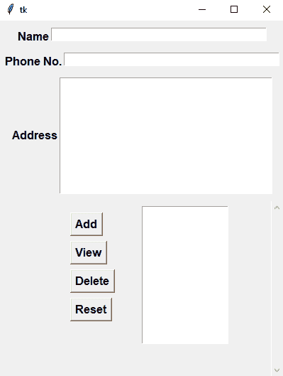
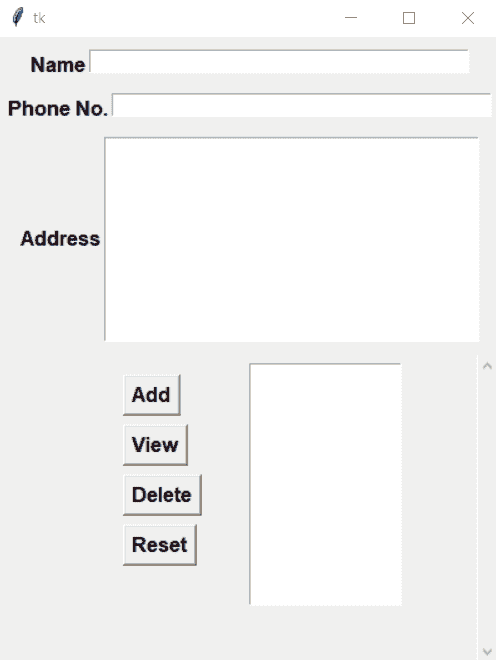

# 用 Python 创建通讯录–使用 Tkinter

> 原文:[https://www . geeksforgeeks . org/create-address-book-in-python-use-tkinter/](https://www.geeksforgeeks.org/create-address-book-in-python-using-tkinter/)

**先决条件:** [**Tkinter**](https://www.geeksforgeeks.org/python-gui-tkinter/)

在本文中，我们将讨论如何使用 Python 在 Tkinter 中创建地址簿。

### **分步实施:**

**步骤 1:** 创建图形用户界面。

在这里，我们将添加所有的图形用户界面组件，如标签、文本区域和按钮。

## 蟒蛇 3

```
# Import Module
from tkinter import *

# Create Object
root = Tk()

# Set geometry
root.geometry('400x500')

# Add Buttons, Label, ListBox
Name = StringVar()
Number = StringVar()

frame = Frame()
frame.pack(pady=10)

frame1 = Frame()
frame1.pack()

frame2 = Frame()
frame2.pack(pady=10)

Label(frame, text = 'Name', font='arial 12 bold').pack(side=LEFT)
Entry(frame, textvariable = Name,width=50).pack()

Label(frame1, text = 'Phone No.', font='arial 12 bold').pack(side=LEFT)
Entry(frame1, textvariable = Number,width=50).pack()

Label(frame2, text = 'Address', font='arial 12 bold').pack(side=LEFT)
address = Text(frame2,width=37,height=10)
address.pack()

Button(root,text="Add",font="arial 12 bold").place(x= 100, y=270)
Button(root,text="View",font="arial 12 bold").place(x= 100, y=310)
Button(root,text="Delete",font="arial 12 bold").place(x= 100, y=350)
Button(root,text="Reset",font="arial 12 bold").place(x= 100, y=390)

scroll_bar = Scrollbar(root, orient=VERTICAL)
select = Listbox(root, yscrollcommand=scroll_bar.set, height=12)
scroll_bar.config (command=select.yview)
scroll_bar.pack(side=RIGHT, fill=Y)
select.place(x=200,y=260)

# Execute Tkinter
root.mainloop()
```

**输出:**



**第二步:创建用户定义函数进行操作检索。**

这些是本程序中使用的功能:

*   **添加:**这将在通讯录数据结构中添加一条记录，并更新 GUI。
*   **视图:**这将代表所选记录的所有值。
*   **删除:**这将从通讯录数据结构中删除所选记录，并更新 GUI。
*   **复位**:这将复位输入参数的所有输入值。
*   **update_book:** 这将更新整个通讯录数据结构。

## 蟒蛇 3

```
# Information List
datas = []

# Add Information
def add():
    global datas
    datas.append([Name.get(),Number.get(),address.get(1.0, "end-1c")])
    update_book()

# View Information
def view():
    Name.set(datas[int(select.curselection()[0])][0])
    Number.set(datas[int(select.curselection()[0])][1])
    address.delete(1.0,"end")
    address.insert(1.0, datas[int(select.curselection()[0])][2])

# Delete Information
def delete():
    del datas[int(select.curselection()[0])]
    update_book()

def reset():
    Name.set('')
    Number.set('')
    address.delete(1.0,"end")

# Update Information
def update_book():
    select.delete(0,END)

    for n,p,a in datas:
        select.insert(END, n)
```

**完整代码:**

## 蟒蛇 3

```
# Import Module
from tkinter import *

# Create Object
root = Tk()

# Set geometry
root.geometry('400x500')

# Information List
datas = []

# Add Information
def add():
    global datas
    datas.append([Name.get(),Number.get(),address.get(1.0, "end-1c")])
    update_book()

# View Information
def view():
    Name.set(datas[int(select.curselection()[0])][0])
    Number.set(datas[int(select.curselection()[0])][1])
    address.delete(1.0,"end")
    address.insert(1.0, datas[int(select.curselection()[0])][2])

# Delete Information
def delete():
    del datas[int(select.curselection()[0])]
    update_book()

def reset():
    Name.set('')
    Number.set('')
    address.delete(1.0,"end")

# Update Information
def update_book():
    select.delete(0,END)
    for n,p,a in datas:
        select.insert(END, n)

# Add Buttons, Label, ListBox
Name = StringVar()
Number = StringVar()

frame = Frame()
frame.pack(pady=10)

frame1 = Frame()
frame1.pack()

frame2 = Frame()
frame2.pack(pady=10)

Label(frame, text = 'Name', font='arial 12 bold').pack(side=LEFT)
Entry(frame, textvariable = Name,width=50).pack()

Label(frame1, text = 'Phone No.', font='arial 12 bold').pack(side=LEFT)
Entry(frame1, textvariable = Number,width=50).pack()

Label(frame2, text = 'Address', font='arial 12 bold').pack(side=LEFT)
address = Text(frame2,width=37,height=10)
address.pack()

Button(root,text="Add",font="arial 12 bold",command=add).place(x= 100, y=270)
Button(root,text="View",font="arial 12 bold",command=view).place(x= 100, y=310)
Button(root,text="Delete",font="arial 12 bold",command=delete).place(x= 100, y=350)
Button(root,text="Reset",font="arial 12 bold",command=reset).place(x= 100, y=390)

scroll_bar = Scrollbar(root, orient=VERTICAL)
select = Listbox(root, yscrollcommand=scroll_bar.set, height=12)
scroll_bar.config (command=select.yview)
scroll_bar.pack(side=RIGHT, fill=Y)
select.place(x=200,y=260)

# Execute Tkinter
root.mainloop()
```

**输出:**

