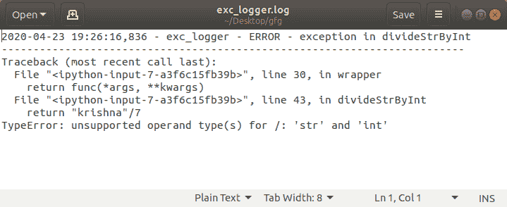

# 在 Python 中创建异常日志装饰器

> 原文:[https://www . geeksforgeeks . org/create-an-exception-logging-decorator-in-python/](https://www.geeksforgeeks.org/create-an-exception-logging-decorator-in-python/)

**先决条件:**[Python 中的装饰者](https://www.geeksforgeeks.org/decorators-in-python/)[Python 中的登录](https://www.geeksforgeeks.org/logging-in-python/)

日志记录有助于您跟踪运行的程序/应用程序。它存储您想要存储的任何输出/错误/消息/异常。程序执行可以在代码运行时借助 print 语句进行调试。但是代码并不优雅，也不是一个好的实践。日志是应用程序遵循的标准流程，用于将流程存储在日志文件中，这将有助于在未来/意外情况下进行分析/调试。

### 异常记录

对于记录器，我们有不同级别的消息记录。由于本文仅限于异常日志记录，我们将使用“信息”级别的日志消息来帮助我们检查代码是否如预期的那样工作。如果出现异常，它将使用 logger 对象 logger.exception(“引发的某个异常”)将异常存储到日志文件中

下面是实现。

```py
import logging
from functools import wraps

def create_logger(): 

    #create a logger object
    logger = logging.getLogger('exc_logger')
    logger.setLevel(logging.INFO)

    #create a file to store all the 
    # logged exceptions
    logfile = logging.FileHandler('exc_logger.log')

    fmt = '%(asctime)s - %(name)s - %(levelname)s - %(message)s'
    formatter = logging.Formatter(fmt)

    logfile.setFormatter(formatter)
    logger.addHandler(logfile)

    return logger

logger = create_logger()

# you will find a log file
# created in a given path
print(logger)

def exception(logger):

    # logger is the logging object
    # exception is the decorator objects 
    # that logs every exception into log file
    def decorator(func):

        @wraps(func)
        def wrapper(*args, **kwargs):

            try:
                return func(*args, **kwargs)

            except:
                issue = "exception in "+func.__name__+"\n"
                issue = issue+"-------------------------\
                ------------------------------------------------\n"
                logger.exception(issue)
            raise

        return wrapper
    return decorator

@exception(logger)
def divideStrByInt():
    return "krishna"/7

# Driver Code
if __name__ == '__main__':
    divideStrByInt()   
```

**输出:**

