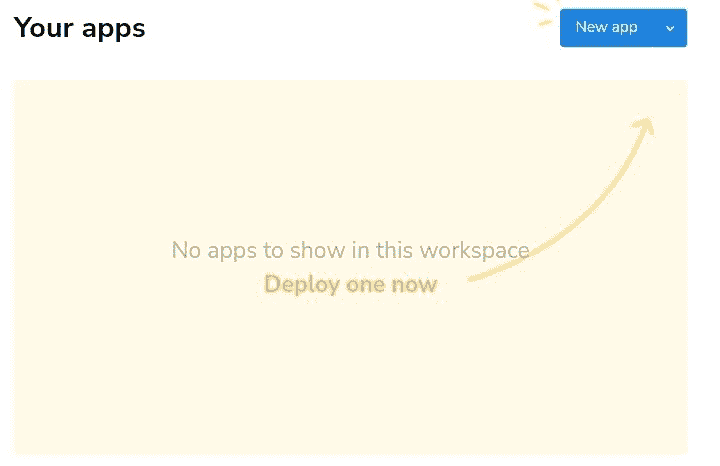
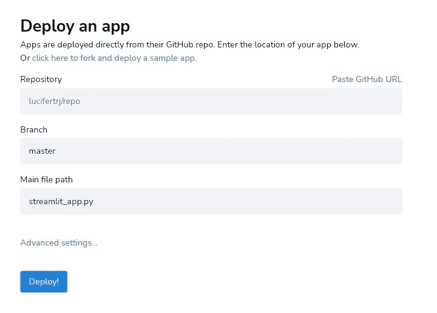

# 使用 Python 和 Streamlit 创建和部署股价网络应用程序

> 原文:[https://www . geesforgeks . org/create-and-deploy-a-stock-price-web-application-use-python-and-streamlit/](https://www.geeksforgeeks.org/create-and-deploy-a-stock-price-web-application-using-python-and-streamlit/)

在本文中，我们将看到如何创建和部署股价 web 应用程序。

为了创建一个处理数据科学的惊人的网络应用程序，我们有一个完美的平台来执行这项任务。[精简](https://www.geeksforgeeks.org/a-beginners-guide-to-streamlit/)和 [Python](https://www.geeksforgeeks.org/python-programming-language/) 包以最快的方式构建和共享数据应用程序。

Streamlit 是开源的，任何人都可以贡献它，但首先要在本地安装 Streamlit。

```
pip install streamlit
```

简化确保以最快的方式构建和共享数据应用程序。股票将永远是未来几年的热门话题。每个收入不错的人都喜欢投资股市。股票市场是上市公司股票交易的地方。因为我们正在处理股票价格的细节，我们可能需要网页废料的细节。但据我们所知，有一个这样的 Python 库处理股票价格。总之，雅虎金融与在线广告公司合作，为您提供尽可能相关和有用的广告。

```
pip install yfinance
```

## 使用流线创建股票价格网络应用程序

首先导入网络应用程序所需的必要模块。

```
import streamlit as st
import yfinance as finance
```

你需要知道 Markdown 的基本语法才能在 Web App 上显示文本。你可以查看这个[关于 Markdown](https://www.geeksforgeeks.org/introduction-to-markdown/) 的介绍，然后开始。一旦你熟悉了 Markdown 语言，使用 Streamlit 显示消息就变得很容易了。

**设置标题名称、侧栏标题和副标题:**

```
st.title("Build and Deploy Stock Market App Using Streamlit")
st.header("A Basic Data Science Web Application")
st.sidebar.header("Geeksforgeeks \n TrueGeeks")
```

代码的实际部分现在开始。因为我们将分析谷歌和微软的股票价格，初始化股票代码属性，并获得过去一个月的谷歌和 MSFT 的历史。

yfinance 允许您在一定时间内检查更新。yfinance 归还熊猫。具有多级列名的数据框，其中一级用于跑马灯，一级用于股价数据。您可以查看下面显示标题、数据、公司摘要信息的代码，并绘制一个惊人的图表。

显示表格数据，包括不同时间间隔的打开、高、低、关闭和体积数据。一旦初始化了跑马灯，您就可以查看跑马灯的详细信息，包括长摘要、员工总数、州和国家名称、收入增长以及更多信息。

我们已经为这个 web 应用程序使用了最重要的命令，您可以查看下面的代码。

## 计算机编程语言

```
import streamlit as st
import yfinance as finance

def get_ticker(name):
    company = finance.Ticker(name)  # google
    return company

# Project Details
st.title("Build and Deploy Stock Market App Using Streamlit")
st.header("A Basic Data Science Web Application")
st.sidebar.header("Geeksforgeeks \n TrueGeeks")

company1 = get_ticker("GOOGL")
company2 = get_ticker("MSFT")

# fetches the data: Open, Close, High, Low and Volume
google = finance.download("GOOGL", start="2021-10-01", end="2021-10-01")
microsoft = finance.download("MSFT", start="2021-10-01", end="2021-10-01")

# Valid periods: 1d,5d,1mo,3mo,6mo,1y,2y,5y,10y,ytd,max
data1 = company1.history(period="3mo")
data2 = company2.history(period="3mo")

# markdown syntax
st.write("""
### Google
""")

# detailed summary on Google
st.write(company1.info['longBusinessSummary']) 
st.write(google)

# plots the graph
st.line_chart(data1.values) 

st.write("""
### Microsoft
""")
st.write(company2.info['longBusinessSummary'], "\n", microsoft)
st.line_chart(data2.values)
```

### 运行代码的命令

```
 streamlit run myapp.py
```


## 使用简化部署数据科学网络应用程序

通过互联网上提供的各种选项，可以部署简化的 web 应用程序供直接使用。关于如何部署 Streamlit 应用程序，有不同的平台。您也可以使用 Heroku 部署您的应用程序。查看[在 Heroku](https://www.geeksforgeeks.org/deploy-your-machine-learning-web-app-streamlit-on-heroku/) 上部署应用的完整指南。

我们将研究由 Streamlit 本身提供的直接方法。如果您的应用程序托管在公共 GitHub repo 中，并且您希望世界上的任何人都能够访问它，那么免费社区层是完美的解决方案。在继续下一步之前，你需要你自己的 GitHub 账户来保存你的网络应用。一旦你把你的应用放到 GitHub 上，确保你已经添加了一个 requirement.txt 文件。该文件将包含必需的 Python 库。

您只需要遵循三个步骤来部署您的应用:

**第一步**:为你的细流应用程序创建一个 Github 资源库，然后注册(https://forms . Streamlit . io/Community-注册)到细流社区。

**第二步**:需要等待 2 个工作日，然后才能最终部署你的 app。打开你将从 https://share.streamlit.io/社区收到的邮件，创建一个新的应用程序。



**步骤 3:** 接下来选择您在第一步创建的回购。选择 repo_name 后，选择保存代码的分支名称和主 python 文件。



**一旦你的应用部署完毕，你可以用这个网址找到它:**

> https://share.streamlit.io/[username]/[repo_name]/[default_branch_name]/[your_py_code_file_name]