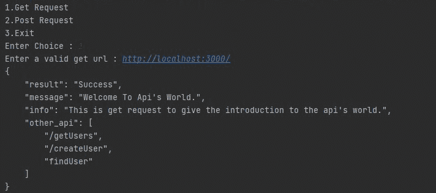
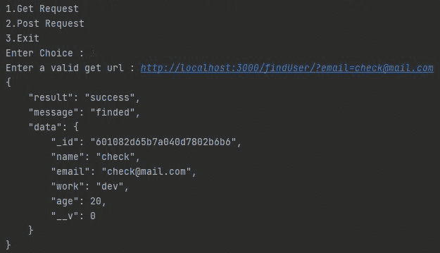
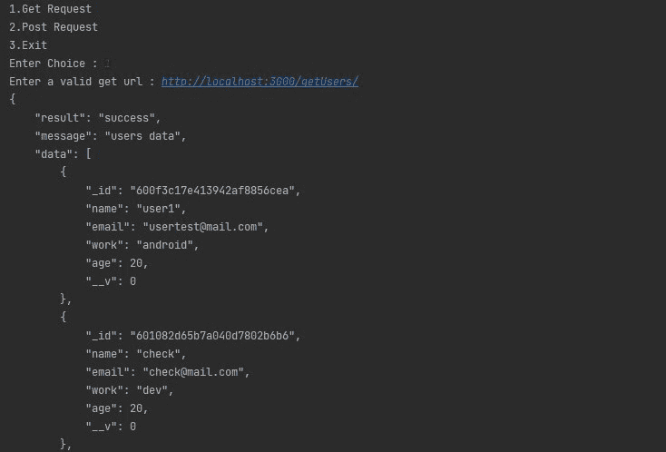
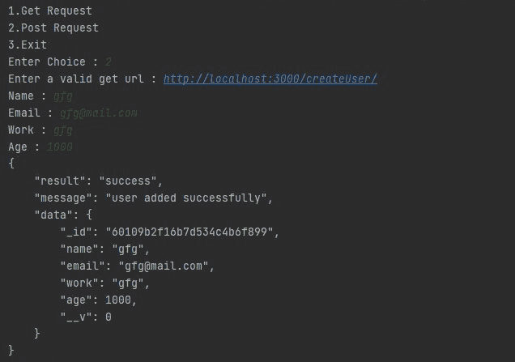

# 使用 Python 请求模块创建 API 测试器

> 原文:[https://www . geesforgeks . org/create-API-tester-use-python-requests-module/](https://www.geeksforgeeks.org/create-api-tester-using-python-requests-module/)

**先决条件:** [Python 请求模块](https://www.geeksforgeeks.org/python-requests-tutorial/)[API](https://www.geeksforgeeks.org/what-is-api-how-it-is-useful-in-web-development/)

在本文中，我们将通过创建一个应用编程接口测试器来讨论 Python *请求*模块的工作过程。

[API](https://www.geeksforgeeks.org/what-is-api-how-it-is-useful-in-web-development/) 代表应用编程接口(所有交互性的主要参与者)。它就像一个信使，将我们的请求带到一个系统，并通过无缝连接将响应返回给我们。我们在许多情况下使用 API，比如为一个 web 应用程序获取数据，或者连接到一个远程服务器，该服务器拥有不断变化的天气等数据，或者使两个应用程序能够相互交换数据。

[请求](https://www.geeksforgeeks.org/python-requests-tutorial/)库是 Python 的一个组成部分，用于向指定的网址发出 HTTP 请求。无论是 REST APIs 还是 Web 报废，都必须了解请求，以便进一步使用这些技术。当一个人向 URI 提出请求时，它会返回一个响应。Python 请求提供了管理请求和响应的内置功能。

**分步方法:**

*   首先，我们从用户那里选择他们想要的输入。
*   取一个输入网址。

**如果用户选择获取请求。**

*   在 *getReq()* 功能中，使用 Requests 模块发出 GET 请求并存储结果。
*   使用 JSON 模块格式化结果并返回。

**如果用户选择发布请求。**

*   取一个字典数据发送到服务器。
*   在 *postReq()* 函数中，使用 Request 模块用 JSON 数据进行 POST Request，并存储结果。
*   使用 JSON 模块格式化结果并返回。

最后，打印返回的结果。

**以下是基于上述方法的实现:**

## 蟒蛇 3

```
# request module to
# work with api's
import requests

# json module to
# parse and get json
import json

# This function are return the
# json response from given url
def getReq(url):

    # handle the exceptions
    try:

        # make a get request using requests
        # module and store the result.
        res = requests.get(url)

        # return the result after
        # formatting in json.
        return json.dumps(res.json(), indent=4)
    except Exception as ee:
        return f"Message : {ee}"

# This function are return the
# json response of url and json
# data you send the server  
def postReq(url, data):

    # handle the exceptions
    try:

        # make a post request with
        # the json data
        res = requests.post(url, json=data)

        # return the response after
        # formatting in json.
        return json.dumps(res.json(), indent=4)
    except Exception as er:
        return f"Message : {er}"

# Driver Code
if __name__ == '__main__':

    # always run loop to make
    # menu driven program
    while True:

        # handle the exceptions
        try:
            choice = int(input("1.Get Request\n2.Post Request\n3.Exit\nEnter Choice : "))

            # get user choice and perform tasks.
            if choice == 1:

                # take a url as a input.
                url_inp = input("Enter a valid get url : ")

                # print the result of the url.
                print(getReq(url_inp))

            elif choice == 2:

                # take a url as a input
                url_inp = input("Enter a valid get url : ")

                # take a formal data as input in dictionary.
                data_inp = {
                    "name": input("Name : "),
                    "email": input("Email : "),
                    "work": input("Work : "),
                    "age": input("Age : ")
                }

                # print the result.
                print(postReq(url_inp, data_inp))

            elif choice == 3:

                # if user want to exit.
                exit(0)

        except Exception as e:
            print("Error : ", e)
```

**输出:**

首先，发出 get 请求



带有查询的 get 请求。



获取所有用户的获取请求。



最后，用 JSON 数据发出一个 post 请求。



下面是描述程序功能的完整输出视频

<video class="wp-video-shortcode" id="video-550016-1" width="640" height="360" preload="metadata" controls=""><source type="video/mp4" src="https://media.geeksforgeeks.org/wp-content/uploads/20210129032525/final4.mp4?_=1">[https://media.geeksforgeeks.org/wp-content/uploads/20210129032525/final4.mp4](https://media.geeksforgeeks.org/wp-content/uploads/20210129032525/final4.mp4)</video>