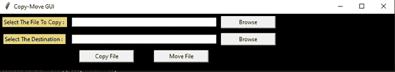

# 使用 Python 中的 Tkinter 创建复制-移动图形用户界面

> 原文:[https://www . geesforgeks . org/create-copy-move-GUI-using-tkinter-in-python/](https://www.geeksforgeeks.org/create-copy-move-gui-using-tkinter-in-python/)

每个阅读这篇文章的人都很清楚复制文件或将文件从一个特定位置移动到另一个位置的重要性。在这篇文章中，我们不仅试图解释程序，还添加了一些令人兴奋的界面。到目前为止，你们中的许多人可能已经了解了我们正在谈论的内容。是的，你是对的，我们将在这个项目中使用“Tkinter”和“shutil”。所以我们将从安装软件包开始。

### 所需模块:

*   **shutil:**Python***shutil 模块*** 让我们可以轻松操作文件对象，而无需大量潜入文件对象。它处理低级语义，如创建文件对象，一旦文件被复制就关闭文件，并允许我们专注于程序的业务逻辑。shutil 是原生库，不需要从外部安装，只需要在使用的时候导入即可。
*   **tkinter :** Tkinter 是一个绑定到 Tk GUI 工具包的 Python。它是 Tk 图形用户界面工具包的标准 python 界面，或者简单地说，Tkit 被用作 Python 图形用户界面。Tkinter 也是原生库，不需要从外部安装，只需要导入，边用边用。

图形用户界面如下图所示:



**下面是实现:**

## 蟒蛇 3

```
# Importing necessary packages
import shutil
import tkinter as tk
from tkinter import *
from tkinter import messagebox, filedialog

# Defining CreateWidgets() function to
# create necessary tkinter widgets
def CreateWidgets():
    link_Label = Label(root, text ="Select The File To Copy : ",
                    bg = "#E8D579")
    link_Label.grid(row = 1, column = 0,
                    pady = 5, padx = 5)

    root.sourceText = Entry(root, width = 50,
                            textvariable = sourceLocation)
    root.sourceText.grid(row = 1, column = 1,
                        pady = 5, padx = 5,
                        columnspan = 2)

    source_browseButton = Button(root, text ="Browse",
                                command = SourceBrowse, width = 15)
    source_browseButton.grid(row = 1, column = 3,
                            pady = 5, padx = 5)

    destinationLabel = Label(root, text ="Select The Destination : ",
                            bg ="#E8D579")
    destinationLabel.grid(row = 2, column = 0,
                        pady = 5, padx = 5)

    root.destinationText = Entry(root, width = 50,
                                textvariable = destinationLocation)
    root.destinationText.grid(row = 2, column = 1,
                            pady = 5, padx = 5,
                            columnspan = 2)

    dest_browseButton = Button(root, text ="Browse",
                            command = DestinationBrowse, width = 15)
    dest_browseButton.grid(row = 2, column = 3,
                        pady = 5, padx = 5)

    copyButton = Button(root, text ="Copy File",
                        command = CopyFile, width = 15)
    copyButton.grid(row = 3, column = 1,
                    pady = 5, padx = 5)

    moveButton = Button(root, text ="Move File",
                        command = MoveFile, width = 15)
    moveButton.grid(row = 3, column = 2,
                    pady = 5, padx = 5)

def SourceBrowse():

    # Opening the file-dialog directory prompting
    # the user to select files to copy using
    # filedialog.askopenfilenames() method. Setting
    # initialdir argument is optional Since multiple
    # files may be selected, converting the selection
    # to list using list()
    root.files_list = list(filedialog.askopenfilenames(initialdir ="C:/Users/AKASH / Desktop / Lockdown Certificate / Geek For Geek"))

    # Displaying the selected files in the root.sourceText
    # Entry using root.sourceText.insert()
    root.sourceText.insert('1', root.files_list)

def DestinationBrowse():
    # Opening the file-dialog directory prompting
    # the user to select destination folder to
    # which files are to be copied using the
    # filedialog.askopendirectory() method.
    # Setting initialdir argument is optional
    destinationdirectory = filedialog.askdirectory(initialdir ="C:/Users/AKASH / Desktop / Lockdown Certificate / Geek For Geek")

    # Displaying the selected directory in the
    # root.destinationText Entry using
    # root.destinationText.insert()
    root.destinationText.insert('1', destinationdirectory)

def CopyFile():
    # Retrieving the source file selected by the
    # user in the SourceBrowse() and storing it in a
    # variable named files_list
    files_list = root.files_list

    # Retrieving the destination location from the
    # textvariable using destinationLocation.get() and
    # storing in destination_location
    destination_location = destinationLocation.get()

    # Looping through the files present in the list
    for f in files_list:

        # Copying the file to the destination using
        # the copy() of shutil module copy take the
        # source file and the destination folder as
        # the arguments
        shutil.copy(f, destination_location)

    messagebox.showinfo("SUCCESSFUL")

def MoveFile():

    # Retrieving the source file selected by the
    # user in the SourceBrowse() and storing it in a
    # variable named files_list'''
    files_list = root.files_list

    # Retrieving the destination location from the
    # textvariable using destinationLocation.get() and
    # storing in destination_location
    destination_location = destinationLocation.get()

    # Looping through the files present in the list
    for f in files_list:

        # Moving the file to the destination using
        # the move() of shutil module copy take the
        # source file and the destination folder as
        # the arguments
        shutil.move(f, destination_location)

    messagebox.showinfo("SUCCESSFUL")

# Creating object of tk class
root = tk.Tk()

# Setting the title and background color
# disabling the resizing property
root.geometry("830x120")
root.title("Copy-Move GUI")
root.config(background = "black")

# Creating tkinter variable
sourceLocation = StringVar()
destinationLocation = StringVar()

# Calling the CreateWidgets() function
CreateWidgets()

# Defining infinite loop
root.mainloop()
```

**输出:**

<video class="wp-video-shortcode" id="video-424035-1" width="640" height="360" preload="metadata" controls=""><source type="video/mp4" src="https://media.geeksforgeeks.org/wp-content/uploads/20210116125833/FreeOnlineScreenRecorderProject5.mp4?_=1">[https://media.geeksforgeeks.org/wp-content/uploads/20210116125833/FreeOnlineScreenRecorderProject5.mp4](https://media.geeksforgeeks.org/wp-content/uploads/20210116125833/FreeOnlineScreenRecorderProject5.mp4)</video>