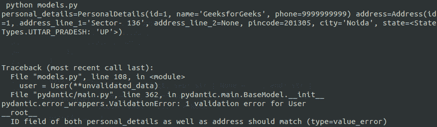

# 使用 Python 中的 Pydantic 模块创建自定义数据类型

> 原文:[https://www . geeksforgeeks . org/create-custom-data types-using-pydantic-module-in-python/](https://www.geeksforgeeks.org/create-custom-datatypes-using-pydantic-module-in-python/)

很多时候，我们发现我们需要将一长串变量传递给一个函数，而在 Python 函数签名中指定所有这些可能会有点麻烦。同样，当您希望对变量进行某种验证时，也会出现问题。对于一长串的变量，很难一直验证主函数体内的数据，这也不是一个好的做法。在这种情况下，您想要做的是将变量分离并隔离到不同的类中。在这里，我们将演示如何使用 **pydantic** 创建模型以及您的自定义验证。首先，让我们讨论用例。

考虑一下，我们正在从一个 API 调用中接收一些数据，我们需要对其进行某种分析。通常，应用编程接口响应将以 JSON 的形式发送响应，因此我们希望我们的模型能够**序列化和反序列化 JSON (1)** 。

此外，我们将假设某些变量的类型。例如，如果我们传递一个地址，我们会假设密码是一个整数值。这是**型式检查(2)** 。

要执行分析，您需要对数据做一些假设，比如密码应该与提供的地区名称匹配。这是**验证(3)** 。

我们还可以假设，对于某些领域，比如州，它应该在一个州的列表中，比如在印度，而不是任何随机的任意值。这属于**清洁(4)** 。

因此，有了这四个要求，让我们开始编码输出模式。我假设您的系统上安装了 **python** 。要安装 **pydantic** 只需运行，

```py
pip install pydantic
```

设置好之后，创建一个名为 **models.py** 的文件，并将下面的代码粘贴到其中。我们在代码本身中添加了详细的内嵌注释，使其更容易直接理解。

## 蟒蛇 3

```py
# import required modules
from enum import Enum
from typing import Optional
from pydantic import BaseModel, PositiveInt, validator, root_validator, constr

# custom class used as choices for state
# pydantic choices using the built-in Enum of python
# which reduces the need for additional packages
class StateTypes(str, Enum):

    DELHI = "DLH"
    UTTAR_PRADESH = "UP"
    BENGALURU = "BLR"
    WEST_BENGAL = "WB"

# class to get personal credentials
class PersonalDetails(BaseModel):
    id: int

    # constr gives us the ability to specify
    # the min and max length
    name: constr(min_length=2, max_length=15
    phone: PositiveInt

    # validation at field level
    @validator("phone")

    # get phone number
    def phone_length(cls, v):

        # phone number should typically be of length 10
        if len(str(v)) != 10:
            raise ValueError("Phone number must be of ten digits")
        return v

# class to get address                
class Address(BaseModel):
    id: int
    address_line_1: constr(max_length=50)

    # assigning some fields to be optional
    address_line_2: Optional[constr(max_length=50)] = None
    pincode: PositiveInt
    city: constr(max_length=30)

    # using choices in python is this simple.
    # Just create a class with Enums as choices
    # and the pass the class as type for the field
    state: StateTypes

    @validator("pincode")
    def pincode_length(cls, v):
        if len(str(v)) != 6:
            raise ValueError("Pincode must be of six digits")
        return v

# using BaseModels as custom datatypes
# in the User class                
class User(BaseModel):

    personal_details: PersonalDetails
    address: Address

    @root_validator(skip_on_failure=True)

    # skip_on_failure=True means it will skip the
    # validation for this class if it's custom
    # fields are not validated
    def check_id(cls, values):

        # custom validation ensuring personal_details.id is
        # same as address.id
        personal_details: PersonalDetails = values.get("personal_details")
        address: Address = values.get("address")
        if personal_details.id != address.id:
            raise ValueError(
                "ID field of both personal_details as well as address should match"
            )
        return values

# Driver Code
if __name__ == "__main__":

# testing models                
    validated_data = {
        "personal_details": {
            "id": 1,
            "name": "GeeksforGeeks",
            "phone": 9999999999,
        },
        "address": {
            "id": 1,
            "address_line_1": "Sector- 136",
            "pincode": 201305,
            "city": "Noida",
            "state": "UP",
        },
    }

    # this would work without any error as
    # no validation will fail
    user = User(**validated_data)

    # would print the standard __str__ value for the model
    print(user)

    unvalidated_data = {
        "personal_details": {
            "id": 1,
            "name": "GeeksforGeeks",
            "phone": 9999999999,
        },
        "address": {
            "id": 2,
            "address_line_1": "Sector- 136",
            "pincode": 201305,
            "city": "Noida",
            "state": "UP",
        },
    }

    # this would raise a value error since the IDs
    # are different
    user = User(**unvalidated_data)
    print(user)
```

**输出:**



执行截图

运行后，第一个 print 语句将成功执行，但是在下一次初始化**用户**模型时，它将抛出类型为*值错误*的*验证错误*，因为个人详细信息和地址的**id**不匹配。