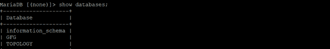

# 使用 Python 中的 PyMySQL 在 MariaDB 中创建数据库

> 原文:[https://www . geesforgeks . org/create-database-in-mariadb-using-pymysql-in-python/](https://www.geeksforgeeks.org/create-database-in-mariadb-using-pymysql-in-python/)

**马里亚数据库**是一个开源数据库管理系统和它的前身 MySQL。可以使用 **pymysql 客户端**与 MariaDB 进行交互，类似于使用 Python 的 mysql。

在本文中，我们将研究使用 *pymysql* 创建数据库的过程。要创建数据库，请使用以下语法:

```py
Syntax:CREATE DATABASE databaseName;

```

**示例:**

在本例中，我们将使用 *pymysql* 客户端创建一个名为“GFG”的数据库:

## 计算机编程语言

```py
# import the mysql client for python

import pymysql

# Create a connection object
# IP address of the MySQL database server
Host = "localhost" 

# User name of the database server
User = "user"       

# Password for the database user
Password = ""           

conn  = pymysql.connect(host=Host, user=User, password=Password)

# Create a cursor object
cur  = conn.cursor()

# creating database 
cur.execute("CREATE DATABASE GFG") 

cur.execute("SHOW DATABASES")
databaseList = cur.fetchall()

for database in databaseList:
  print(database)

conn.close()
```

**输出:**



上面的程序举例说明了*马里亚数据库*数据库“ *GFG* ”的创建，其中主机名为“ *localhost* ”，用户名为“用户”，密码为“您的密码”。

假设我们想在数据库中创建一个表，那么我们需要连接到一个数据库。下面是在上述程序中创建的 *GFG* 数据库中创建一个表的程序。

**示例:**

## 蟒蛇 3

```py
import pymysql

conn = pymysql.connect('localhost','user','password','GFG')
cur = conn.cursor()
cur.execute("DROP TABLE IF EXISTS PRODUCT") 
query = """CREATE TABLE PRODUCT ( 
         PRODUCT_ID  CHAR(20) NOT NULL, 
         price  int(10), 
         PRODUCT_TYPE VARCHAR(64) ) """

# To execute the SQL query
cur.execute(query)   

# To commit the changes
conn.commit()         
conn.close()
```

**输出:**

 