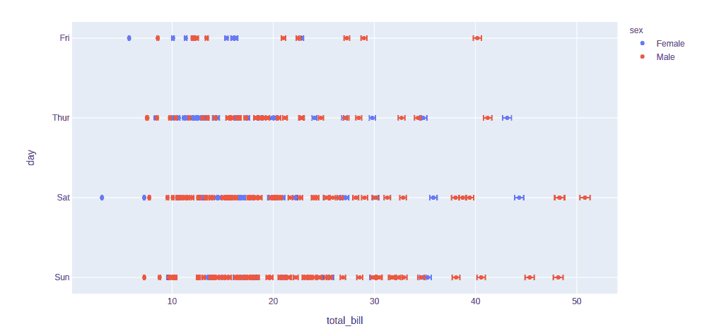
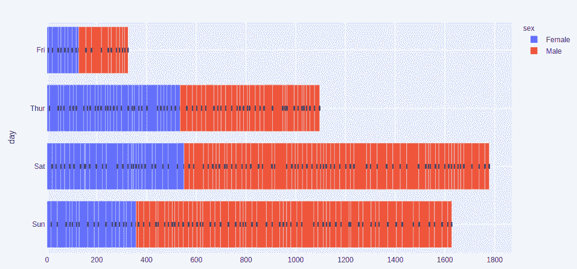
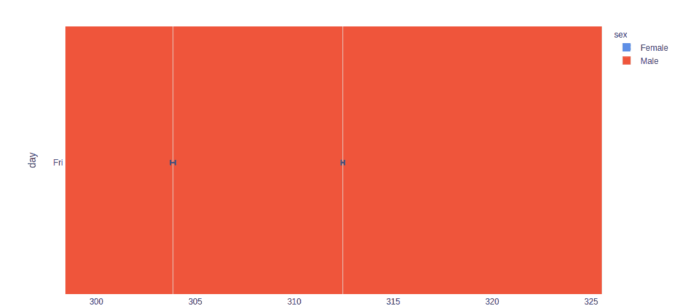
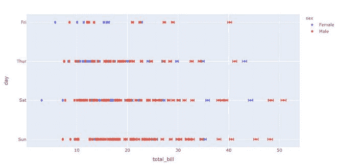
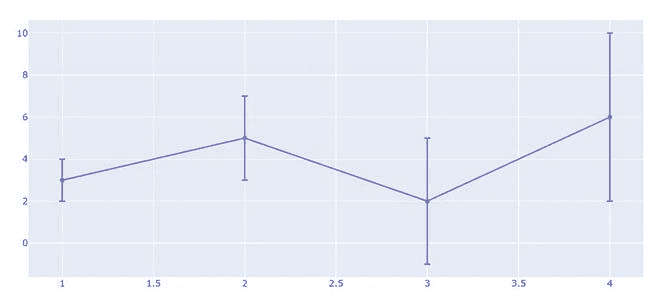
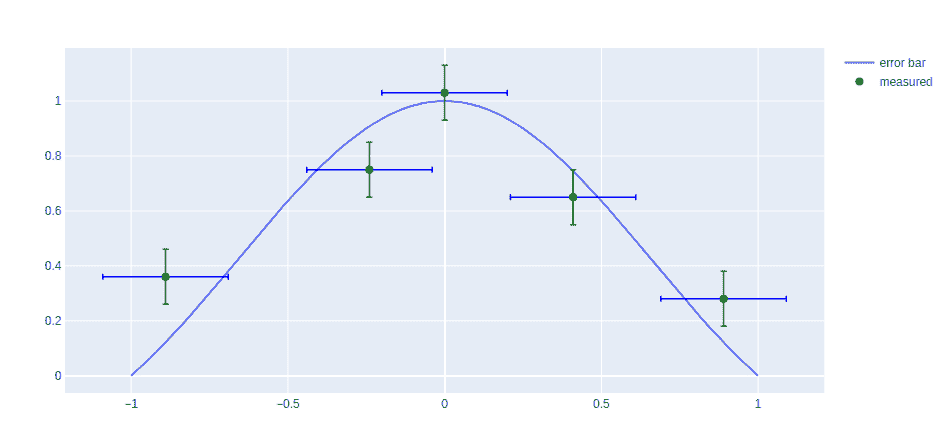

# 在 Python 中创建误差线

> 原文:[https://www . geesforgeks . org/create-error-bar-in-plotly-python/](https://www.geeksforgeeks.org/create-error-bars-in-plotly-python/)

[Plotly](https://www.geeksforgeeks.org/getting-started-with-plotly-python/) 是一个 Python 库，用来设计图形，尤其是交互图形。它可以绘制各种图形和图表，如直方图、条形图、箱线图、展开图等。它主要用于数据分析以及财务分析。plotly 是一个交互式可视化库。

## 绘图中的误差线

用于表示 2D 数据点的函数，如 px .散点图、px.line、px.bar 等。，误差线作为列名给出，它是 error_x(对于 x 位置的误差)和 error_y(对于 y 位置的误差)的值。误差线是数据的图形表示交替，用在图表上表示报告容量的误差或不确定性。

**示例 1:** 在本例中，我们将使用 tips()数据集绘制一个简单的错误图。

## 蟒蛇 3

```py
import plotly.express as px

df = px.data.tips()
df["error"] = df["total_bill"]/100

fig = px.scatter(df, x="total_bill", y="day", color="sex",
                 error_x="error", error_y="error")
fig.show()
```

**输出:**



**例 2:**

## 蟒蛇 3

```py
import plotly.express as px

df = px.data.tips()
df["e"] = df["total_bill"]/100

fig = px.bar(df, x="total_bill", y="day", color="sex",
             error_x="e", error_y="e")
fig.show()
```

**输出:**



上面的例子似乎有些混乱，但是一旦你放大它，你就会更准确地理解这个图形。



**示例 3:** 在本例中，我们将看到非对称误差条，当结果存在非线性相关性时，就会出现非对称误差。

## 蟒蛇 3

```py
import plotly.express as px

df = px.data.tips()
df["error"] = df["total_bill"]/100
df["W_error"] = df["total_bill"] - df["tip"] 

fig = px.scatter(df, x="total_bill", y="day", color="sex",
                 error_x="error", error_y="W_error")
fig.show()
```

**输出:**



**示例 4:** 在本例中，我们将看到对称误差条，对称平均绝对百分比误差是基于百分比误差的精度度量。

## 蟒蛇 3

```py
import plotly.graph_objects as go
x_data = [1, 2, 3, 4]
y_data = [3, 5, 2, 6]

fig = go.Figure(data = go.Scatter(
        x= x_data,
        y= y_data,
        error_y = dict(

              # value of error bar given in data coordinates
            type ='data',
            array = [1, 2, 3,4],
            visible = True)
    ))
fig.show()
```

**输出:**



**示例 5:** 在本例中，我们将看到如何使用错误栏的属性对其进行着色和样式设置。

## 蟒蛇 3

```py
import plotly.express as px
import plotly.graph_objects as go
import numpy as np

X = np.linspace(-1, 1, 100)
Y = np.sinc(X)

x = [-0.89, -0.24, -0.0, 0.41, 0.89, ]
y = [0.36, 0.75, 1.03, 0.65, 0.28, ]

fig = go.Figure()
fig.add_trace(go.Scatter(
    x=X, y=Y,
    name='error bar'
))

fig.add_trace(go.Scatter(
    x=x, y=y,
    mode='markers',
    name='measured',
    error_y=dict(
        type='constant',
        value=0.1,
        color='green',
        thickness=1.5,
        width=3,
    ),
    error_x=dict(
        type='constant',
        value=0.2,
        color='blue',
        thickness=1.5,
        width=3,
    ),
    marker=dict(color='green', size=8)
))

fig.show()
```

**输出:**

