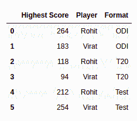
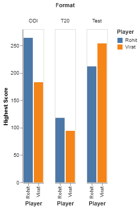
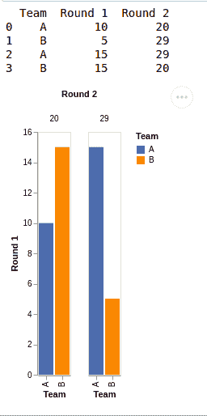

# 使用 Python 中的牛郎星创建分组条形图

> 原文:[https://www . geesforgeks . org/create-group-bar-chart-use-Altair-in-python/](https://www.geeksforgeeks.org/create-grouped-bar-chart-using-altair-in-python/)

当我们想要比较多组数据项时，分组条形图是一个方便的工具来表示我们的数据。要制作分组条形图，我们需要数据集中至少三行三列的数据。这三列可以用作-一列用于值，一列用于系列，一列用于类别。在分组条形图中，系列中的数据值并排表示，并按特定类别分组，因此它们的值可以相应地在轴上表示。属于特定系列的所有数据值在所有类别中都将始终以相同的颜色表示。

让我们举一个例子，假设，我们想比较两个玩家在三种格式下的跑步。在这里，玩家得分的运行作为值，玩家名称作为系列，游戏的格式作为类别。通常，每个玩家的得分在不同的格式中会有相同的颜色表示。

在本文中，我们将学习使用 Python 中的 Altair 库创建分组条形图。

正如我们所讨论的，我们至少需要三行/三列，我们将从导入必要的库开始，然后使用 pandas 库创建一个具有三列的数据集。

**例 1:**

## 计算机编程语言

```
import altair as alt
import pandas as pd

# creating a custom dataframe
data = pd.DataFrame([[264, 'Rohit', 'ODI'], 
                     [183, 'Virat', 'ODI'], 
                     [118, 'Rohit', 'T20'], 
                     [94, 'Virat', 'T20'],
                     [212, 'Rohit','Test'],
                     [254, 'Virat','Test']],
                     columns=['Highest Score', 'Player', 'Format'])

print(data)
```

**输出:**



现在，我们有一个包含三列的数据集，我们希望在其中比较两个玩家(系列)在不同格式(类别)下的最高得分(值)。

## 计算机编程语言

```
gp_chart = alt.Chart(data).mark_bar().encode(
  alt.Column('Format'), alt.X('Player'),
  alt.Y('Highest Score', axis=alt.Axis(grid=False)), 
  alt.Color('Player'))

gp_chart.display()
```

**输出:**



我们可以通过调用 **alt 来绘制分组图。图表()**阿尔泰库中存在的方法。我们希望我们的类别显示为列，因此我们可以在 **alt 中传递 Format。列()**方法，我们的系列(玩家)将在 x 轴上表示，因此我们在 **alt 中通过玩家。X()** 字段，我们的值(运行)应该显示在 y 轴上，因此我们通过了 **alt 内的最高分。Y()** 场。每个玩家在所有格式中都应该有相同的颜色，所以我们在 **alt 中传递玩家。Color()** 方法。

**例 2:**

## 蟒蛇 3

```
# importing package
import altair as alt
import pandas as pd

# create data
data = pd.DataFrame([['A', 10, 20],
                     ['B', 5, 29],
                     ['A', 15, 29],
                     ['B', 15, 20]],
                    columns=['Team', 'Round 1', 'Round 2'])
# view data
print(data)

gp_chart = alt.Chart(data).mark_bar().encode(
    alt.Column('Round 2'), alt.X('Team'),
    alt.Y('Round 1', axis=alt.Axis(grid=False)),
    alt.Color('Team'))

gp_chart.display()
```

**输出:**

