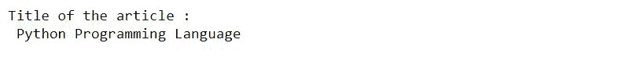
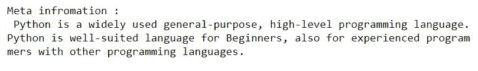
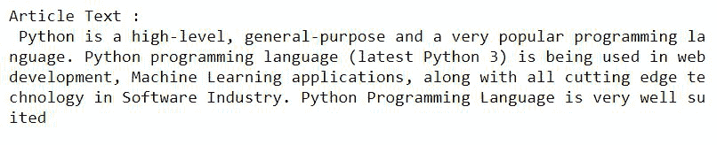
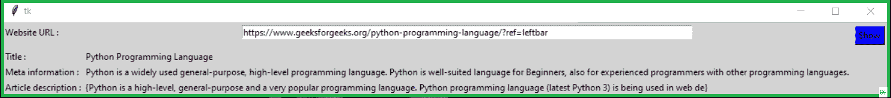

# 用 Python 创建图形用户界面来抓取文章

> 原文:[https://www . geeksforgeeks . org/create-GUI-to-web-scratch-in-python 中的文章/](https://www.geeksforgeeks.org/create-gui-to-web-scrape-articles-in-python/)

**先决条件-** [**图形用户界面应用程序使用 Tkinter**](https://www.geeksforgeeks.org/create-first-gui-application-using-python-tkinter/)

在本文中，我们将编写脚本，从给定网址的文章中提取信息。标题、元信息、文章描述等信息。，将被提取。

我们将使用**鹅模块**。

Goose 模块有助于提取以下信息:

*   文章的正文。
*   文章的主图像。
*   文章中嵌入的任何 YouTube/Vimeo 电影。
*   元描述。
*   当标记时。

首先，使用以下命令安装所需的模块。

```py
pip install goose3
```

### **接近**

*   导入模块。
*   用 Goose()创建一个对象。提取(网址)功能。
*   用 obj.title 属性获取标题。
*   使用 obj.meta_description 属性获取元描述。
*   获取带有 obj.article.cleaned_text 属性的文本。

### **实施**

**第一步:初始化需求。**

## 蟒蛇 3

```py
# import module
from goose3 import Goose

# var for URL
url = "https://www.geeksforgeeks.org/python-programming-language/?ref=leftbar"

# initialization with
article = Goose().extract(url)
```

**第二步:提取标题。**

## 蟒蛇 3

```py
print("Title of the article :\n",article.title)
```

**输出:**



**第三步:提取元信息**

## 蟒蛇 3

```py
print("Meta information :\n",article.meta_description)
```

**输出:**



**第四步:提取物品**

## 蟒蛇 3

```py
print("Article Text :\n",article.cleaned_text[:300])
```

**输出:**



**第五步:使用** [**Tkinter**](https://www.geeksforgeeks.org/python-gui-tkinter/) 进行可视化

## 蟒蛇 3

```py
# import modules
from tkinter import *
from goose3 import Goose

# for getting information
def info():
    article = Goose().extract(e1.get())
    title.set(article.title)
    meta.set(article.meta_description)
    string = article.cleaned_text[:150]
    art_dec.set(string.split("\n"))

# object of tkinter
# and background set to grey
master = Tk()
master.configure(bg='light grey')

# Variable Classes in tkinter
title = StringVar();
meta = StringVar();
art_dec = StringVar();

# Creating label for each information
# name using widget Label
Label(master, text="Website URL : " ,
      bg = "light grey").grid(row=0, sticky=W)
Label(master, text="Title :",
      bg = "light grey").grid(row=3, sticky=W)
Label(master, text="Meta information :",
      bg = "light grey").grid(row=4, sticky=W)
Label(master, text="Article description :",
      bg = "light grey").grid(row=5, sticky=W)

# Creating label for class variable
# name using widget Entry
Label(master, text="", textvariable=title,
      bg = "light grey").grid(row=3,column=1, sticky=W)
Label(master, text="", textvariable=meta,
      bg = "light grey").grid(row=4,column=1, sticky=W)
Label(master, text="", textvariable=art_dec,
      bg = "light grey").grid(row=5,column=1, sticky=W)

e1 = Entry(master, width = 100)
e1.grid(row=0, column=1)

# creating a button using the widget 
# to call the submit function
b = Button(master, text="Show", command=info , bg = "Blue")
b.grid(row=0, column=2,columnspan=2, rowspan=2,padx=5, pady=5,)

mainloop()
```

**输出:**

