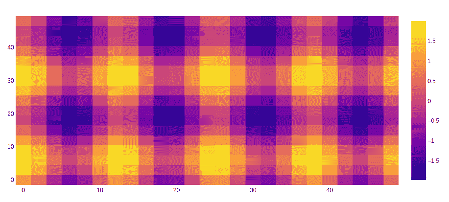
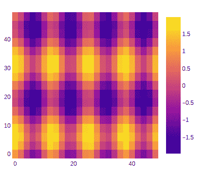

# 在

中使用图形对象类创建热图

> 原文:[https://www . geesforgeks . org/create-heat map-using-graph _ objects-class-in-plot/](https://www.geeksforgeeks.org/create-heatmaps-using-graph_objects-class-in-plotly/)

Plotly 是一个 Python 库，用于设计图形，尤其是交互式图形。它可以绘制各种图形和图表，如直方图、条形图、箱线图、展开图等。它主要用于数据分析以及财务分析。plotly 是一个交互式可视化库。

## 使用图形对象的热图

热图是数据的二维图形表示，其中矩阵中包含的单个值以颜色表示。

> **语法:** plotly.graph_objects。热图(参数=无，自动色标=无，颜色条=无，颜色刻度=无，x =无，y =无，z =无，**kwargs)
> 
> **参数:**
> 
> **arg:** 与此构造函数兼容的属性集合
> 
> **自动色阶:**确定色阶是默认调色板(自动色阶:true)还是由色阶确定的调色板。
> 
> **color bar:**plot . graph _ objects . heat map . color bar 实例或具有兼容属性的 dict
> 
> **色阶:**设置色阶。colorscale 必须是包含数组的数组，这些数组将规范化值映射到 rgb、rgba、hex、hsl、hsv 或命名颜色字符串。
> 
> **x:** 设置 x 坐标。
> 
> **y:** 设置 y 坐标。
> 
> **z:** 设置 z 坐标。

**示例:**

## 蟒蛇 3

```
import plotly.graph_objects as go

feature_x = np.arange(0, 50, 2) 
feature_y = np.arange(0, 50, 3) 

# Creating 2-D grid of features 
[X, Y] = np.meshgrid(feature_x, feature_y) 

Z = np.cos(X / 2) + np.sin(Y / 4) 

fig = go.Figure(data =
     go.Heatmap(x = feature_x, y = feature_y, z = Z,))

fig.show()
```

**输出:**



## 呈现不相等块大小的热图

简而言之，可以显示不同大小的块，以使数据相互区分，从而使其更加清晰，同时呈现为数据具有彼此不同的高度和宽度。

**示例:**

## 蟒蛇 3

```
import plotly.graph_objects as go

feature_x = np.arange(0, 50, 2)
feature_y = np.arange(0, 50, 3)

# Creating 2-D grid of features
[X, Y] = np.meshgrid(feature_x, feature_y)

Z = np.cos(X / 2) + np.sin(Y / 4)

fig = go.Figure(data=go.Heatmap(
  x=feature_x, y=feature_y, z=Z,))

fig.update_layout(
    margin=dict(t=200, r=200, b=200, l=200),
    showlegend=False,
    width=700, height=700,
    autosize=False)

fig.show()
```

**输出:**

