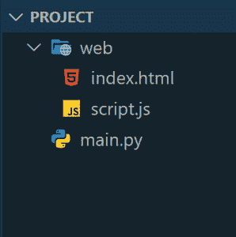
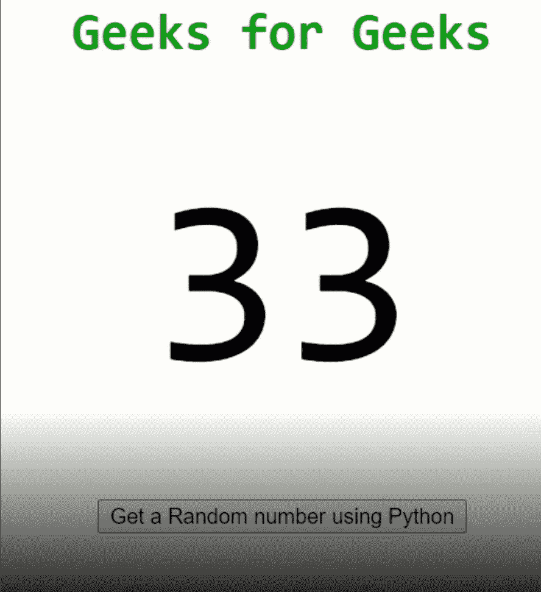

# 使用 Python 中的 Eel 创建 HTML 用户界面

> 原文:[https://www . geesforgeks . org/create-html-user-interface-use-eel-in-python/](https://www.geeksforgeeks.org/create-html-user-interface-using-eel-in-python/)

Eel 是一个 Python 库，用于制作简单的离线 HTML/JS GUI 应用程序，可以完全访问 Python 功能和库。Eel 托管一个本地网络服务器，然后让您用 Python 注释函数，这样就可以从 Javascript 调用它们，反之亦然。

### **安装**

要安装此模块，请在终端中键入以下命令。

```
pip install eel
```

### 入门指南

首先，创建一个项目文件夹，并在它下面创建另一个名为 web 的文件夹。web 文件夹由所有网站文件组成。在项目文件夹内的 web 文件夹外创建一个 main.py python 文件。

这应该会建立一个如下所示的文件夹:



文件和文件夹

在前端 javascript 中使用 eel。在 HTML 文件中包含以下代码:

包含这个库创建了一个可以用来与 Python 端通信的 eel 对象。Python 代码中任何用 **@eel 修饰的函数，这样暴露**:

> @ eel . expert
> 
> def 函数():

使用 eel.expose 公开的任何 python 函数都可以在如下 javascript 中调用:

> eel.python_function_name()(回调)；

下面是一个例子，python 有一个函数 **random_python** ，它返回一个 1 到 100 之间的随机数，Javascript 调用，然后抓取返回的数字，并更改一个 div 的 innerHTML。

这里的 HTML 文件用于创建一个显示所有必需属性的窗口，javascript 文件将被 HTML 文件调用，为创建的窗口增加活力。Python 代码被用来使这一切工作。

**HTML 文件:**

## 超文本标记语言

```
<!DOCTYPE html>
<html lang="en">
  <head>
    <meta charset="UTF-8" />
    <meta http-equiv="X-UA-Compatible" content="IE=edge" />
    <meta name="viewport" content="width=device-width, initial-scale=1.0" />
    <title>Eel Example</title>
    <style>
      h1{
        color: green;
        text-align: center;
      }
      .random_number{
        margin: 50px;
        font-size: 150px;
        text-align: center;
      }
      button{
        display: block;
        margin: 0 auto;
      }
    </style>
  </head>
  <body>
    <h1>Geeks for Geeks</h1>
    <div class="random_number"></div>
    <button>Get a Random number using Python</button>
    <script type="text/javascript" src="../eel.js"></script>
    <script src="./script.js"></script>
  </body>
</html>
```

**script.js :**

## java 描述语言

```
// Onclick of the button
document.querySelector("button").onclick = function () {  
  // Call python's random_python function
  eel.random_python()(function(number){                      
    // Update the div with a random number returned by python
    document.querySelector(".random_number").innerHTML = number;
  })
}
```

**主. py 包含:**

## 蟒蛇 3

```
import eel
from random import randint

eel.init("web")  

# Exposing the random_python function to javascript
@eel.expose    
def random_python():
    print("Random function running")
    return randint(1,100)

# Start the index.html file
eel.start("index.html")
```

**输出:**



**注意:**这里 javascript 调用的是 python 函数，当 python 返回数据时，它会改变 div 文本。