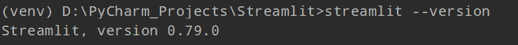
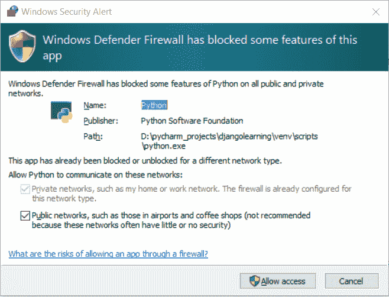
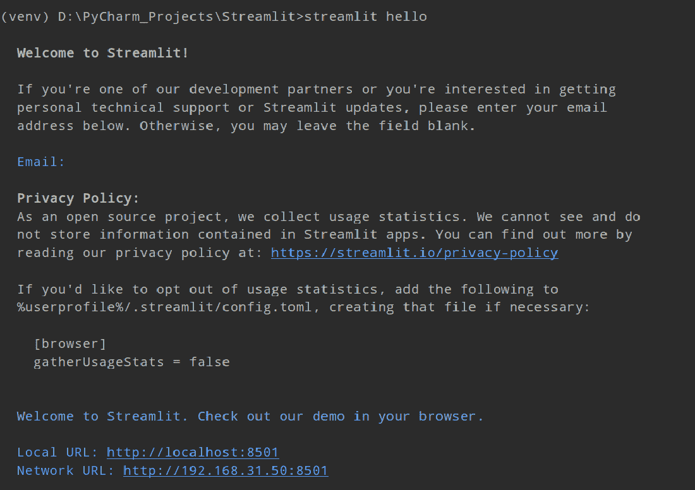
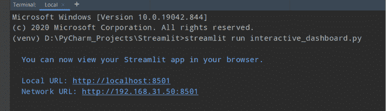
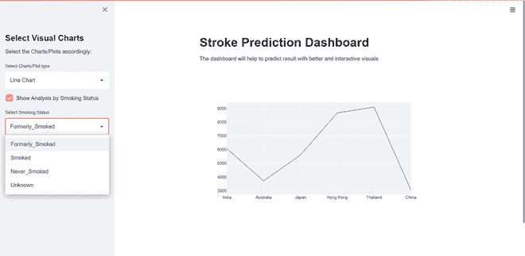

# 使用细流

在 Python 中创建交互式仪表板

> 原文:[https://www . geeksforgeeks . org/create-interactive-dashboard-in-python-use-stream it/](https://www.geeksforgeeks.org/create-interactive-dashboard-in-python-using-streamlit/)

为了更好地理解我们的数据集，一个交互式的信息仪表板是非常必要的。这将有助于研究人员更好地理解我们的结果，之后，研究人员可以做出一些必要的改变来更好地理解。为了快速理解，可视化报告必须优于数字格式。

简而言之，Streamlit 是创建仪表板的一种非常简单和容易的方法，它可以帮助我们创建一个高效、有效和解释性的仪表板。Streamlit 是一个开源的 web 应用程序框架，它通过一个可爱的仪表板来调查和理解信息，从而使信息研究者的工作变得简单。

使用细流不需要前端知识。这个框架将把数据脚本转换成一个可共享的 web 应用程序，只需几行代码，也只需几秒钟。在本文中，我们将讨论如何使用细流在 Python 中创建交互式仪表板。

### 安装:

在实际实现之前，我们需要安装 Streamlit web 框架。只需在命令提示符下运行以下命令。

```
pip install streamlit
```

一旦我们成功安装了 streamlit。现在，让我们在继续之前检查一下，让我们检查一下 streamlit 是否安装成功。只需在下面写下这个命令，

```
streamlit --version
```



用于验证细流 web 框架的安装

我们已经完成了基本的安装步骤。现在，让我们使用这个预定义的命令运行我们的第一个程序，

```
streamlit hello
```

一旦我们第一次运行这个命令，它会要求我们访问，只需点击允许访问按钮。



一旦我们点击了允许访问按钮，我们将在命令提示符下获得一个本地网址。这将询问我们的电子邮件 id，我们可以跳过这一步，只需按回车键，否则，我们可以输入我们的电子邮件 id 以获得未来的技术支持。



**输出:**

这个窗口会在我们的 Chrome 浏览器上自动打开。


我们可以选择任何演示来进一步了解 streamlit web 框架。要关闭或退出正在运行的应用程序，我们需要按 Ctrl+C。

### 方法:

让我们讨论我们的方法，我们将使用笔画预测数据集创建一个交互式和解释性的仪表板。有许多方法可以显示文本、图像、地图等等。Streamlit 为我们提供了一些功能，通过这些功能我们可以编写标题、标题、减价等。

<figure class="table">

| **功能** | 

**描述**

 |
| --- | --- |
| 标题() | 它用于设置标题。 |
| 降价() | 它用于将一些文本显示为 Markdown。 |
| 文本() | 该函数用于为任何主题或图像编写一些描述文本。 |
| 乳胶() | 用于解释性仪表板上的数学表达式。 |
| 侧边栏() | 这个函数用来在仪表板上创建一个侧边栏，然后我们可以把一些数据放在那个部分。 |
| 地图() | 用于显示地图。 |

</figure>

以上功能是常用的。在本例中，我们可以创建三种类型的图表，分别是折线图、条形图和气泡图。在这里，我们还有四个条件“以前吸过”、“吸过”、“从未吸过”和“未知”。在这个例子的帮助下，我们可以为任何条件创建任何图表，这意味着总共有 12 个图表。

**步骤 1:** 首先，我们将使用上述功能为主仪表板窗口设置一个标题和一些描述:

> 标题(“中风预测仪表板”)
> 
> st.markdown(“仪表板将帮助研究人员更多地了解给定的数据集及其输出”)

**步骤 2:** 现在，让我们创建一个带有简单标题和描述的侧栏。

> 侧边栏标题(“选择可视图表”)
> 
> st.sidebar.markdown("相应地选择图表/曲线图:")

**第三步:**使用熊猫库，我们需要阅读我们的。用于创建数据框的 csv 文件。您可以使用这个[数据集](https://drive.google.com/file/d/1F67Ezf9H1rI-sCmjRYvnRwpc0UmaaDtY/view)进行演示。

```
data = pd.read_csv("<Path_for_.csv_file>")
```

**步骤 4:** Streamlit 还为我们提供了一些功能，通过这些功能，我们可以在一行代码中轻松创建一个选择框。在我们的程序中，我们给出了两个参数，第一个参数是标题，第二个参数是元组形式的选择框选项。

> Chart _ visual = ST . sidebar . selectbox('选择图表/绘图类型'，('折线图'，'条形图'，'气泡图')

**第 5 步:**与选择框类似，我们有另一种创建复选框的方法。

```
st.sidebar.checkbox("Show Analysis by Smoking Status", True, key=1)
```

**第六步:**使用 selectbox()函数，我们将创建一个具有四个选项的 selectbox。

> selected _ Status = ST . sidebar . selectbox('选择吸烟状态'，选项=['以前吸过'，'吸过'，'从未吸过'，'未知'])

**第 7 步:**当我们从第一个选择框中选择一个选项时，该值会存储到 chart_visual 变量中。该变量值代表图表类型。通过第二个选择框，该值被存储到 selected_status 变量中。使用这个值，我们将创建主图形。使用简单的 if_else 条件，我们将为绘制图形创造条件。

**步骤 8:** 使用 add_trace()方法，新的轨迹将被添加到图形对象图形中。该方法将采用图形对象跟踪(go 的一个实例。去吧。分散等。)作为参数并将其添加到图中。

**第九步:**使用 go。散开()，走。Bar()方法，我们将创建信息图表，通过这些图表，研究人员可以轻松了解数据集的输出。首先，去吧。散点图()在我们的程序中采用四个参数，第一个作为 x 轴值，第二个作为 y 轴值，第三个作为图形的模式，第四个作为新创建的图形的名称。

```
fig.add_trace(go.Scatter(x=data.Country, y=data.formerly_smoked,
                                 mode='lines',
                                 name='Formerly_Smoked'))
```

**第十步:**第二，走。Bar()方法在我们的程序中采用三个参数，第一个作为 x 轴值，第二个作为 y 轴值，第三个作为新创建的图形的名称。

```
fig.add_trace(go.Bar(x=data.Country, y=data.Unknown,
                             name="Unknown"))
```

**下面是实现:**

## 蟒蛇 3

```
import streamlit as st
import pandas as pd
import plotly.graph_objects as go

st.title("Stroke Prediction Dashboard")
st.markdown("The dashboard will help a researcher to get to know \
more about the given datasets and it's output")
st.sidebar.title("Select Visual Charts")
st.sidebar.markdown("Select the Charts/Plots accordingly:")

data = pd.read_csv("D:\PyCharm_Projects\Streamlit\demo_data_set.csv")

chart_visual = st.sidebar.selectbox('Select Charts/Plot type', 
                                    ('Line Chart', 'Bar Chart', 'Bubble Chart'))

st.sidebar.checkbox("Show Analysis by Smoking Status", True, key = 1)
selected_status = st.sidebar.selectbox('Select Smoking Status',
                                       options = ['Formerly_Smoked', 
                                                  'Smoked', 'Never_Smoked', 
                                                  'Unknown'])

fig = go.Figure()

if chart_visual == 'Line Chart':
    if selected_status == 'Formerly_Smoked':
        fig.add_trace(go.Scatter(x = data.Country, y = data.formerly_smoked,
                                 mode = 'lines',
                                 name = 'Formerly_Smoked'))
    if selected_status == 'Smoked':
        fig.add_trace(go.Scatter(x = data.Country, y = data.Smokes,
                                 mode = 'lines', name = 'Smoked'))
    if selected_status == 'Never_Smoked':
        fig.add_trace(go.Scatter(x = data.Country, y = data.Never_Smoked,
                                 mode = 'lines',
                                 name = 'Never_Smoked'))
    if selected_status == 'Unknown': 
        fig.add_trace(go.Scatter(x=data.Country, y=data.Unknown,
                                 mode='lines',
                                 name="Unknown"))

elif chart_visual == 'Bar Chart':
    if selected_status == 'Formerly_Smoked':
        fig.add_trace(go.Bar(x=data.Country, y=data.formerly_smoked,
                             name='Formerly_Smoked'))
    if selected_status == 'Smoked':
        fig.add_trace(go.Bar(x=data.Country, y=data.Smokes,
                             name='Smoked'))
    if selected_status == 'Never_Smoked':
        fig.add_trace(go.Bar(x=data.Country, y=data.Never_Smoked,
                             name='Never_Smoked'))
    if selected_status == 'Unknown':
        fig.add_trace(go.Bar(x=data.Country, y=data.Unknown,
                             name="Unknown"))

elif chart_visual == 'Bubble Chart':
    if selected_status == 'Formerly_Smoked':
        fig.add_trace(go.Scatter(x=data.Country, 
                                 y=data.formerly_smoked,
                                 mode='markers',
                                 marker_size=[40, 60, 80, 60, 40, 50],
                                 name='Formerly_Smoked'))

    if selected_status == 'Smoked':
        fig.add_trace(go.Scatter(x=data.Country, y=data.Smokes,
                                 mode='markers', 
                                 marker_size=[40, 60, 80, 60, 40, 50],
                                 name='Smoked'))

    if selected_status == 'Never_Smoked':
        fig.add_trace(go.Scatter(x=data.Country,
                                 y=data.Never_Smoked,
                                 mode='markers', 
                                 marker_size=[40, 60, 80, 60, 40, 50],
                                 name = 'Never_Smoked'))
    if selected_status == 'Unknown':
        fig.add_trace(go.Scatter(x=data.Country,
                                 y=data.Unknown,
                                 mode='markers',
                                 marker_size=[40, 60, 80, 60, 40, 50], 
                                 name="Unknown"))

st.plotly_chart(fig, use_container_width=True)
```

为了运行上面的程序，我们将在命令提示符下运行一个简单的命令。

```
streamlit run file_name.py
```

**输出:**



命令提示符窗口输出

借助本地主机网址，我们可以在任何网络浏览器上看到我们的程序输出。



主仪表板输出

**输出视频:**

<video class="wp-video-shortcode" id="video-578206-1" width="640" height="360" preload="metadata" controls=""><source type="video/mp4" src="https://media.geeksforgeeks.org/wp-content/uploads/20210320174827/Streamlit_Dashboard.mp4?_=1">[https://media.geeksforgeeks.org/wp-content/uploads/20210320174827/Streamlit_Dashboard.mp4](https://media.geeksforgeeks.org/wp-content/uploads/20210320174827/Streamlit_Dashboard.mp4)</video>