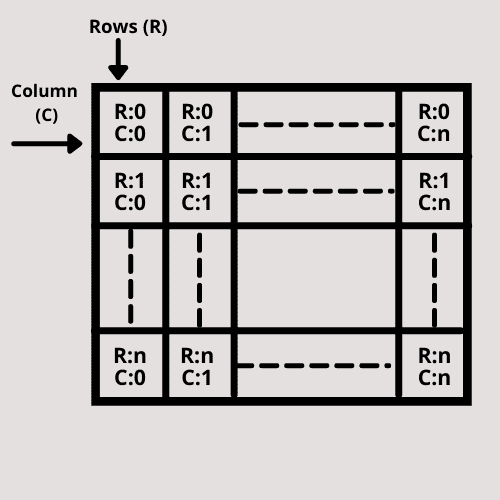

# 使用 Tkinter

使用网格管理器创建多个框架

> 原文:[https://www . geesforgeks . org/create-multi-frames-with-grid-manager-use-tkinter/](https://www.geeksforgeeks.org/create-multiple-frames-with-grid-manager-using-tkinter/)

**先决条件** : [Tkinter](https://www.geeksforgeeks.org/python-gui-tkinter/)

**Tkinter** 可以支持在同一帧中创建多个小部件。不仅如此，它还支持一种机制来使它们相对于彼此对齐。在 Tkinter 中对齐不同小部件最简单的方法之一是通过网格管理器。除了对齐各种小部件之外，网格管理器还可以用于对齐大量的框架。

在本文中，我们将讨论将多个框架与网格管理器对齐的方法。

为此，首先需要定义框架，然后需要使用 grid()对齐它们。

**语法:**

> frame1=LabelFrame(应用程序，text = " #您希望在框架中给出的文本")
> 
> 框架 1 .网格(行= #行值，列= #列值)

### 使用的功能

*   L [abelFrame()](https://www.geeksforgeeks.org/python-tkinter-create-labelframe-and-add-widgets-to-it/) 用于创建框架
*   [网格()](https://www.geeksforgeeks.org/python-grid-method-in-tkinter/)用于将网格管理器应用于创建的小部件

### 方法

*   导入模块
*   使用 tkinter 创建图形用户界面应用程序
*   给这个应用一个标题。(可选)
*   现在，创建第一个框架，即框架 1
*   通过指定行和列值，在网格管理器中显示框架 1。
*   此外，创建一个希望在框架 1 中显示的小部件。
*   显示您在上一步中制作的小部件。
*   要创建更多帧，请重复步骤 4 至 7。重复这些步骤 n 次，创建 n 个帧。不要忘记更改每一帧的行值和列值。您可以根据给定的图像更改帧的行值和列值。



*   最后，循环在屏幕上显示图形用户界面应用程序。

**程序:**

## 计算机编程语言

```py
# Import the library tkinter
from tkinter import *

# Create a GUI app
app = Tk()

# Give a title to your app
app.title("Vinayak App")

# Constructing the first frame, frame1
frame1 = LabelFrame(app, text="Fruit", bg="green",
                    fg="white", padx=15, pady=15)

# Displaying the frame1 in row 0 and column 0
frame1.grid(row=0, column=0)

# Constructing the button b1 in frame1
b1 = Button(frame1, text="Apple")

# Displaying the button b1
b1.pack()

# Constructing the second frame, frame2
frame2 = LabelFrame(app, text="Vegetable", bg="yellow", padx=15, pady=15)

# Displaying the frame2 in row 0 and column 1
frame2.grid(row=0, column=1)

# Constructing the button in frame2
b2 = Button(frame2, text="Tomato")

# Displaying the button b2
b2.pack()

# Make the loop for displaying app
app.mainloop()
```

**输出:**

