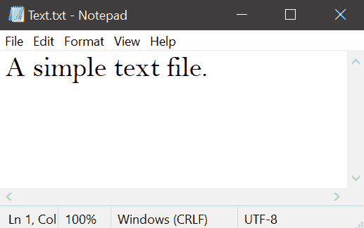

# 使用 Python 创建文件的密码保护 Zip 文件

> 原文:[https://www . geesforgeks . org/create-password-protected-zip-of-a-file-use-python/](https://www.geeksforgeeks.org/create-password-protected-zip-of-a-file-using-python/)

ZIP 是一种支持无损数据压缩的归档文件格式。无损压缩是指压缩算法允许从压缩数据中完美地重建原始数据。因此，ZIP 文件是包含一个或多个压缩文件的单个文件，提供了一种理想的方法来缩小大文件并将相关文件保存在一起。

在本文中，我们将学习如何使用 Python 创建受密码保护的文件 Zip。为此，我们使用 python 中的 **pyminizip** 模块。

### **安装:**

****pyminizip**模块可以使用以下命令安装:**

```py
pip install pyminizip
```

**为了创建 zip，我们使用了来自 **pyminizip** 的 **compress()** 方法。因此，我们首先讨论它的语法和参数。**

### ****语法:****

> **pyminizip . compress("/src file/path . txt "，" file_path_prefix "，"/distfile/path.zip "，" password "，int(compress_level))**
> 
> ****论据:****
> 
> *   **src 文件路径(字符串)**
> *   **src 文件前缀路径(字符串)或无(添加到文件前的路径)**
> *   **dst 文件路径(字符串)**
> *   **密码(字符串)或无(创建无密码 zip)**
> *   **压缩级别(int)在 1 到 9 之间，1(更快)< — > 9(更压缩)或 0(默认)** 
> 
> ****返回值:**始终不返回**

### ****实施:****

****输入文件:****

****

****程序:****

## **蟒蛇 3**

```py
# importing module
import pyminizip

# input file path
inpt = "./Text.txt"

# prefix path
pre = None

# output zip file path
oupt = "./output.zip"

# set password value
password = "GFG"

# compress level
com_lvl = 5

# compressing file
pyminizip.compress(inpt, None, oupt,
                   password, com_lvl)
```

****输出:****

****