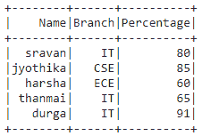
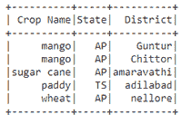

# 从元组列表中创建 PySpark 数据框

> 原文:[https://www . geeksforgeeks . org/create-py spark-data frame-from-list-of-tuples/](https://www.geeksforgeeks.org/create-pyspark-dataframe-from-list-of-tuples/)

在本文中，我们将讨论从元组列表创建 Pyspark 数据帧。

为此，我们将使用 pyspark 中的 createDataFrame()方法。该方法从 RDD、列表或熊猫数据帧创建数据帧。这里的数据是元组列表，列是列名列表。

**语法:**

> data frame = spark . createdata frame(数据，列)

**例 1:**

## 蟒蛇 3

```
# importing module
import pyspark

# importing sparksession from 
# pyspark.sql module
from pyspark.sql import SparkSession

# creating sparksession and giving
# an app name
spark = SparkSession.builder.appName('sparkdf').getOrCreate()

# list of tuples of college data
data = [("sravan", "IT", 80),
        ("jyothika", "CSE", 85),
        ("harsha", "ECE", 60),
        ("thanmai", "IT", 65),
        ("durga", "IT", 91)]

# giving column names of dataframe
columns = ["Name", "Branch", "Percentage"]

# creating a dataframe
dataframe = spark.createDataFrame(data, columns)

# show data frame
dataframe.show()
```

**输出:**



**例 2:**

## 蟒蛇 3

```
# importing module
import pyspark

# importing sparksession from 
# pyspark.sql module
from pyspark.sql import SparkSession

# creating sparksession and giving 
# an app name
spark = SparkSession.builder.appName('sparkdf').getOrCreate()

# list of tuples of plants data
data = [("mango", "AP", "Guntur"),
        ("mango", "AP", "Chittor"),
        ("sugar cane", "AP", "amaravathi"),
        ("paddy", "TS", "adilabad"),
        ("wheat", "AP", "nellore")]

# giving column names of dataframe
columns = ["Crop Name", "State", "District"]

# creating a dataframe
dataframe = spark.createDataFrame(data, columns)

# show data frame
dataframe.show()
```

**输出:**



**例 3:**

对列表中的记录(元组)进行计数的 Python 代码

## 蟒蛇 3

```
# importing module
import pyspark

# importing sparksession from
# pyspark.sql module
from pyspark.sql import SparkSession

# creating sparksession and giving
# an app name
spark = SparkSession.builder.appName('sparkdf').getOrCreate()

#list of tuples of plants data
data = [("mango", "AP", "Guntur"),
        ("mango", "AP", "Chittor"),
        ("sugar cane", "AP", "amaravathi"),
        ("paddy", "TS", "adilabad"),
        ("wheat", "AP", "nellore")]

# giving column names of dataframe
columns = ["Crop Name", "State", "District"]

# creating a dataframe 
dataframe = spark.createDataFrame(data, columns)

#count records in the list
dataframe.count()
```

**输出:**

```
5
```