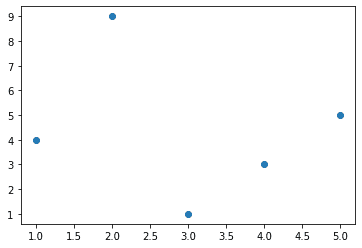
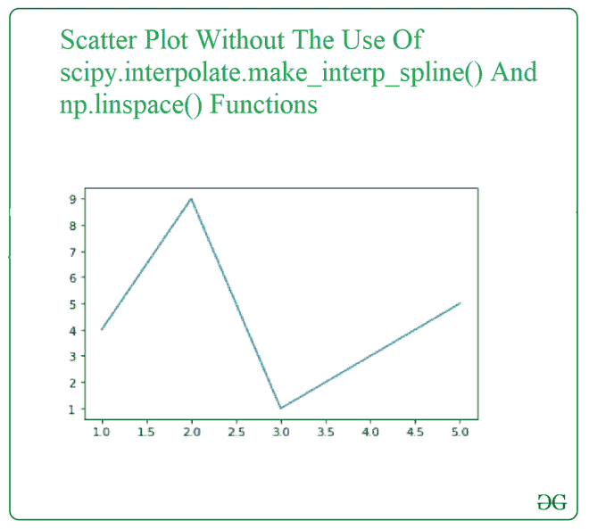
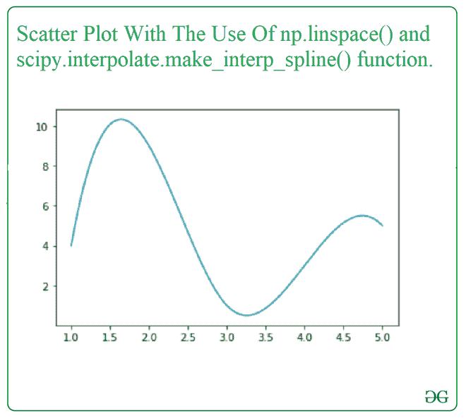

# 使用 Python 使用平滑线创建散点图

> 原文:[https://www . geesforgeks . org/create-散点图-带平滑线-使用-python/](https://www.geeksforgeeks.org/create-scatter-plot-with-smooth-line-using-python/)

曲线可以被平滑，以达到可视化的良好近似的想法。在本文中，我们将在 SciPy 库的帮助下用平滑线绘制散点图。要绘制平滑的散点图，我们使用以下函数:

*   来自 scipy 库中的**SciPy . INTERPOL . make _ interp _ spline()**计算插值 B 样条的系数。通过从 Scipy 库中导入该函数并添加参数，可以更容易地获得散点图的平滑线。

> **语法:**
> 
> scipy . INTERPOL . make _ interp _ spline(x，y，k=3，t =无，bc _ type =无，轴=0，check _ 有限=真)
> 
> **参数:**
> 
> *   x:-脓肿
> *   y:-坐标
> *   k:-B 样条度
> *   t:-节
> *   BC _ type:-边界条件
> *   轴:-插值轴
> *   check _ limited:-是否检查输入数组是否只包含有限的数字
> 
> **返回:**一个度数为 k，节数为 t 的 BSpline 对象

*   **np.linspace()** 函数是从 NumPy 库中导入的，用于获取指定间隔内均匀分布的数字，用于绘制平滑的直线散点图。

> **语法:**
> 
> numpy.linspace(开始，停止，num=50，endpoint=True，retstep=False，dtype =无，axis=0)
> 
> **参数:**
> 
> *   start:-序列的起始值。
> *   stop:-序列的结束值。
> *   数量:-要生成的样本数量。
> *   端点:-如果为真，停止是最后一个样本。
> *   retstep:-如果为 True，则返回(样本，步长)，其中步长是样本之间的间距。
> *   dtype:-输出数组的类型。
> *   轴:-结果中存储样本的轴。
> 
> **返回:**封闭区间内等间距样本数的数组

**接近**

*   导入模块
*   创建或加载数据
*   创建散点图
*   从散点图的点创建平滑曲线
*   显示图

让我们从一个样本散点图开始。

**例:**

## 蟒蛇 3

```
import numpy as np
import matplotlib.pyplot as plt

x = np.array([1, 2, 3, 4, 5])

y = np.array([4, 9, 1, 3, 5])

plt.scatter(x, y)

plt.show()
```

**输出:**



现在让我们通过连接散点图的点来可视化散点图，这样就可以出现一条不平坦的曲线，也就是说不平滑，这样差异就可以很明显了。

**示例:**

## 蟒蛇 3

```
import numpy as np
import matplotlib.pyplot as plt

x = np.array([1, 2, 3, 4, 5])

y = np.array([4, 9, 1, 3, 5])

plt.plot(x, y)

plt.show()
```

**输出:**



现在，我们将使用 np.linspace()和 scipy . INTERPOL . make _ interp _ spline()函数查看与上面相同的示例。

**示例:**

## 蟒蛇 3

```
import numpy as np
import matplotlib.pyplot as plt
from scipy.interpolate import make_interp_spline

x = np.array([1, 2, 3, 4, 5])
y = np.array([4, 9, 1, 3, 5])

xnew = np.linspace(x.min(), x.max(), 300)

gfg = make_interp_spline(x, y, k=3)

y_new = gfg(xnew)

plt.plot(xnew, y_new)

plt.show()
```

**输出:**

