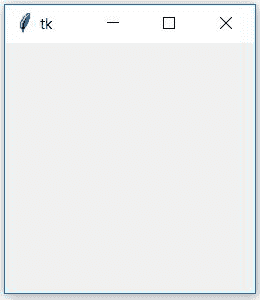
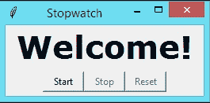
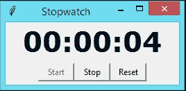

# 使用 python 创建秒表

> 原文:[https://www . geesforgeks . org/create-秒表-使用-python/](https://www.geeksforgeeks.org/create-stopwatch-using-python/)

本文重点介绍如何在 python 中使用 Tkinter 创建秒表
**Tkinter** : Tkinter 是 Python 的标准 GUI 库。Python 与 Tkinter 相结合，为创建图形用户界面应用程序提供了一种快速简单的方法。Tkinter 为 Tk GUI 工具包提供了一个强大的面向对象的接口。开始使用 Tkinter 非常容易，下面是一些示例代码，您可以在 python 中使用 Tkinter。

## 蟒蛇 3

```py
# Python program to create a
# a new window using Tkinter
# importing the required libraries
import tkinter

# creating a object 'top' as instance of class Tk
top = tkinter.Tk()

# This will start the blank window
top.mainloop()
```

**输出:**



**使用 Tkinter 创建秒表**

现在让我们尝试使用 Tkinter 模块创建一个程序来创建秒表。
秒表是一种手持式时计，旨在测量从启动时的特定时间到停止时的时间。设计用于远距离观看的秒表的大型数字版本，如在体育场中，被称为秒表。在手动计时中，时钟是通过人按一个按钮来启动和停止的。在全自动时间内，启动和停止都由传感器自动触发。
**必需模块:**我们将只使用 Tkinter 来创建图形用户界面，在这个程序中不会使用其他库。
**源代码:**

## 蟒蛇 3

```py
# Python program to illustrate a stop watch
# using Tkinter
#importing the required libraries
import tkinter as Tkinter
from datetime import datetime
counter = 66600
running = False
def counter_label(label):
    def count():
        if running:
            global counter

            # To manage the initial delay.
            if counter==66600:            
                display="Starting..."
            else:
                tt = datetime.fromtimestamp(counter)
                string = tt.strftime("%H:%M:%S")
                display=string

            label['text']=display   # Or label.config(text=display)

            # label.after(arg1, arg2) delays by 
            # first argument given in milliseconds
            # and then calls the function given as second argument.
            # Generally like here we need to call the 
            # function in which it is present repeatedly.
            # Delays by 1000ms=1 seconds and call count again.
            label.after(1000, count) 
            counter += 1

    # Triggering the start of the counter.
    count()     

# start function of the stopwatch
def Start(label):
    global running
    running=True
    counter_label(label)
    start['state']='disabled'
    stop['state']='normal'
    reset['state']='normal'

# Stop function of the stopwatch
def Stop():
    global running
    start['state']='normal'
    stop['state']='disabled'
    reset['state']='normal'
    running = False

# Reset function of the stopwatch
def Reset(label):
    global counter
    counter=66600

    # If rest is pressed after pressing stop.
    if running==False:      
        reset['state']='disabled'
        label['text']='Welcome!'

    # If reset is pressed while the stopwatch is running.
    else:               
        label['text']='Starting...'

root = Tkinter.Tk()
root.title("Stopwatch")

# Fixing the window size.
root.minsize(width=250, height=70)
label = Tkinter.Label(root, text="Welcome!", fg="black", font="Verdana 30 bold")
label.pack()
f = Tkinter.Frame(root)
start = Tkinter.Button(f, text='Start', width=6, command=lambda:Start(label))
stop = Tkinter.Button(f, text='Stop',width=6,state='disabled', command=Stop)
reset = Tkinter.Button(f, text='Reset',width=6, state='disabled', command=lambda:Reset(label))
f.pack(anchor = 'center',pady=5)
start.pack(side="left")
stop.pack(side ="left")
reset.pack(side="left")
root.mainloop()
```

**输出:**





<video class="wp-video-shortcode" id="video-162386-1" width="640" height="360" preload="metadata" controls=""><source type="video/mp4" src="https://media.geeksforgeeks.org/wp-content/uploads/2017-10-26-at-19-18-25.mp4?_=1">[https://media.geeksforgeeks.org/wp-content/uploads/2017-10-26-at-19-18-25.mp4](https://media.geeksforgeeks.org/wp-content/uploads/2017-10-26-at-19-18-25.mp4)</video>

本文由 [**Subhajit Saha**](https://auth.geeksforgeeks.org/profile.php?user=Subhajit Saha) 供稿。如果你喜欢 GeeksforGeeks 并想投稿，你也可以使用[write.geeksforgeeks.org](https://write.geeksforgeeks.org)写一篇文章或者把你的文章邮寄到 review-team@geeksforgeeks.org。看到你的文章出现在极客博客主页上，帮助其他极客。
如果发现有不正确的地方，或者想分享更多关于上述话题的信息，请写评论。