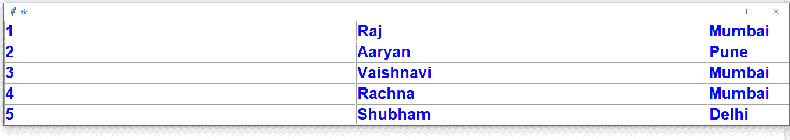

# 使用 Tkinter 创建表格

> 原文:[https://www.geeksforgeeks.org/create-table-using-tkinter/](https://www.geeksforgeeks.org/create-table-using-tkinter/)

Python 为开发图形用户界面提供了多种选择。在所有的 GUI 方法中， **Tkinter** 是最常用的方法。它是 Python 附带的 Tk 图形用户界面工具包的标准 Python 接口。Python 搭配 Tkinter 是创建 GUI 应用程序最快最简单的方法。使用 Tkinter 创建图形用户界面是一项简单的任务。

**注意:**更多信息请参考[Python GUI–tkinter](http://geeksforgeeks.org/python-gui-tkinter/)

## 使用 Tkinter 创建表

表格对于以行和列的形式显示数据很有用。不幸的是，Tkinter 没有提供创建表的表小部件。但是我们可以使用替代方法创建一个表。例如，我们可以通过以行和列的形式重复显示条目小部件来制作表格。

要创建一个五行四列的表，我们可以使用两个循环，如下所示:

```
for i in range(5):
    for j in range(4):

```

在这些循环中，我们必须通过创建 Entry 类的对象来创建 Entry 小部件，如下所示:

```
e = Entry(root, width=20, fg='blue', font=('Arial', 16, 'bold')

```

现在，我们需要逻辑来在行和列中放置这个 Entry 小部件。这可以通过使用`grid()`方法来完成，我们可以将行和列位置传递给该方法，如下所示:

```
# here i and j indicate 
# row and column positions
e.grid(row=i, column=j)

```

我们可以使用`insert()`方法将数据插入到 Entry 小部件中，如下所示:

```
e.insert(END, data)

```

这里，“END”表示在 Entry 小部件中的前一个数据的末尾连续追加的数据。

这是在下面给出的程序中使用的逻辑，使用来自列表的数据。我们取了一个包含 5 个元组的列表，每个元组包含 4 个值，表示学生 id、姓名、城市和年龄。

因此，我们将有一个 5 行、每行 4 列的表。这个程序也可以应用于来自数据库的数据，以表格的形式显示整个数据。

**源代码:**

```
# Python program to create a table

from tkinter import *

class Table:

    def __init__(self,root):

        # code for creating table
        for i in range(total_rows):
            for j in range(total_columns):

                self.e = Entry(root, width=20, fg='blue',
                               font=('Arial',16,'bold'))

                self.e.grid(row=i, column=j)
                self.e.insert(END, lst[i][j])

# take the data
lst = [(1,'Raj','Mumbai',19),
       (2,'Aaryan','Pune',18),
       (3,'Vaishnavi','Mumbai',20),
       (4,'Rachna','Mumbai',21),
       (5,'Shubham','Delhi',21)]

# find total number of rows and
# columns in list
total_rows = len(lst)
total_columns = len(lst[0])

# create root window
root = Tk()
t = Table(root)
root.mainloop()
```

**输出:**
