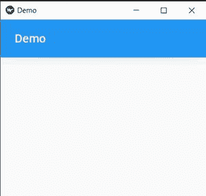
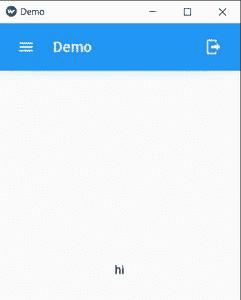
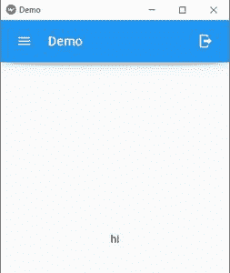
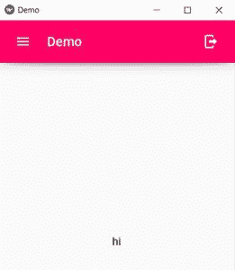
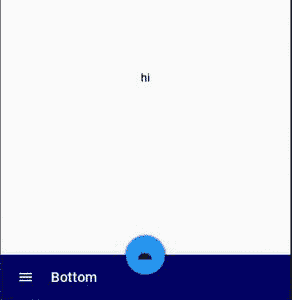
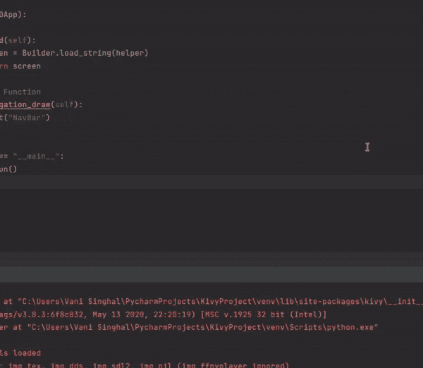

# 在 KivyMD 中创建工具栏

> 原文:[https://www.geeksforgeeks.org/create-toolbar-in-kivymd/](https://www.geeksforgeeks.org/create-toolbar-in-kivymd/)

在本文中，我们将看到如何使用 Python 中的 KivyMD 在移动应用程序中添加工具栏。KivyMD 提供两种类型工具栏–

*   顶部工具栏
*   底部工具栏

让我们看看如何创建每种类型的工具栏，以及如何添加某些属性，如标题、左菜单、右菜单等。一些常用的属性是–

### 添加标题:

要向工具栏添加标题，请使用**标题**属性。

> **语法:**标题:“我们要在工具栏上显示的标题”

其表述如下-

```py
MDToolbar:
    title:'Demo'     
```



### **添加左右菜单:**

这是你在某些应用程序中看到的左右菜单。为了创建这个，使用了以下属性。

> **语法:**
> 
> Left_action_items:我们需要指定一个图标和与之相关的功能，它将显示在标题的左侧。
> 
> right_action_items:类似于 left_action_items 但在右侧

其表示如下:

> MDToolbar:
> 
> 标题:“演示”
> 
> left _ action _ items:[' menu '，lambda x:app . navigation _ draw()]]
> 
> right_action_items:['注销'，lambda x:app . navigation _ draw()]]



### **海拔:**

它用于在工具栏下方显示阴影效果

> **语法:**立面:在工具栏下方显示阴影效果

其表示如下

> MDToolbar:
> 
> 标题:“演示”
> 
> left _ action _ items:[' menu '，lambda x:app . navigation _ draw()]]
> 
> right_action_items:['注销'，lambda x:app . navigation _ draw()]]
> 
> 标高:10



### **背景颜色:**

要更改工具栏的颜色，使用 md_bg_color。

> **语法:** md_bg_color:其表示形式应为 RGB 值

其表示如下:

> MDToolbar:
> 
> 标题:“演示”
> 
> left _ action _ items:[' menu '，lambda x:app . navigation _ draw()]]
> 
> right_action_items:['注销'，lambda x:app . navigation _ draw()]]
> 
> 标高:10
> 
> MD _ BG _ color:0.0、100/255.1



### **底栏:**

除了顶部工具栏，我们还可以添加底部工具栏。MDBottomAppBar 用于在底部显示工具栏。

其表示如下:

> MDBottomAppBar:
> 
> MDToolbar:
> 
> 标题:“底部”
> 
> left _ action _ items:[' menu '，lambda x:app . navigation _ draw()]]
> 
> 标高:10
> 
> MD _ BG _ color:0.0、100/255.1



让我们看一个例子，我们将创建顶部和底部工具栏。

**注意:**屏幕上的小部件会根据窗口的大小自行调整，因为默认情况下小部件使用大小提示(调整)。

## 蟒蛇 3

```py
from kivymd.app import MDApp
from kivymd.uix.label import MDLabel
from kivymd.uix.screen import Screen
from kivy.lang import Builder

# builder method
helper="""
Screen:
    name:'About us'
    BoxLayout:
        orientation:'vertical'
        MDToolbar:
            title:'Demo'
            left_action_items:[['menu',lambda x: app.navigation_draw()]]
            right_action_items:[['logout',lambda x: app.navigation_draw()]]
            elevation:10
            md_bg_color: 0,0,100/255,1

        MDLabel:
            text:"hi"
            halign:'center'
        MDBottomAppBar:
            MDToolbar:
                title:'Bottom'
                left_action_items:[['menu',lambda x: app.navigation_draw()]]
                elevation:10
                md_bg_color: 0,0,100/255,1
"""
class Demo(MDApp):

    def build(self):

        screen=Builder.load_string(helper)
        return screen

    # lambda Function
    def navigation_draw(self):
        print("NavBar")

if __name__ == "__main__":
    Demo().run()
```

**输出:**

