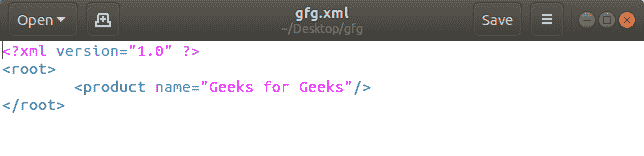
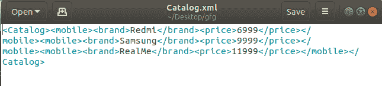

# 使用 Python 创建 XML 文档

> 原文:[https://www . geesforgeks . org/create-XML-documents-using-python/](https://www.geeksforgeeks.org/create-xml-documents-using-python/)

**可扩展标记语言(XML)** ，是一种可以用来创建自己的标签的标记语言。它是由万维网联盟(W3C)创建的，旨在克服作为所有网页基础的 HTML 的局限性。XML 基于标准通用标记语言 SGML。它用于存储和传输数据。XML 不依赖于平台和编程语言。您可以在任何平台上用任何语言编写程序，使用 XML 发送、接收或存储数据。它为以人类可读和机器可读的格式编码文档定义了一组规则。

数据存储在 XML 文档中。XSL(可扩展样式表语言)文档描述了如何将 XML 文档转换成其他类型的文档(如 HTML、TXT 甚至 XML)。)转换的过程称为 XSLT，有时也称为 XSL 转换。

**示例:**

```
<?xml version=“1.0” standalone=“yes” ?>
<message>    
<from> Robert </from>   
<to> Mario </to>
</message>
```

**注:**更多信息请参考 [XML |基础知识](https://www.geeksforgeeks.org/xml-basics/)

## 使用 Python 创建 XML 文档

**1)使用 minidom** 创建 XML 文档
首先，我们导入`minidom`以使用`xml.dom`。然后我们创建`root`元素并将其附加到 XML 中。之后，为极客创造一个父母的子产品，即极客。创建子产品后，文件名保存为“根据您的选择的任何名称. xml”。不要忘记附加。您给文件的文件名末尾的 xml。Minidom 是文档对象模型接口的最小实现，具有类似于其他语言的应用编程接口。它旨在比完整的 DOM 更简单，也更小。

**示例:**

```
from xml.dom import minidom
import os 

root = minidom.Document()

xml = root.createElement('root') 
root.appendChild(xml)

productChild = root.createElement('product')
productChild.setAttribute('name', 'Geeks for Geeks')

xml.appendChild(productChild)

xml_str = root.toprettyxml(indent ="\t") 

save_path_file = "gfg.xml"

with open(save_path_file, "w") as f:
    f.write(xml_str) 
```

**输出:**



**2)使用元素树**创建 XML 文档
首先我们要导入`'xml.etree.ElementTree'`来创建一个子树。之后，我们制作根元素，这个根元素应该在一个预期的块中，否则会出现错误。创建根元素后，我们可以轻松地创建一个树结构。然后，该文件将被存储为“您想给该文件命名的名称. xml”。元素树是一个重要的 Python 库，允许您解析和导航 XML 文档。使用 ElementTree，我们可以将文档分解成易于处理的树形结构。

**示例:**

```
import xml.etree.ElementTree as gfg 

def GenerateXML(fileName) :

    root = gfg.Element("Catalog")

    m1 = gfg.Element("mobile")
    root.append (m1)

    b1 = gfg.SubElement(m1, "brand")
    b1.text = "Redmi"
    b2 = gfg.SubElement(m1, "price")
    b2.text = "6999"

    m2 = gfg.Element("mobile")
    root.append (m2)

    c1 = gfg.SubElement(m2, "brand")
    c1.text = "Samsung"
    c2 = gfg.SubElement(m2, "price")
    c2.text = "9999"

    m3 = gfg.Element("mobile")
    root.append (m3)

    d1 = gfg.SubElement(m3, "brand")
    d1.text = "RealMe"
    d2 = gfg.SubElement(m3, "price")
    d2.text = "11999"

    tree = gfg.ElementTree(root)

    with open (fileName, "wb") as files :
        tree.write(files)

# Driver Code
if __name__ == "__main__": 
    GenerateXML("Catalog.xml")
```

**输出:**



有三个助手函数对于创建元素节点的层次结构很有用。`Element()`函数创建一个标准节点，`SubElement()`函数将新节点附加到父节点，`Comment()`函数创建一个使用 XML 注释语法序列化的节点。

属性值可以一次配置一个`withset()`(如根节点)，或者通过将字典传递给节点工厂(如每个组和播客节点)来一次性配置。